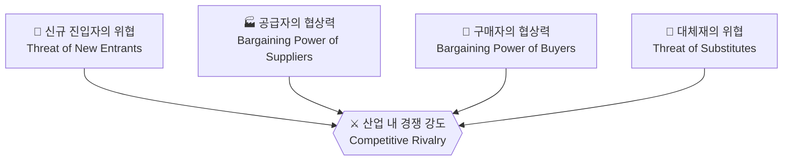

# Porter's Five Forces 분석 방법론

**"내 비즈니스가 속한 필드가 돈이 될까?"**를 알려주는 마법의 돋보기가
바로 포터의 5가지 힘 분석 모델입니다.

이 모델은 우리가 어떤 산업에 뛰어들 때, 그 산업의 **수익성**을 미리
분석을 통해 기업은 어떤 시장에서 싸워야 할지, 그리고 어떻게 자리를
잡아야 할지 **전략적 판단**을 내릴 수 있게 됩니다.

## 모델 구조

