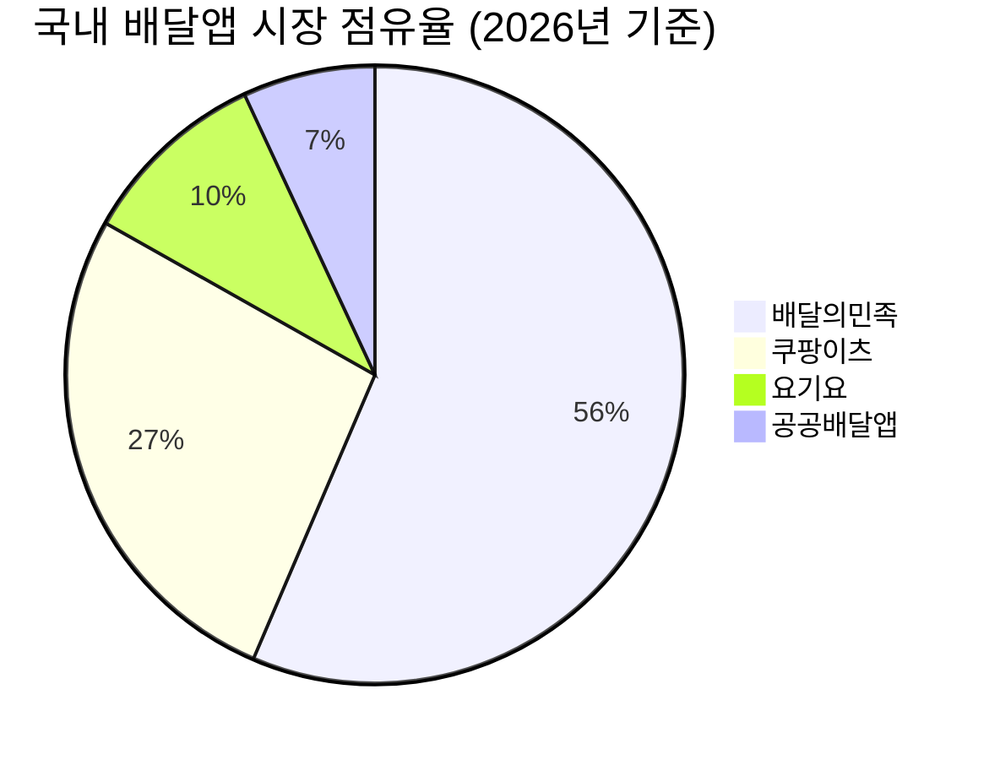
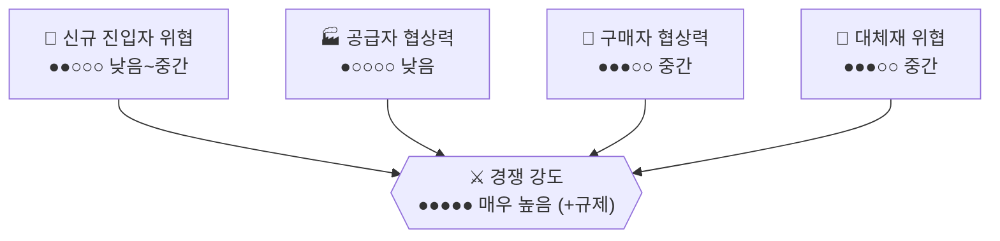

# 국내 배달앱 시장 — Porter's Five Forces 분석

> 강도 게이지: ○○○○○(낮음) → ●●●●●(매우 높음)

## 1. 신규 진입자의 위협 — 강도: 낮음~중간 ●●○○○
- 배달앱은 소비자·가맹점·라이더가 동시에 모여야 가치가 생기는 3면 네트워크 플랫폼이라, 이미 형성된 배민(전국 54~60%)·쿠팡이츠(25~29%) 양강 구도를 신규 사업자가 깨기는 매우 어렵다.
- 지자체가 지원한 공공배달앱들은 점유율 7% 수준에 머물며 네트워크 효과 확보에 실패했다.
- 다만 쿠팡이 쿠팡이츠로 단기간에 시장에 안착한 사례처럼, 이미 다른 영역에서 강력한 이용자 기반과 자본을 가진 플레이어(쿠팡, 네이버 등)에게는 진입이 상대적으로 가능하다.
- 종합: 자본 없는 신규 진입은 거의 불가능, 대자본 플레이어에게는 진입 여지가 남아 있음.

## 2. 공급자의 협상력 — 강도: 낮음 ●○○○○
- 공급자는 '라이더(배달 기사)'와 '입점 자영업자(음식점주)' 두 축으로 구성됨.
- 라이더는 다수 분산되어 개별 협상력이 낮지만, 최근 라이더 노조·단체행동을 통해 집단적 협상력이 조금씩 커지는 추세.
- 입점 자영업자는 다수 소상공인으로 분산되어 있고 플랫폼의 수수료·광고비 정책에 의존적이라 개별 협상력이 매우 낮다. 상생협의체를 통해 집단적으로 목소리를 내고 있지만 강제력은 약하다.
- 종합: 공급자 전반의 협상력은 낮은 편.

## 3. 구매자(소비자)의 협상력 — 강도: 중간 ●●●○○
- 앱 설치·전환 비용이 낮아 소비자가 여러 앱을 동시에 쓸 수 있지만, 배민클럽·쿠팡와우 같은 구독형 멤버십과 지역별 락인 효과(수도권은 쿠팡이츠 강세, 지방은 배민 강세)로 완전한 자유 전환은 제한적.
- 종합: 이커머스보다는 협상력이 낮지만, 여전히 프로모션에 따라 이동하는 경향이 있음.

## 4. 대체재의 위협 — 강도: 중간 ●●●○○
- 가게 자체 배달·전화주문·포장·방문수령, 편의점 즉석식품, 밀키트, 직접 요리 등이 대체 가능.
- 다만 원클릭 주문과 실시간 위치 추적 같은 배달앱의 편의성이 강력해, 이커머스 시장보다는 대체재 위협이 낮은 편.
- 종합: 상시 존재하지만 이커머스보다는 약한 수준.

## 5. 기존 경쟁자 간 경쟁 강도 — 강도: 매우 높음 (+ 규제 리스크) ●●●●●
- 배민(전국 1위)과 쿠팡이츠(수도권에서 배민을 거의 추격)의 양강 구도가 고착되었고, 요기요는 점유율이 하락(10%)하며 3위로 밀려남.
- 수수료 인하 경쟁, 무료배달·멤버십 혜택 경쟁이 치열하며, 여기에 더해 정부 주도 상생협의체와 차등 수수료제, 수수료 상한제 등 규제 리스크가 2026년 '배달 플랫폼 규제 원년'으로 불릴 만큼 강하게 작용 중.
- 종합: 경쟁 강도가 매우 높고, 정치·사회적 압력이라는 추가 리스크가 수익성을 지속적으로 압박.

## 종합 평가

| 힘 | 강도 | 게이지 |
|---|---|---|
| 신규 진입자 위협 | 낮음~중간 | ●●○○○ |
| 공급자 협상력 | 낮음 | ●○○○○ |
| 구매자 협상력 | 중간 | ●●●○○ |
| 대체재 위협 | 중간 | ●●●○○ |
| 경쟁 강도 | 매우 높음 (+규제 리스크) | ●●●●● |

**산업 매력도: 중간~낮음.** 네트워크 효과로 신규 진입 장벽은 이커머스보다 높지만, 양강 체제의 극심한 경쟁과 정부 규제 압박이 수익성을 계속 갉아먹는 구조다. 1위 사업자(배민)는 방어적 지위를 유지하지만, 수수료 규제가 실제로 강화되면 업계 전체의 마진이 구조적으로 낮아질 위험이 있다.

## Sources
- [배달앱 순위, 2026년 시장 점유율 대변화](https://blog.hansungshowcase.kr/92279)
- [배달앱 판도 변화…쿠팡이츠 급증·배민·요기요 감소](https://www.m-i.kr/news/articleView.html?idxno=1307332)
- [배달앱 상생협의체 좌초위기](https://www.khan.co.kr/article/202604281410001)
- [2026 배달앱 수수료 구조 해부와 소상공인 수익성 진단](https://www.koreabizreview.com/articles/kbr-legacy-7743)
