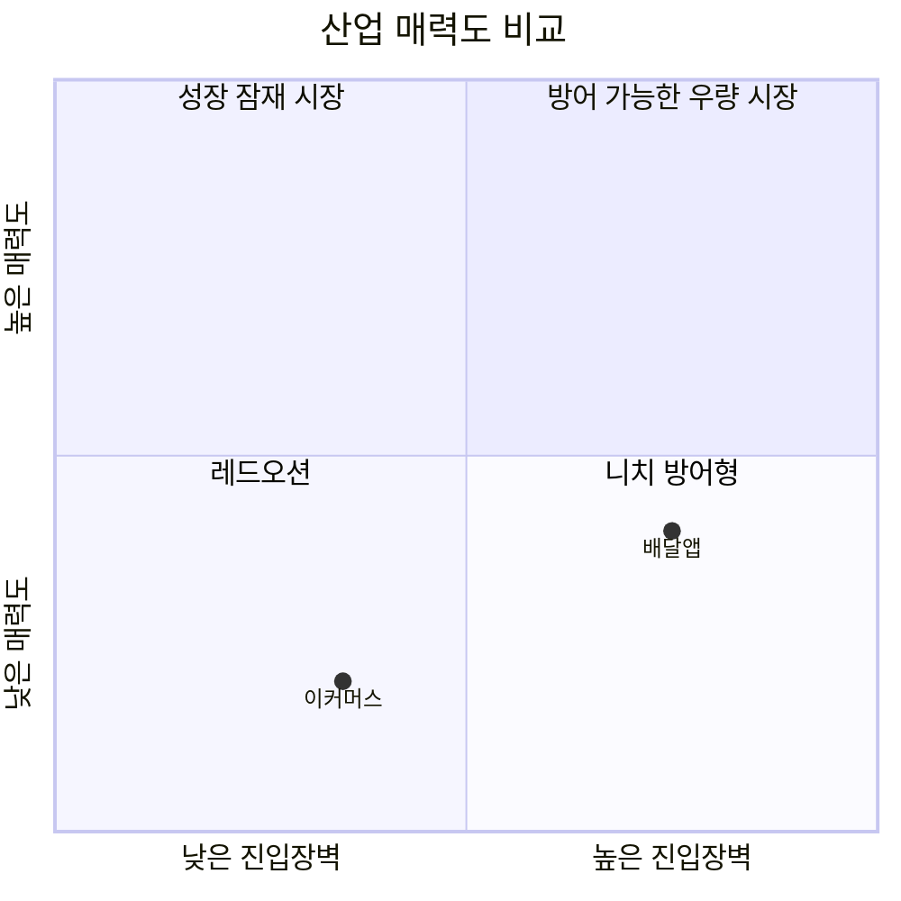

# 국내 이커머스 시장 vs 국내 배달앱 시장 — Five Forces 비교

| 힘 | 이커머스 시장 | 배달앱 시장 |
|---|---|---|
| 신규 진입자 위협 | 중~높음 (C커머스 침투로 자본력 있는 해외 플레이어에겐 낮아짐) | 낮음~중간 (3면 네트워크 효과로 진입 장벽 높음) |
| 공급자 협상력 | 낮음~중간 (대형 브랜드 제외 대부분 낮음) | 낮음 (라이더·자영업자 모두 분산) |
| 구매자 협상력 | 높음 (전환비용 0에 가까움) | 중간 (멤버십·지역 락인으로 일부 완화) |
| 대체재 위협 | 중간~높음 (오프라인·D2C·중고거래 등 다양) | 중간 (자체배달·포장 등, 편의성 대비 약함) |
| 경쟁 강도 | 매우 높음 | 매우 높음 (+ 규제 리스크 추가) |
| **산업 매력도** | **낮음** | **중간~낮음** |

## 핵심 차이
1. **진입 장벽의 방향이 반대다.** 이커머스는 C커머스(알리·테무)의 침투로 자본력 있는 신규 플레이어에게 문이 열리는 중이지만, 배달앱은 네트워크 효과 때문에 이미 배민·쿠팡이츠 양강 체제로 굳어져 신규 진입이 훨씬 어렵다.
2. **구매자 락인 수준이 다르다.** 이커머스는 소비자가 가격에 따라 즉시 이동하는 완전 경쟁적 구조인 반면, 배달앱은 구독 멤버십과 지역별 선호로 어느 정도 락인이 형성되어 있다.
3. **배달앱에는 이커머스보다 강한 '정치적 리스크'가 얹혀 있다.** 이커머스도 규제(개인정보보호, 통관) 이슈가 있지만, 배달앱은 소상공인·라이더 보호를 명분으로 한 수수료 상한제·상생협의체 등 직접적인 가격 규제 압박을 받고 있어 향후 수익성 구조 자체가 정책에 의해 바뀔 가능성이 크다.
4. **경쟁 강도는 둘 다 매우 높지만 성격이 다르다.** 이커머스는 다자간(쿠팡·네이버·신세계·C커머스) 경쟁이고, 배달앱은 양강 간의 직접 대결 구도다.

## 전략적 시사점
- **신규 진입을 고민하는 사업자 입장**: 이커머스는 자본만 있으면(C커머스 사례처럼) 진입 자체는 가능하나 경쟁·구매자 파워가 강해 장기 수익 확보가 어렵다. 배달앱은 진입 자체가 어렵지만, 일단 3위 안에 안착하면(쿠팡이츠 사례) 네트워크 효과의 보호를 받을 수 있다.
- **기존 1위 사업자 입장**: 이커머스 1위(쿠팡)는 규모의 경제로 경쟁을 방어하지만 구매자 협상력 때문에 마진 압박이 상시적이다. 배달앱 1위(배민)는 경쟁 압박보다 정부 규제 리스크가 더 큰 변수로 작용한다.
- **투자/사업 우선순위 관점**: 두 시장 모두 산업 자체의 매력도는 높지 않으며, 수익은 "얼마나 방어 가능한 지위(규모의 경제 또는 네트워크 효과)를 확보했는가"에 좌우되는 승자 중심 구조다.
