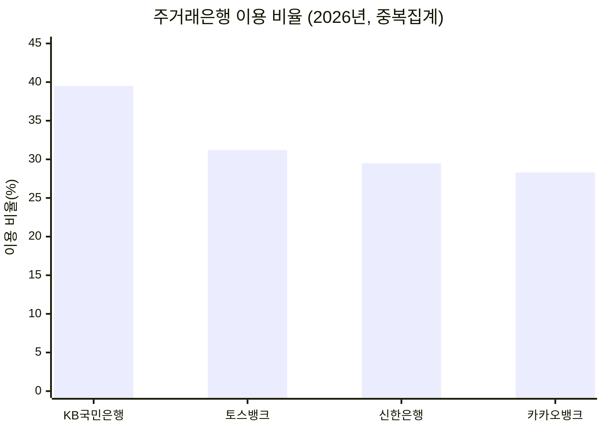
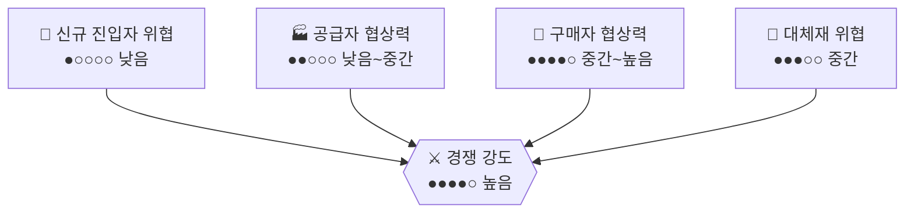

# 은행 및 금융 서비스 시장 (KB국민은행 vs 카카오뱅크) — Porter's Five Forces 분석

> 강도 게이지: ○○○○○(낮음) → ●●●●●(매우 높음)

## 1. 신규 진입자의 위협 — 강도: 낮음 (단, 정책적으로 제한된 문은 열려 있음) ●○○○○
- 은행업은 정부 인가제로, 최소자본금 요건과 엄격한 건전성 규제를 통과해야 해 일반 기업의 진입이 거의 불가능하다.
- 다만 은산분리 규제가 완화되어 ICT 기업이 인터넷전문은행 지분을 최대 34%까지 보유할 수 있게 됐고, 금융당국이 인터넷전문은행 신규 인가 절차를 진행 중이다. 카카오뱅크·토스뱅크가 이 좁은 문을 통해 성공적으로 진입한 사례.
- 종합: 일반적인 진입 장벽은 매우 높지만, 정책이 허용하는 소수의 빅테크·핀테크에게는 제한적 진입 기회가 열려 있음.

## 2. 공급자의 협상력 — 강도: 낮음~중간 ●●○○○
- 은행의 '공급자'는 자금 조달처(예금자, 채권시장)와 IT/클라우드 인프라 벤더로 볼 수 있다.
- 예금자는 다수 분산되어 개별 협상력은 낮지만, 금리 비교가 쉬워지면서 자금이 더 높은 금리를 주는 곳으로 이동하는 경향이 커졌다.
- 인터넷은행은 클라우드·IT 인프라 의존도가 높아 특정 벤더에 대한 기술적 종속이 발생할 수 있다.
- 종합: 낮음~중간.

## 3. 구매자(고객)의 협상력 — 강도: 중간~높음 (증가 추세) ●●●●○
- 오픈뱅킹과 마이데이터로 여러 은행의 계좌·상품을 한 앱에서 비교할 수 있게 되면서 전환 장벽이 낮아졌다.
- 실제로 주거래은행 조사에서 토스뱅크(31.2%)가 신한은행(29.5%)을 앞서는 등, 인터넷은행이 전통 은행의 주거래 기반을 빠르게 잠식하고 있다.
- 다만 급여이체·대출 관계 등으로 완전한 전환에는 여전히 관성이 남아 있다.
- 종합: 중간~높음, 계속 강해지는 추세.

## 4. 대체재의 위협 — 강도: 중간 ●●●○○
- 결제·송금 영역에서는 토스·카카오페이 등 핀테크 서비스가 은행 기능을 상당 부분 대체하고 있다.
- 다만 예수신(예금·대출)의 핵심 기능은 신뢰와 규제(예금보호제도)가 뒷받침돼야 하므로 비금융 플레이어가 완전히 대체하기는 어렵다.
- 종합: 결제/송금은 대체 위협이 높지만 핵심 뱅킹 업무는 낮음 — 전체적으로 중간.

## 5. 기존 경쟁자 간 경쟁 강도 — 강도: 높음 ●●●●○
- 4대 시중은행(KB·신한·하나·우리)과 인터넷전문은행 3사(카카오뱅크·토스뱅크·케이뱅크)가 경쟁하며, 케이뱅크가 기업은행을 제치고 순위를 올리는 등 지형이 계속 흔들리고 있다.
- 금리 경쟁뿐 아니라 슈퍼앱 전략(하나의 앱에서 결제·투자·대출까지)을 둘러싼 플랫폼 경쟁이 치열하다.
- 종합: 높음, 특히 인터넷은행 간 성장 경쟁이 두드러짐.

## 종합 평가

| 힘 | 강도 | 게이지 |
|---|---|---|
| 신규 진입자 위협 | 낮음 (정책적으로 제한된 문은 열림) | ●○○○○ |
| 공급자 협상력 | 낮음~중간 | ●●○○○ |
| 구매자 협상력 | 중간~높음 | ●●●●○ |
| 대체재 위협 | 중간 | ●●●○○ |
| 경쟁 강도 | 높음 | ●●●●○ |

**산업 매력도: 중간~높음.** 규제로 인한 높은 진입 장벽이 기존 사업자를 두텁게 보호하는, 흔치 않게 "장벽이 매력도를 높이는" 산업이다. 다만 오픈뱅킹·핀테크로 인한 고객 이동성 증가와 대체 결제 서비스의 확산이 장기적으로 마진을 압박할 수 있다.

## Sources
- [주거래은행 1위는 KB…2위는?](https://marketin.edaily.co.kr/News/ReadE?newsId=04421446645384632)
- [카카오뱅크 핵심 기업분석 - 2026년 하반기](https://jasoseol.com/companies/4699/insights)
- [인터넷전문은행 관련 규제 개선](https://www.kimchang.com/ko/insights/detail.kc?sch_section=4&idx=18790)
- [인터넷전문은행 신규인가 심사기준 및 절차](https://www.fsc.go.kr/comm/getFile?srvcId=BBSTY1&upperNo=83473&fileTy=ATTACH&fileNo=4)
