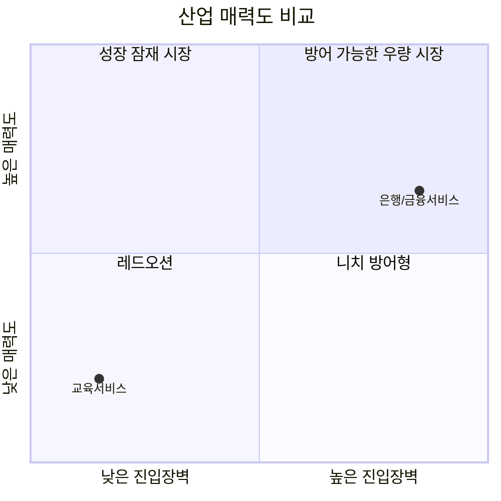

# 은행/금융 서비스 vs 교육 서비스 — Five Forces 비교

| 힘 | 은행/금융 서비스 | 교육 서비스 |
|---|---|---|
| 신규 진입자 위협 | 낮음 (정부 인가제, 단 빅테크엔 제한적 문 열림) | 높음 (기술적 장벽 거의 없음) |
| 공급자 협상력 | 낮음~중간 | 중간~높음 (스타강사·명문대 브랜드) |
| 구매자 협상력 | 중간~높음 (오픈뱅킹으로 증가) | 높음 (무료 대체재로 충성도 낮음) |
| 대체재 위협 | 중간 (결제/송금만 대체 가능) | 매우 높음 (유튜브 등 무료 콘텐츠) |
| 경쟁 강도 | 높음 | 높음 (M&A로 재편 중) |
| **산업 매력도** | **중간~높음** | **낮음** |

## 핵심 차이
1. **진입 장벽의 존재 여부가 산업 매력도를 정반대로 가른다.** 은행업은 정부 인가·자본 규제라는 강력한 장벽이 기존 사업자를 보호해 매력도를 오히려 높이지만, 교육 서비스는 진입 장벽이 거의 없어 신규 플레이어가 끊임없이 유입되며 매력도를 낮춘다.
2. **무료 대체재의 파괴력이 다르다.** 은행의 핵심 기능(예수신)은 신뢰와 규제가 뒷받침되어야 해 비금융 플레이어가 완전히 대체하기 어렵지만, 교육은 유튜브 같은 무료 콘텐츠가 유료 서비스의 가격 결정력 자체를 제한한다.
3. **공급자 리스크의 성격이 다르다.** 은행은 예금자·IT 벤더가 분산되어 있어 공급자 리스크가 낮은 편이지만, 교육은 스타강사·명문대 브랜드 같은 '핵심 자산이 곧 이탈 리스크'가 되는 구조다.
4. **경쟁의 결과물이 다르다.** 은행은 인터넷은행(토스뱅크·카카오뱅크)의 급성장으로 시중은행의 주거래 기반이 흔들리는 '지형 재편'이고, 교육은 Coursera-Udemy 인수처럼 '합병을 통한 산업 통합'이 진행 중이다.

## 전략적 시사점
- **신규 진입을 고민하는 사업자 입장**: 은행업은 정부 인가라는 큰 장벽 때문에 진입 자체가 거의 불가능하지만, 일단 인가를 받으면(카카오뱅크·토스뱅크 사례) 규제가 보호막이 되어 안정적 수익을 기대할 수 있다. 교육 서비스는 진입은 쉽지만 무료 대체재와 낮은 구매자 충성도 때문에 장기 수익화가 훨씬 어렵다.
- **기존 1위 사업자 입장**: 은행(KB국민은행)은 규제 보호를 받지만 오픈뱅킹·핀테크로 인한 고객 이동성 증가에 대응해야 한다. 교육(메가스터디)은 규제 보호가 없는 대신 '검증된 성과'라는 브랜드 신뢰로 무료 대체재와 차별화해야 한다.
- **투자/사업 우선순위 관점**: 은행/금융은 진입 장벽이 두터운 만큼 안정적이지만 성장성은 제한적인 "방어형" 산업이고, 교육 서비스는 진입은 쉽지만 무료 경쟁과 낮은 충성도 때문에 "브랜드·자격증명 차별화"에 성공한 소수만 살아남는 산업이다.
