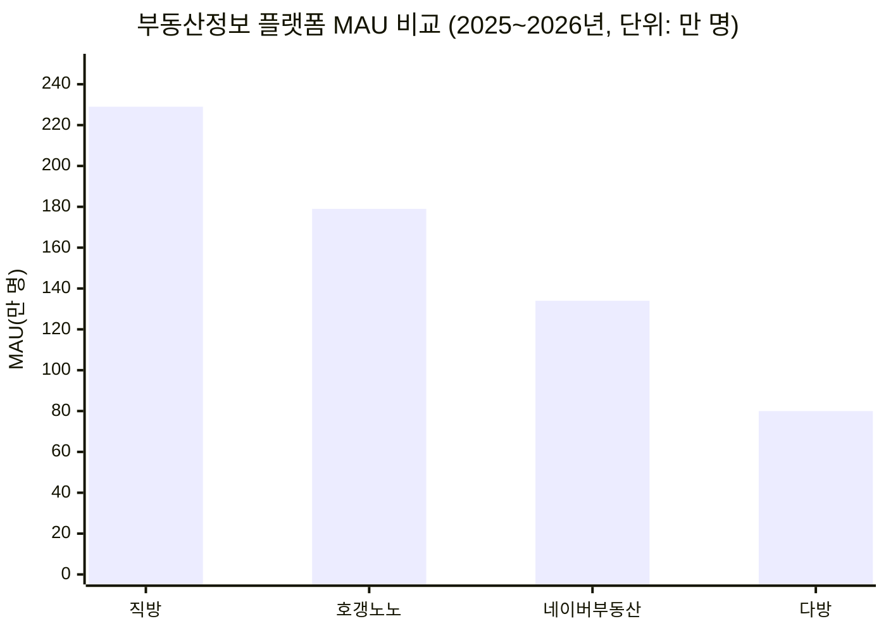
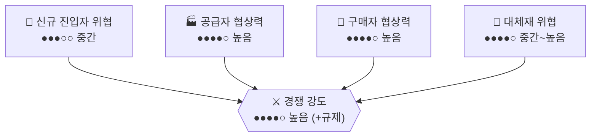

# 국내 부동산정보 플랫폼 시장 (직방 vs 다방 vs 네이버부동산) — Porter's Five Forces 분석

> 강도 게이지: ○○○○○(낮음) → ●●●●●(매우 높음)

## 1. 신규 진입자의 위협 — 강도: 중간 ●●●○○
- 매물 검색 앱 자체를 만드는 기술적 장벽은 낮지만, 실사용자가 신뢰할 만한 수준의 매물 데이터(등록 매물 수·검증 정확도)를 쌓으려면 공인중개사 네트워크 확보에 오랜 시간이 걸려 실질적 진입 장벽은 높은 편이다.
- 다만 2026년 1월부터 국토부의 부동산 빅데이터 플랫폼이 '데이터 오픈마켓'으로 전환되어 누구나 실거래가·시세 데이터를 사고팔 수 있게 되면서, 데이터 확보라는 진입 장벽 자체가 낮아지는 정책적 변화가 진행 중이다.
- 네이버처럼 이미 압도적 트래픽을 가진 포털이 '네이버부동산'으로 카테고리를 확장하는 방식은 신규 스타트업과는 다른 차원의 진입 위협이다.
- 종합: 스타트업의 백지 진입은 어렵지만, 대형 포털·데이터 오픈마켓발 신규 진입 가능성은 계속 열려 있음.

## 2. 공급자의 협상력 — 강도: 높음 ●●●●○
- 이 시장의 '공급자'는 매물을 등록하는 공인중개사다. 다른 플랫폼 시장과 달리 공급자가 한국공인중개사협회(한공협)라는 11만 회원 규모의 법정단체급 조직으로 뭉쳐 있어 협상력이 매우 강하다.
- 한공협은 자체 플랫폼 '한방'을 운영하며 회원들에게 직방·네이버부동산 등 경쟁 플랫폼 매물 등록을 자제하도록 압박한 전례가 있고, 최근에는 공인중개사법 개정을 통한 법정단체화까지 추진하며 프롭테크 업계와 정면으로 충돌하고 있다.
- 직방이 파트너 중개사와 중개수수료를 50~70% 배분하며 매물을 확보하는 구조 자체가, 공급자(중개사)의 협상력이 강해 플랫폼이 수익을 양보해야 하는 시장임을 보여준다.
- 종합: 공급자가 조직화된 이익단체로 뭉쳐 있어 협상력이 매우 강한, 다른 분석 대상 시장과 구별되는 특이 구조.

## 3. 구매자(이용자)의 협상력 — 강도: 높음 ●●●●○
- 매물 검색은 무료이며 여러 앱을 동시에 설치해 비교하는 데 아무 비용이 들지 않아 전환 장벽이 사실상 0에 가깝다.
- 다만 실제 거래(계약)까지 가면 중개사와의 신뢰 관계, 현장 방문 경험이 개입해 완전한 플랫폼 전환은 제한적이다.
- 종합: 정보 탐색 단계의 협상력은 매우 높지만, 실거래 단계에서는 관성이 일부 작동.

## 4. 대체재의 위협 — 강도: 중간~높음 ●●●●○
- 네이버부동산처럼 포털 내 통합 서비스, 당근마켓의 지역 부동산 카테고리, 청약홈 등 공공 정보 채널이 대체 가능한 정보원으로 작동한다.
- 여전히 다수의 실수요자가 발품(현장 방문, 공인중개사 사무소 직접 방문)을 통해 정보를 얻는 오프라인 관행도 남아 있다.
- 종합: 온라인 대체 채널이 많고 포털 통합 서비스의 위협이 커, 이커머스 시장과 유사하게 대체 위협이 상시 존재.

## 5. 기존 경쟁자 간 경쟁 강도 — 강도: 높음 (+ 규제 리스크) ●●●●○
- 직방(MAU 229만, 1위)이 호갱노노(179만)·네이버부동산(134만)·다방(80만)을 앞서는 다자 경쟁 구도이며, 직방은 삼성SDS 홈IoT 사업부 인수 등 M&A로 스마트홈·아파트 관리까지 사업을 확장하며 격차를 벌리고 있다.
- 직방은 5년 연속 적자 끝에 2026년 상반기 흑자 전환에 성공하며 내년 상반기 상장(IPO) 예비심사 청구를 목표로 하는 등, 시장이 '광고형 매물 검색'에서 '종합 프롭테크 플랫폼' 경쟁으로 재편되고 있다.
- 여기에 공인중개사법 개정을 둘러싼 한공협과의 갈등이 겹치면서, 순수 경쟁 강도뿐 아니라 규제·정치적 리스크가 사업 확장의 발목을 잡을 수 있는 구조다.
- 종합: 경쟁이 매물 검색을 넘어 중개·스마트홈까지 확장되며 치열해지는 가운데, 규제 리스크가 추가 압박 요인으로 작용.

## 종합 평가

| 힘 | 강도 | 게이지 |
|---|---|---|
| 신규 진입자 위협 | 중간 | ●●●○○ |
| 공급자 협상력 | 높음 | ●●●●○ |
| 구매자 협상력 | 높음 | ●●●●○ |
| 대체재 위협 | 중간~높음 | ●●●●○ |
| 경쟁 강도 | 높음 (+규제 리스크) | ●●●●○ |

**산업 매력도: 중간~낮음.** 다섯 가지 힘이 고르게 중간 이상으로 작동해 만만한 시장이 아니며, 특히 공급자(공인중개사협회)가 조직화된 이익단체로서 강한 저항력을 행사한다는 점이 이 시장 고유의 리스크다. 다만 직방처럼 매물 검색을 넘어 중개·스마트홈까지 수직 확장해 규모의 경제를 확보한 선두 업체는 흑자 전환과 IPO까지 노릴 수 있는 수준으로 성장할 수 있다.

## Sources
- ["원룸 앱에서 종합 부동산 플랫폼으로"…다방, 서비스 13주년](https://www.venturesquare.net/1083955)
- [부동산 플랫폼 비교 활용 전략 - 직방·다방·호갱노노·네이버부동산](https://houseinfo.kr/blog/0171-real-estate-platform-comparison/)
- [2026년부터 부동산 빅데이터 플랫폼, 데이터 오픈마켓 전환](https://news.nate.com/hissue/clstList?isq=10477&type=c)
- [2026년 부동산매물클린관리센터 거짓매물 처리현황](https://kiso.or.kr/%EC%95%8C%EB%A6%BC%EB%A7%88%EB%8B%B9/%EC%A3%BC%EC%9A%94-%EA%B3%B5%EA%B0%9C%EC%82%AC%ED%95%AD/%EA%B1%B0%EC%A7%93%EB%A7%A4%EB%AC%BC%EC%8B%A0%EA%B3%A0%EC%B2%98%EB%A6%AC%ED%98%84%ED%99%A9/?mod=document&uid=1486)
- [공인중개사협회 법정단체 되나…프롭테크와 갈등 우려](https://www.hankyung.com/article/202511253534i)
- [공인중개사법 개정 움직임…프롭테크 업계가 반발하는 이유](https://www.tech42.co.kr/%EA%B3%B5%EC%9D%B8%EC%A4%91%EA%B0%9C%EC%82%AC%EB%B2%95-%EA%B0%9C%EC%A0%95-%EC%9B%80%EC%A7%81%EC%9E%84-%ED%94%84%EB%A1%AD%ED%85%8C%ED%81%AC-%EC%97%85%EA%B3%84%EA%B0%80-%EB%B0%98%EB%B0%9C/)
- [M&A로 몸집 불린 직방, IPO는 숨 고르기](http://www.hansbiz.co.kr/news/articleView.html?idxno=627182)
- ['2.5조 유니콘' 직방, 3년만에 몸값 3000억원…올해 흑자 기대](https://www.sidae.com/article/2026071315401229373)
