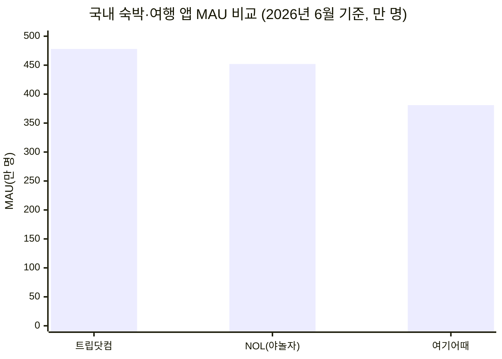
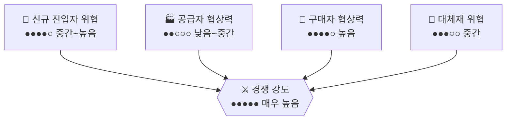

# 호텔 및 숙박업 플랫폼 시장 (야놀자 vs 여기어때, 글로벌 OTA 포함) — Porter's Five Forces 분석

> 강도 게이지: ○○○○○(낮음) → ●●●●●(매우 높음)

## 1. 신규 진입자의 위협 — 강도: 중간~높음 ●●●●○
- 예약 플랫폼 앱 자체의 개발 장벽은 낮지만, 숙박업소(모텔·펜션·호텔) 공급자 네트워크를 확보해 "재고"를 채우는 것이 실질적 진입장벽이라 국내 신규 스타트업의 진입은 쉽지 않다.
- 그러나 트립닷컴이 2026년 6월 기준 MAU 약 478만 명으로 야놀자(NOL, 약 452만 명)와 여기어때(약 381만 명)를 모두 제치며 2021년 3월 이후 처음으로 1위에 올라섰다. 이는 이미 글로벌 재고망과 자본을 갖춘 해외 OTA(트립닷컴·부킹닷컴·아고다)에게는 국내 진입 장벽이 사실상 낮다는 뜻이다.
- 국내 신규 사업자에게는 공급자 확보·마케팅비 부담이라는 장벽이 크지만, 이미 글로벌 인벤토리를 보유한 해외 대자본 플레이어에게는 앱 현지화만으로도 빠른 침투가 가능하다.
- 종합: 국내 자본만으로는 진입이 어렵지만, 해외 대형 OTA에게는 장벽이 낮아 실질적 신규 진입 위협이 크다.

## 2. 공급자의 협상력 — 강도: 낮음~중간 ●●○○○
- 공급자는 모텔·펜션·게스트하우스 등 다수의 영세 숙박업주(다수 분산, 협상력 낮음)와 특급호텔 체인·리조트(브랜드력 보유, 협상력 높음)로 양분된다.
- 영세 숙박업주는 플랫폼의 노출 순위·수수료 정책에 의존적이라 개별 협상력이 거의 없으며, 야놀자클라우드처럼 예약·객실관리 SaaS까지 플랫폼에 종속되면 이탈 비용이 더 커진다.
- 반면 신라호텔·롯데호텔 등 대형 체인은 자체 다이렉트 예약 채널과 브랜드 충성도를 활용해 OTA 의존도를 낮출 수 있어 협상력이 상대적으로 높다.
- 종합: 전체적으로는 플랫폼이 우위를 갖되, 상위 호텔 체인만 예외적으로 협상력을 보유.

## 3. 구매자(소비자)의 협상력 — 강도: 높음 ●●●●○
- 여러 앱(야놀자·여기어때·트립닷컴·아고다)을 동시에 설치해 가격을 비교하는 것이 일상화되어 있고, 앱 전환 비용이 거의 없다.
- 특가·타임세일·쿠폰에 따라 소비자가 즉시 다른 플랫폼으로 이동하는 낮은 로열티 구조이며, 성수기·비수기에 따른 가격 민감도도 매우 크다.
- 실제로 국내 플랫폼은 저단가 국내 숙박 예약에 집중되는 반면(3월 야놀자 카드결제액 832억 원), 고단가 해외여행 결제는 아고다(같은 기간 2,841억 원)로 쏠리는 등 소비자가 목적에 따라 플랫폼을 골라 쓰는 경향이 뚜렷하다.
- 종합: 가격 비교가 쉽고 전환 장벽이 낮아 소비자 협상력이 강함.

## 4. 대체재의 위협 — 강도: 중간 ●●●○○
- 호텔·항공사 다이렉트 예약(자사 앱·홈페이지), 여행사 패키지, 공유숙박(에어비앤비) 등이 대체 채널로 작동한다.
- 다만 에어비앤비는 2025년 10월 16일부터 영업신고 의무화가 전면 시행되어 미신고 숙소는 2026년 1월 1일부터 예약이 차단되는 등, 국내에서는 독채·오피스텔 임대 같은 공유숙박 형태가 법적으로 제한적이라 대체재로서의 파괴력이 해외만큼 크지 않다.
- 호텔 다이렉트 예약도 "최저가 보장" 정책으로 OTA를 우회하려 하지만, 여전히 다수 소비자는 비교 편의성 때문에 플랫폼을 거친다.
- 종합: 규제가 공유숙박 대체재의 성장을 억제해 이커머스·배달앱보다는 대체재 위협이 낮은 편.

## 5. 기존 경쟁자 간 경쟁 강도 — 강도: 매우 높음 ●●●●●
- 국내 2강(야놀자·여기어때)이 앱 설치·사용시간 지표에서 엎치락뒤치락하는 각축전을 벌이는 가운데, 트립닷컴·부킹닷컴·아고다 등 글로벌 OTA가 MAU 기준으로 토종 앱들을 추월하며 3파전 이상의 다자 경쟁 구도로 재편되었다.
- 야놀자는 2026년 1분기 통합거래액(TTV) 9조 5,000억 원으로 역대 최대 외형 성장을 기록했지만 177억 원의 영업손실을 내는 등, 외형 성장과 수익성이 엇갈리는 출혈 경쟁이 계속되고 있다. 나스닥 상장을 추진 중인 야놀자는 기업가치 평가 압박까지 겹쳐 있다.
- 야놀자는 예약 중개를 넘어 클라우드 기반 호텔 운영 SaaS(전 세계 190여 개국 공급)로 사업을 다각화하며 경쟁의 축을 "예약 중개"에서 "호스피탈리티 인프라"로 넓히고 있다.
- 종합: 국내 2강 경쟁에 글로벌 OTA의 침투까지 겹쳐 경쟁 강도가 매우 높고, 수익성 압박이 구조적으로 지속.

## 종합 평가

| 힘 | 강도 | 게이지 |
|---|---|---|
| 신규 진입자 위협 | 중간~높음 | ●●●●○ |
| 공급자 협상력 | 낮음~중간 | ●●○○○ |
| 구매자 협상력 | 높음 | ●●●●○ |
| 대체재 위협 | 중간 (규제로 공유숙박 제한) | ●●●○○ |
| 경쟁 강도 | 매우 높음 | ●●●●● |

**산업 매력도: 낮음~중간.** 소비자 협상력이 강하고 국내외 플레이어가 뒤섞인 경쟁이 극심해 수익성을 내기 어려운 구조다. 다만 공유숙박 규제가 대체재 위협을 일정 부분 막아주고 있고, 야놀자처럼 예약 중개에서 호텔 운영 SaaS로 사업모델을 확장하면 순수 중개 수수료 경쟁에서 벗어난 방어선을 만들 여지가 있다.

## Sources
- [2026년 1분기 여행 앱 시장, 857만 해외여행자의 선택은 '글로벌 OTA'](https://hitchhickr.com/south_korean_travel_app_market_2026_q1/)
- [1등 위협 여기어때, 앱 설치·사용시간서 야놀자 추월](https://www.g-enews.com/article/ICT/2025/03/2025032711250980530b8d776efa_1)
- [거래액 9.5조의 '그늘'…야놀자, 나스닥 문턱 넘을까](https://www.edaily.co.kr/News/Read?newsId=01312006645449904&mediaCodeNo=257)
- [에어비앤비, 오는 10월 16일부터 영업신고 의무화 조치 전면 시행](https://news.airbnb.com/ko/enforcement)
- [야놀자, 클라우드 기반 호스피탈리티 솔루션 확산](https://zdnet.co.kr/view/?no=20250813235529)
