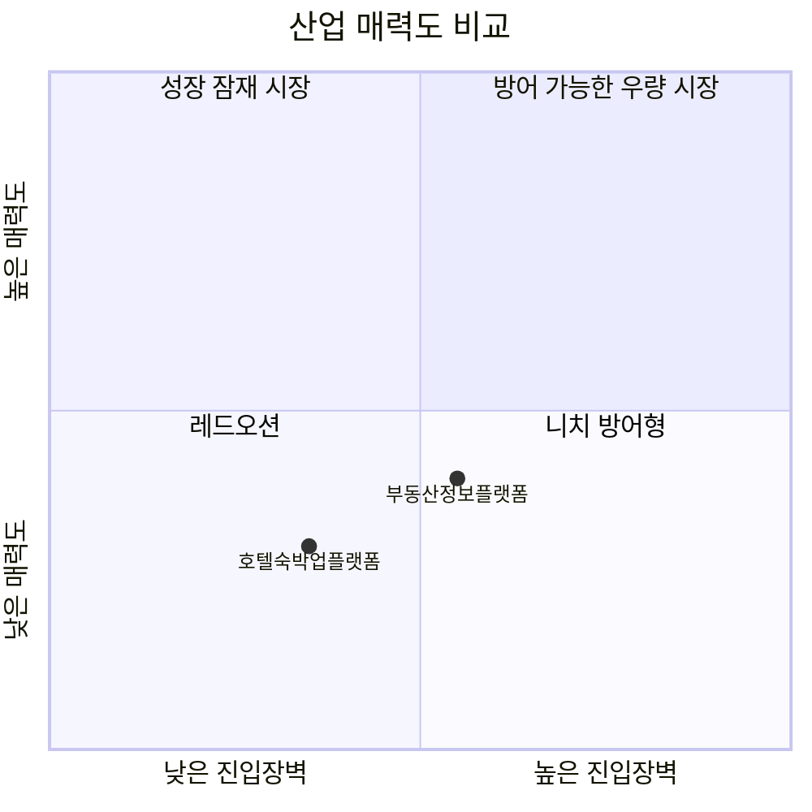

# 부동산정보 플랫폼 vs 호텔·숙박업 플랫폼 — Five Forces 비교

| 힘 | 부동산정보 플랫폼 | 호텔·숙박업 플랫폼 |
|---|---|---|
| 신규 진입자 위협 | 중간 (매물 데이터 축적 장벽, 단 데이터 오픈마켓화로 완화 중) | 중간~높음 (국내는 어렵지만 해외 OTA엔 사실상 무방비) |
| 공급자 협상력 | 높음 (공인중개사협회가 법정단체급으로 조직화) | 낮음~중간 (영세 숙박업주는 약함, 대형 호텔체인만 예외) |
| 구매자 협상력 | 높음 (탐색 단계는 무료·전환비용 0, 단 실거래 단계는 관성 존재) | 높음 (앱 전환비용 0, 가격에 따라 즉시 이동) |
| 대체재 위협 | 중간~높음 (포털 통합서비스, 당근마켓, 청약홈 등) | 중간 (공유숙박은 영업신고 규제로 대체 파괴력 제한) |
| 경쟁 강도 | 높음 (+공인중개사법 개정 갈등) | 매우 높음 (국내 2강 + 글로벌 OTA 다자 경쟁) |
| **산업 매력도** | **중간~낮음** | **낮음~중간** |

## 핵심 차이

1. **공급자 협상력의 축이 정반대다.** 부동산정보 플랫폼은 공급자(공인중개사)가 한국공인중개사협회라는 11만 회원 규모의 법정단체급 조직으로 뭉쳐 있어 플랫폼을 상대로 강한 협상력·정치적 저항력을 행사한다. 반면 호텔·숙박업 플랫폼의 공급자(영세 모텔·펜션 업주)는 다수 분산돼 있어 협상력이 낮고, 대형 호텔체인만 예외적으로 다이렉트 예약 채널을 통해 방어력을 갖는다. 두 시장 모두 "양면 플랫폼"이지만 공급자 쪽 힘의 크기가 극과 극이다.

2. **신규 진입 위협의 성격이 다르다.** 부동산정보 플랫폼은 정책 변화(부동산 빅데이터 오픈마켓 전환)가 진입 장벽을 서서히 낮추는 구조인 반면, 호텔·숙박업 플랫폼은 이미 글로벌 인벤토리와 자본을 가진 해외 OTA(트립닷컴·아고다·부킹닷컴)가 앱 현지화만으로 즉시 침투해 국내 1위를 뒤집는(트립닷컴의 2026년 6월 MAU 역전) 사례가 실제로 나타났다. 즉 부동산은 "제도가 문을 여는" 속도전이고, 호텔·숙박은 "이미 자본력을 가진 외부자가 언제든 들어올 수 있는" 상시적 위협이다.

3. **대체재를 막는 힘의 원천이 다르다.** 부동산정보 플랫폼은 대체재(포털 통합서비스, 당근마켓, 공공 정보채널)를 막을 뚜렷한 장치가 없어 대체 위협이 상시적으로 높다. 반면 호텔·숙박업 플랫폼은 에어비앤비 영업신고 의무화 같은 정부 규제가 오히려 대체재(공유숙박)의 성장을 억제해주는, "규제가 기존 플랫폼을 보호하는" 역설적 구조를 가진다.

4. **경쟁의 무게중심 이동 방향이 비슷하다.** 두 시장 모두 1위 사업자가 순수 중개(매물 검색 / 숙박 예약)를 넘어 인접 사업으로 수직 확장 중이다. 직방은 매물 검색에서 중개·스마트홈(삼성SDS 홈IoT 인수)으로, 야놀자는 예약 중개에서 클라우드 기반 호텔 운영 SaaS(190여 개국 공급)로 사업모델을 넓히며 순수 중개 수수료 경쟁에서 벗어나려는 동일한 전략적 방향성을 보인다.

## 전략적 시사점

- **신규 진입을 고민하는 사업자 입장**: 부동산정보 플랫폼은 데이터 오픈마켓 전환이라는 정책 변화의 타이밍을 노려 진입할 여지가 있지만, 공인중개사협회라는 조직화된 공급자 저항을 넘어서는 매물 확보 전략이 필수다. 호텔·숙박업 플랫폼은 국내 자본만으로는 공급자(숙박업소) 네트워크를 따라잡기 어려워, 트립닷컴처럼 이미 글로벌 인벤토리를 가진 자본이 아니라면 신규 진입 성공 가능성이 낮다.
- **기존 1위 사업자 입장**: 직방은 공인중개사법 개정을 둘러싼 갈등이라는 규제 리스크를 관리하면서 IPO를 준비해야 하는 이중 과제를 안고 있다. 야놀자는 국내 2강 경쟁과 글로벌 OTA 침투를 동시에 방어하며 나스닥 상장을 추진해야 해, 외형 성장(TTV 9.5조 원)과 수익성(영업손실) 사이의 괴리를 좁히는 것이 급선무다.
- **공통 시사점**: 두 시장 모두 순수 중개 모델의 수익성 한계(직방의 오랜 적자, 야놀자의 영업손실)에 부딪혀 "정보 중개"에서 "인프라 제공자(스마트홈·SaaS)"로 사업모델을 전환하는 것이 생존 전략이 되고 있다. 규제 환경(공인중개사법, 공유숙박 신고제)이 산업 매력도를 좌우하는 핵심 변수라는 점도 공통적이며, 두 시장 모두 규제 리스크를 선제적으로 관리하는 대관·정책 대응 역량이 곧 경쟁력의 일부가 되었다.
