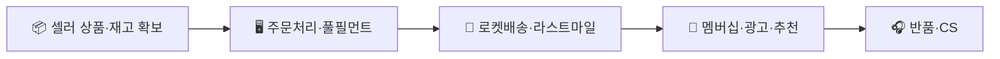
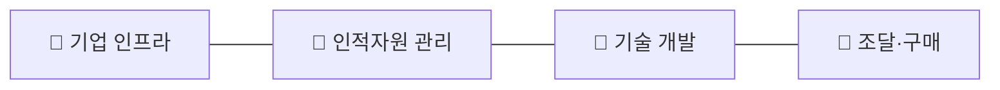

# 국내 이커머스 시장 — 가치사슬(Value Chain) 분석
> 쿠팡·네이버쇼핑형 오픈마켓+직매입 모델을 기준으로 분석

## 1. 주요활동 (Primary Activities)

### 1-1. 투입·조달 물류 (Inbound Logistics)
**핵심 투입자원**: 셀러(입점업체)의 상품, 직매입 상품 재고, 물류센터 부지·설비, 상품 데이터(가격·이미지·리뷰).
- **설계 관점**: 오픈마켓(셀러 다수 확보)과 직매입(로켓배송용 재고 직접 보유) 중 어떤 조달 방식을 핵심으로 할지가 물류센터 설계·재고 리스크·마진 구조를 결정한다. 셀러의 플랫폼 참여 유인은 낮은 입점 수수료·트래픽·정산 속도로 만들어진다.
- **개선 관점**: 다품종 소량 재고를 보유한 직매입 구조는 수요예측 정확도가 곧 재고 손실률과 직결된다. 특정 물류센터·지역 창고에 대한 의존도를 낮추고, 셀러 상품정보(가격·재고·이미지)의 표준화·정합성을 높이는 것이 반품·오배송을 줄이는 핵심 레버다.

### 1-2. 운영·생산 (Operations)
**핵심 처리 과정**: 주문 접수 → 재고 할당 → 피킹·패킹(풀필먼트) → 출고.
- **설계 관점**: 검색→상품상세→장바구니→결제의 구매 흐름과, 결제 실패·재고 부족 시의 예외 처리 로직을 어떻게 설계하느냐가 전환율을 좌우한다. 대규모 세일(블랙프라이데이 등) 트래픽 급증에도 시스템이 버틸 수 있는지가 관건.
- **개선 관점**: 결제 성공률, 품절로 인한 이탈률, 풀필먼트 처리시간(주문→출고 리드타임)을 줄이는 것이 핵심 개선 지표다. 이상거래(사재기 매점, 어뷰징 리뷰)를 탐지하면서 정상 구매자의 불편을 최소화하는 균형이 필요하다.

### 1-3. 산출·배송 물류 (Outbound Logistics)
**핵심 전달 채널**: 자체 배송망(쿠팡친구/CLS), 3PL 택배사, 실시간 배송 추적.
- **설계 관점**: "로켓배송(익일/당일)"처럼 배송 속도를 핵심 경쟁력으로 설계할지, 비용 효율적인 일반 택배 연계로 갈지가 물류 투자 규모를 결정한다. 배송 상태(출고·배송중·도착)를 고객이 즉시 이해할 수 있는 추적 UX가 필수.
- **개선 관점**: 배송 지연·파손 발생 시 선제적으로 상태를 안내할 수 있는지, 라스트마일(마지막 집 앞 배송) 구간의 오배송·분실률을 낮출 수 있는지가 핵심이다. 과도한 배송 알림(문자·푸시)을 줄이는 것도 고객 경험 개선 요소.

### 1-4. 마케팅 및 영업 (Marketing & Sales)
- **설계 관점**: 핵심 고객은 최종 소비자(구매자)와 셀러(입점업체) 양면이다. 소비자에게는 "최저가·최속배송"을, 셀러에게는 "트래픽과 판매 채널"을 핵심 가치로 제공한다. 검색광고·추천·멤버십(와우 멤버십 등)이 유입과 재구매를 만드는 축.
- **개선 관점**: 멤버십 구독료 대비 실제 배송·혜택 사용률(LTV)을 높이는 것, 검색광고 의존 셀러의 광고비 부담과 플랫폼의 객관적 추천 사이의 이해상충을 관리하는 것이 지속가능성의 핵심이다.

### 1-5. 서비스 (Service)
- **설계 관점**: 반품·환불·오배송·품질불량 클레임을 처리하는 CS 체계, 셀러-구매자 간 분쟁 시 플랫폼의 중재 역할 설계가 핵심.
- **개선 관점**: 반품 사유(단순 변심 vs 상품 하자)를 데이터화해 상품 상세페이지·QA 개선에 되먹임할 수 있는지, 챗봇으로 반복 문의(배송 조회, 환불 상태)를 얼마나 흡수할 수 있는지가 CS 비용 구조를 결정한다.

## 2. 지원활동 (Support Activities)

### 2-1. 기업 인프라
- 이커머스 본체, 물류 자회사(예: CLS), 결제·핀테크 자회사 간 책임·데이터 경계 설정이 필요. 최근 개인정보 유출 사고처럼 정보보호·내부감사 체계의 실효성이 브랜드 신뢰에 직결된다.

### 2-2. 인적자원 관리
- 물류 현장 인력(피킹·배송)과 개발·데이터 인력의 처우·문화가 크게 다른 조직을 하나의 회사로 운영해야 하는 것이 특징. 물류 현장의 안전·과로 이슈 관리가 기업 인프라(대외 신뢰)에도 영향을 미친다.

### 2-3. 기술 개발
- 수요예측·재고배치 알고리즘, 검색/추천 엔진, 물류 자동화(로봇 피킹) 등이 핵심 경쟁력. AI 추천의 정확도가 곧 매출과 직결되며, 대규모 트래픽에도 장애 없이 배포할 수 있는 인프라 안정성이 중요하다.

### 2-4. 조달·구매
- 클라우드 인프라, 결제 PG사, 3PL 택배사, 물류센터 부지 임대 등이 핵심 조달 대상. 특정 클라우드·PG사에 대한 종속도를 낮추고, 셀러 대상 수수료 정책의 공정성을 관리하는 것이 규제 리스크를 줄인다.

## 종합 시사점
이커머스의 가치사슬은 **"물류(속도) × 데이터(추천·가격) × 셀러 생태계(다양성)"** 세 요소가 서로를 강화하는 구조다. 로켓배송처럼 물류에 선제 투자해 속도 우위를 만들면 소비자 락인이 생기고, 그 트래픽이 셀러를 끌어들이며, 셀러 데이터가 추천 품질을 높이는 순환이 핵심 경쟁 우위의 원천이다.
