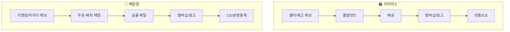

# 국내 이커머스 시장 vs 국내 배달앱 시장 — 가치사슬 비교

| 활동 | 이커머스 시장 | 배달앱 시장 |
|---|---|---|
| 투입·조달 물류 | 셀러 상품·직매입 재고 확보가 핵심 | 가맹점 메뉴 데이터 + 라이더 인력 풀 확보가 핵심 |
| 운영·생산 | 재고 할당 → 피킹·패킹(풀필먼트)의 배치성 처리 | 주문-조리-배차의 실시간 3자 동기화 처리 |
| 산출·배송 물류 | 자체 배송망(로켓배송 등)·3PL 혼합, 속도가 핵심 경쟁력 | 라이더 실물 배달 + 실시간 위치추적 UX가 핵심 |
| 마케팅 및 영업 | 소비자(최저가·속도) + 셀러(트래픽) 양면 시장 | 소비자(무료배달·멤버십) + 가맹점(광고 노출) 양면 시장 |
| 서비스 | 반품·환불·오배송 CS, 셀러-구매자 중재 | 배달지연·오배달 CS, 소비자-가맹점-라이더 3자 중재 |
| 기업 인프라 | 물류 자회사·핀테크 자회사 책임 분리, 정보보호 이슈 | 배달대행 자회사, 정부 상생협의체·수수료 규제 대응 |
| 인적자원 관리 | 물류 현장 인력(정규직/계약직) 처우 관리 | 라이더(개인사업자) 처우·노조 관계 관리 |
| 기술 개발 | 수요예측·재고배치·추천 알고리즘, 물류 자동화 | 배차 매칭·ETA 예측 알고리즘 |
| 조달·구매 | 클라우드, PG사, 3PL 택배사, 물류센터 부지 | 클라우드, PG사, 지도/내비 API, 배달대행사 제휴 |

## 핵심 차이
1. **자산 보유 구조가 다르다.** 이커머스(특히 직매입 모델)는 재고라는 실물 자산을 직접 보유·관리해야 하는 반면, 배달앱은 재고를 보유하지 않고 실시간 매칭 알고리즘이라는 무형 자산이 핵심이다. 이 때문에 이커머스의 운영·생산 활동은 "배치성 처리(재고 할당→출고)"에 가깝고, 배달앱은 "실시간 동시성 처리(주문-조리-배차 동기화)"에 가깝다.
2. **핵심 인적자원의 고용 형태가 다르다.** 이커머스 물류 인력은 상대적으로 정규직·계약직 중심이지만, 배달앱의 라이더는 개인사업자(프리랜서) 구조라 인적자원 관리 방식과 리스크(노조, 처우 이슈)의 성격이 다르다.
3. **경쟁력의 원천이 다르다.** 이커머스는 "물류 속도(로켓배송)"라는 선제 투자형 경쟁력이 핵심이고, 배달앱은 "매칭 정확도와 신뢰(정확한 ETA)"라는 알고리즘형 경쟁력이 핵심이다.
4. **규제·정책 리스크가 걸리는 지점이 다르다.** 이커머스는 개인정보보호·해외직구 규제가 주요 리스크 지점이고, 배달앱은 가맹점·라이더를 둘러싼 수수료·상생협의체 규제가 기업 인프라 활동에 직접적인 부담으로 작용한다.

## 전략적 시사점
- **투자 우선순위**: 이커머스는 물류센터·배송망 같은 자본집약적 인프라에, 배달앱은 매칭 알고리즘과 라이더 네트워크 관리 체계에 투자 우선순위를 둬야 한다.
- **리스크 관리 초점**: 이커머스는 정보보호·재고관리 리스크를, 배달앱은 노동(라이더)·상생(가맹점 수수료) 리스크를 기업 인프라·인적자원 관리 활동에서 선제적으로 관리해야 한다.
- **공통 시사점**: 두 시장 모두 "양면 플랫폼(소비자×공급자)"이라는 점에서 마케팅·영업 활동이 양쪽 이해관계자의 유인을 동시에 설계해야 하며, 어느 한쪽에 과도하게 비용/부담을 전가하면(셀러 수수료, 가맹점 광고비, 라이더 처우) 서비스 활동에서의 분쟁·CS 비용으로 되돌아오는 구조다.
