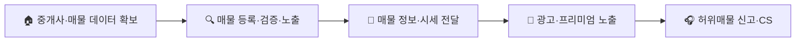

# 국내 부동산정보 플랫폼 시장 — 가치사슬(Value Chain) 분석
> 직방·다방형 매물 검색+중개 연결 모델을 기준으로 분석

## 1. 주요활동 (Primary Activities)

### 1-1. 투입·조달 물류 (Inbound Logistics)
**핵심 투입자원**: 공인중개사가 등록하는 매물 데이터(가격·사진·평면도), 실거래가·시세 공공데이터, 등기부등본 등 권리관계 정보.
- **설계 관점**: 이 시장의 핵심 투입자원은 물건(재고)이 아니라 공인중개사가 자발적으로 등록하는 '매물 데이터' 그 자체다. 따라서 중개사가 플랫폼에 매물을 등록할 유인(트래픽·리드 제공)을 얼마나 설계하느냐가 조달의 성패를 가른다. 국토부 실거래가 등 공공데이터와 중개사 등록 데이터를 어떻게 결합해 표준화하느냐도 핵심이다.
- **개선 관점**: 이 시장 고유의 리스크는 공급자(공인중개사)가 한국공인중개사협회로 조직화되어 있어 협상력이 매우 높다는 점이다. 협회가 자체 플랫폼('한방')으로 회원의 매물 등록을 유도·압박할 경우 특정 협회·중개사 네트워크에 대한 의존도가 특히 문제가 된다. 최근 부동산 빅데이터 오픈마켓 전환처럼 공공데이터 활용도를 높여 중개사 개별 등록에 대한 의존도를 낮추는 것이 개선 레버가 될 수 있다.

### 1-2. 운영·생산 (Operations)
**핵심 처리 과정**: 매물 등록 → 허위매물 검증 → 카테고리·지역별 노출 → 시세·실거래가 매칭 → 문의 연결.
- **설계 관점**: 이커머스·배달앱과 달리 이 시장의 '생산'은 실물 처리가 아니라 매물 데이터의 정확성 검증이다. 허위매물(미끼매물)을 걸러내는 검증 프로세스와, 중개사 문의를 실제 계약으로 이어줄 리드 매칭 로직 설계가 핵심 운영 과제다.
- **개선 관점**: 허위매물 신고·처리 건수, 매물 노출부터 문의 전환까지의 비율을 낮추고 높이는 것이 핵심 지표다. 자동 검증(AI 이미지·중복 매물 탐지)과 수동 심사(부동산매물클린관리센터 신고 처리)의 경계를 어디에 둘지가 검증 속도와 정확도의 트레이드오프를 결정한다.

### 1-3. 산출·배송 물류 (Outbound Logistics)
**핵심 전달 채널**: 앱 내 매물 상세페이지, 지도 기반 검색, 시세·실거래가 비교 화면, 중개사 연락처/채팅 연결.
- **설계 관점**: 배송할 실물이 없는 대신, 매물 정보(가격·위치·평면도·시세 추이)를 얼마나 이해하기 쉽게 전달하느냐가 핵심이다. 지도 기반 UX와 실거래가 그래프처럼 '탐색 경험'이 곧 전달 채널의 품질이다.
- **개선 관점**: 허위매물·낚시성 매물로 인한 신뢰 저하를 방지하고, 매물 정보가 실제 현장 상태와 얼마나 일치하는지(정확도)를 높이는 것이 개선의 핵심이다. 시세 변동 알림처럼 불필요한 알림을 줄이면서도 실수요자에게 필요한 타이밍 정보는 놓치지 않게 하는 균형이 필요하다.

### 1-4. 마케팅 및 영업 (Marketing & Sales)
- **설계 관점**: 핵심 고객은 매물을 찾는 실수요자와 매물을 등록하는 공인중개사 양면이다. 실수요자에게는 '가장 많고 정확한 매물'을, 중개사에게는 '가장 많은 문의 리드'를 제공하는 것이 핵심 가치제안이다. 직방·다방 모두 프리미엄 노출(광고 상품)을 중개사 대상 주요 수익모델로 삼는다.
- **개선 관점**: 정보 탐색만 하고 이탈하는 트래픽(계약까지 이어지지 않는 방문)을 실제 리드·수익으로 전환하는 비율을 높이는 것이 핵심 과제다. 직방이 중개·스마트홈으로 사업을 확장한 것처럼, 단순 매물 검색 트래픽을 중개 완료·부가서비스 매출로 연결하는 교차 판매가 지속가능성의 핵심이다.

### 1-5. 서비스 (Service)
- **설계 관점**: 허위매물 신고, 중개사와의 분쟁(매물 정보 불일치), 계약 관련 문의를 처리하는 체계가 핵심이다. 플랫폼은 직접 중개 당사자가 아니므로 중개사-이용자 간 분쟁에서 플랫폼의 책임 범위를 어떻게 설정할지가 서비스 설계의 난제다.
- **개선 관점**: 반복되는 허위매물 신고 패턴을 사전 검증 로직 개선으로 흡수할 수 있는지, 신고 처리 속도(부동산매물클린관리센터 기준)를 얼마나 단축할 수 있는지가 신뢰도와 직결된다.

## 2. 지원활동 (Support Activities)

### 2-1. 기업 인프라
- 이 시장의 기업 인프라 활동은 공인중개사법 개정을 둘러싼 대관·정책 대응이 유독 큰 비중을 차지한다. 한국공인중개사협회의 법정단체화 추진처럼 산업 전체의 룰을 흔드는 규제 리스크에 선제 대응하는 조직(법무·정책) 역량이 다른 시장보다 훨씬 중요하다.

### 2-2. 인적자원 관리
- 매물 검증(허위매물 심사) 인력과 개발·데이터 인력을 함께 운영해야 하며, 중개사 네트워크 영업(B2B) 조직과 소비자 대상 프로덕트 조직 간 우선순위 조율이 필요하다.

### 2-3. 기술 개발
- 허위매물·중복매물 자동 탐지, 지도 기반 검색·추천, 실거래가 예측 모델이 핵심 경쟁력이다. AI를 활용한 매물 이미지 검증과 시세 예측 정확도가 곧 신뢰도와 직결된다.

### 2-4. 조달·구매
- 클라우드 인프라와 더불어, 국토부 실거래가·공공 부동산 데이터에 대한 접근이 핵심 조달 대상이다. 데이터 오픈마켓 전환 이후에는 공공데이터 공급자에 대한 협상력 확보와 데이터 품질 관리가 새로운 조달 과제로 떠오른다.

## 종합 시사점
부동산정보 플랫폼의 가치사슬은 **"매물 데이터의 신뢰성 × 공급자(중개사) 관계 관리 × 규제 대응력"**이 핵심이다. 이커머스·배달앱과 달리 재고나 실물 이동이 없고, 대신 공급자가 조직화된 이익단체(공인중개사협회)로서 플랫폼에 강한 협상력을 행사한다는 점이 가장 큰 차별점이다. 이 때문에 투입·조달 물류와 기업 인프라 활동이 유독 밀접하게 얽혀 있으며, 직방처럼 정보 탐색형 트래픽을 중개·스마트홈 등 인접 사업으로 확장해 순수 매물 검색 광고 모델의 한계를 넘어서려는 시도가 경쟁력의 새로운 원천이 되고 있다.
