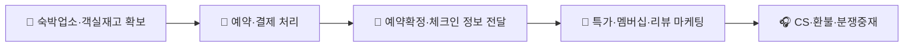
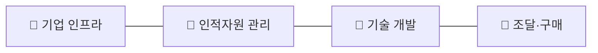

# 호텔 및 숙박업 플랫폼 시장 — 가치사슬(Value Chain) 분석
> 야놀자/여기어때형 예약 중개 + 호스피탈리티 SaaS 결합 모델을 기준으로 분석

## 1. 주요활동 (Primary Activities)

### 1-1. 투입·조달 물류 (Inbound Logistics)
**핵심 투입자원**: 숙박업소(모텔·펜션·호텔·게스트하우스)의 객실 재고, 가격·사진·편의시설 데이터, 리뷰·평점 데이터, 야놀자클라우드 등 PMS(객실관리시스템) 연동 데이터.
- **설계 관점**: 영세 숙박업주와 대형 호텔체인은 플랫폼 참여 유인이 다르다 — 영세업주는 노출·신규 예약 유입이, 체인 호텔은 브랜드 노출과 재고 소진 채널 확보가 핵심 유인이다. 야놀자클라우드처럼 예약·객실관리 SaaS를 무료·저가로 보급해 PMS 데이터를 플랫폼에 직접 연동시키는 것이 객실 재고를 실시간으로 확보하는 핵심 설계 포인트다.
- **개선 관점**: 성수기에 특정 지역·업소로 예약이 몰릴 때 객실 재고 정보(잔여 객실 수)의 실시간 정합성을 얼마나 유지할 수 있는지가 오버부킹·노쇼 리스크를 좌우한다. PMS 연동 업소 비율을 늘려 수기 입력에 의존하는 재고 오류를 줄이고, 리뷰·평점 데이터의 어뷰징(허위 리뷰)을 걸러내는 것이 정보 신뢰도를 높이는 핵심 레버다.

### 1-2. 운영·생산 (Operations)
**핵심 처리 과정**: 검색·필터링 → 객실 선택 → 결제(선결제/현장결제) → 예약확정 → (해외 예약 시) 환율·해외결제 처리.
- **설계 관점**: 국내 숙박(원화 결제, 단기간 예약)과 해외 숙박(외화 결제, 환율 변동, 장기 예약)을 하나의 플랫폼에서 어떻게 처리할지가 결제 아키텍처 설계의 핵심이다. 성수기 트래픽 급증(휴가철, 연휴) 시 검색·결제 시스템이 버틸 수 있는지, 초특가 타임세일 오픈 시 동시 접속 폭주를 어떻게 처리할지도 설계 단계에서 결정해야 한다.
- **개선 관점**: 결제 성공률과 예약 확정률, 오버부킹으로 인한 강제 취소 발생률을 낮추는 것이 핵심 개선 지표다. 성수기·비수기 수요 변동에 따라 동적 가격(다이나믹 프라이싱) 추천이 실제 판매율 개선으로 이어지는지, 노쇼(예약 후 미방문) 비율을 결제 정책(선결제 유도)으로 낮출 수 있는지가 관건이다.

### 1-3. 산출·배송 물류 (Outbound Logistics)
**핵심 전달 채널**: 예약확정 알림(앱·문자·이메일), 체크인 안내·바우처, 실시간 리뷰·평점 노출.
- **설계 관점**: 예약확정 후 체크인 시간·위치·연락처 등 실물 서비스 이용에 필요한 정보를 얼마나 명확하게 전달하는지가 이커머스의 "배송 추적"에 대응하는 핵심 경험이다. 해외 예약의 경우 현지어·시차를 고려한 안내가 추가로 필요하다.
- **개선 관점**: 예약 변경·취소 시 환불 규정을 고객이 예약 전에 명확히 인지하도록 개선할 수 있는지, 체크인 직전 리마인드 알림이 노쇼를 줄이는 데 기여하는지가 핵심이다. 과도한 프로모션 알림으로 인한 피로도를 낮추는 것도 개선 과제다.

### 1-4. 마케팅 및 영업 (Marketing & Sales)
- **설계 관점**: 핵심 고객은 소비자(투숙객)와 숙박업소(공급자) 양면이다. 소비자에게는 최저가·특가·멤버십(야놀자 NOL 포인트 등) 혜택을, 숙박업소에게는 노출 순위 상승 광고와 신규 예약 유입을 핵심 가치로 제공한다. 리뷰·평점은 소비자의 선택을 좌우하는 핵심 마케팅 자산이자 신뢰 지표다.
- **개선 관점**: 특가 프로모션이 종료된 이후에도 재예약(LTV)으로 이어지는지, 국내 숙박에서 해외여행 상품(항공+숙박 패키지)으로 교차 판매율을 높일 수 있는지가 핵심이다. 숙박업소의 광고비 부담이 과도해 이탈로 이어지지 않는지, 리뷰 어뷰징이 마케팅 신뢰도를 훼손하지 않는지 관리해야 한다.

### 1-5. 서비스 (Service)
- **설계 관점**: 예약 취소·환불 지연, 숙박업소 현장 서비스 불만(청결·시설 하자), 오버부킹으로 인한 투숙 거부 등을 처리하는 CS 체계, 그리고 소비자-숙박업소 간 분쟁 중재 체계가 핵심이다.
- **개선 관점**: 반복되는 CS 유형(환불 규정 문의, 오버부킹 클레임)을 예약 단계의 명확한 안내로 선제 흡수할 수 있는지, 분쟁 발생 시 책임 소재(업소 시설 문제 vs 플랫폼 시스템 오류)를 데이터로 구분할 수 있는지가 CS 효율성을 결정한다. 야놀자클라우드 도입 업소에는 예약 관리 기술지원까지 서비스 범위가 확장된다.

## 2. 지원활동 (Support Activities)

### 2-1. 기업 인프라
- 예약 중개 플랫폼(야놀자)과 클라우드 호스피탈리티 SaaS 자회사(야놀자클라우드) 간 사업 경계 설정이 필요하며, 나스닥 상장을 추진하는 만큼 해외 투자자 대상 지배구조·회계 투명성 요구도 커진다. 공유숙박 영업신고 규제 대응을 위한 대관·정책 조직의 역할이 중요하다.

### 2-2. 인적자원 관리
- 예약·결제 시스템을 다루는 개발 인력과, 숙박업주 대상 SaaS 영업·기술지원 인력의 역할이 다르다. 성수기 CS 폭주에 대응하는 인력 탄력 운영(성수기 증원)이 필요하며, 해외 OTA와의 경쟁에서 글로벌 사업 확장 인재 확보도 과제다.

### 2-3. 기술 개발
- 동적 가격(다이나믹 프라이싱) 알고리즘, 리뷰 신뢰도(어뷰징 탐지) 모델, PMS(객실관리시스템) 등이 핵심 경쟁력이다. 예약 중개를 넘어 호텔 운영 인프라(클라우드 PMS)를 해외 190여 개국에 공급하는 만큼, 국가별 규제·언어·통화를 지원하는 기술 확장성이 중요하다.

### 2-4. 조달·구매
- 클라우드 인프라, PG사(국내외 결제·환전 처리), 지도 API, 리뷰 검증 솔루션이 핵심 조달 대상이다. 해외 OTA(트립닷컴·아고다) 대비 결제 인프라의 환율·수수료 경쟁력을 확보하는 것이 중요하다.

## 종합 시사점
호텔·숙박업 플랫폼의 가치사슬은 **"객실 재고의 실시간 정합성 × 리뷰·평점 신뢰도 × 성수기 수요 대응력"**이 핵심이다. 이커머스·배달앱과 달리 물리적 재고(객실)는 숙박업소가 보유하지만, 플랫폼이 PMS(야놀자클라우드)를 통해 그 재고 데이터를 선점하면 예약 중개를 넘어 호스피탈리티 인프라 전체로 사업을 확장할 수 있다는 점이 이 시장 고유의 구조다. 성수기·비수기 수요 변동성을 흡수하는 동적 가격·CS 탄력 운영과, 공유숙박 규제 환경에서 신뢰(리뷰)를 지키는 것이 지속가능한 경쟁 우위의 원천이다.
