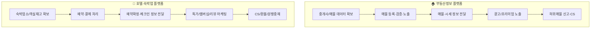

# 부동산정보 플랫폼 vs 호텔·숙박업 플랫폼 — 가치사슬 비교

| 활동 | 부동산정보 플랫폼 | 호텔·숙박업 플랫폼 |
|---|---|---|
| 투입·조달 물류 | 공인중개사가 자발적으로 등록하는 매물 데이터 확보가 핵심, 재고 없음 | 숙박업소의 실물 객실 재고 + PMS 연동 데이터 확보가 핵심 |
| 운영·생산 | 매물 데이터의 정확성 검증(허위매물 필터링)이 '생산'의 본질 | 검색-결제-예약확정의 실시간 처리, 국내외 결제·환율 처리 포함 |
| 산출·배송 물류 | 실물 배송 없이 매물·시세 정보를 이해하기 쉽게 전달(지도·그래프 UX) | 예약확정·체크인 안내 등 실물 서비스 이용 정보 전달 |
| 마케팅 및 영업 | 실수요자(정보탐색) + 중개사(리드) 양면, 탐색 트래픽의 수익화가 과제 | 소비자(특가/멤버십) + 숙박업소(노출광고) 양면, 리뷰가 핵심 마케팅 자산 |
| 서비스 | 허위매물 신고 처리, 플랫폼-중개사 책임범위 설정이 난제 | 환불·오버부킹 CS, 야놀자클라우드 도입 업소엔 기술지원까지 확장 |
| 기업 인프라 | 공인중개사법 개정 등 대관·정책 대응 비중이 유독 큼 | 나스닥 상장 추진에 따른 지배구조 요구 + 공유숙박 규제 대응 |
| 인적자원 관리 | 매물 검증 인력 + 중개사 대상 B2B 영업조직 운영 | 성수기 CS 탄력 인력 + 숙박업주 대상 SaaS 영업·기술지원 인력 |
| 기술 개발 | 허위매물 자동탐지, 지도 검색, 실거래가 예측 모델 | 다이나믹 프라이싱, 리뷰 어뷰징 탐지, 글로벌 PMS 확장성 |
| 조달·구매 | 클라우드 + 국토부 실거래가 등 공공데이터 접근이 핵심 조달 대상 | 클라우드, 국내외 PG사·환전, 지도 API, 리뷰 검증 솔루션 |

## 핵심 차이

1. **재고(자산)를 누가 쥐고 있는지가 다르다.** 부동산정보 플랫폼은 물리적 재고가 아예 없고, 대신 '매물 데이터'라는 정보 자산을 공급자(공인중개사)가 자발적으로 등록해줘야만 확보할 수 있다. 반면 호텔·숙박업 플랫폼은 객실이라는 물리적 재고가 실재하며, 그 재고 데이터를 실시간으로 얼마나 정확히 반영하느냐(PMS 연동)가 운영의 핵심 과제다. 즉 부동산은 "데이터 자체가 존재하게 만드는 것"이 과제이고, 호텔·숙박은 "이미 존재하는 재고의 실시간 정합성을 유지하는 것"이 과제다.

2. **공급자 관계의 성격이 다르다.** 부동산정보 플랫폼의 공급자(공인중개사)는 한국공인중개사협회로 조직화되어 플랫폼에 맞설 수 있는 정치적 협상력을 가진 반면, 호텔·숙박업 플랫폼의 공급자(영세 숙박업주)는 분산되어 있어 오히려 플랫폼(야놀자클라우드 등 SaaS)에 기술적으로 종속되는 방향으로 관계가 흘러간다. 같은 "양면 플랫폼"이라도 공급자의 조직력이 가치사슬 전반의 힘의 균형을 정반대로 결정짓는다.

3. **수익화 지점이 다르다.** 부동산정보 플랫폼은 정보 탐색과 실제 거래(계약) 사이의 간극이 커서, 탐색만 하고 이탈하는 트래픽을 어떻게 리드·수익으로 전환하느냐가 마케팅·영업 활동의 핵심 난제다. 반면 호텔·숙박업 플랫폼은 검색에서 결제까지 원스톱으로 완결되는 구조라 전환 경로가 짧고, 대신 성수기·비수기 수요 변동성을 동적 가격으로 흡수하는 것이 수익화의 핵심이다.

4. **사업 확장의 방향은 닮았다.** 두 시장 모두 순수 중개 모델을 넘어 인접 인프라 사업으로 확장한다는 공통점이 있다 — 부동산은 매물 검색에서 중개·스마트홈으로, 호텔·숙박은 예약 중개에서 클라우드 기반 PMS(호스피탈리티 SaaS)로 나아간다. 다만 부동산은 소비자 인접 영역(스마트홈)으로, 호텔·숙박은 공급자 인접 영역(운영 인프라)으로 확장한다는 방향의 차이가 있다.

## 전략적 시사점

- **투자 우선순위**: 부동산정보 플랫폼은 매물 데이터의 신뢰성(허위매물 검증 기술)과 공인중개사 네트워크 관계 관리에, 호텔·숙박업 플랫폼은 객실 재고의 실시간 정합성(PMS 연동 확대)과 리뷰 신뢰도 관리에 투자를 우선해야 한다.
- **리스크 관리 초점**: 부동산정보 플랫폼은 공인중개사법 개정처럼 공급자 이해관계 단체발 규제 리스크를, 호텔·숙박업 플랫폼은 공유숙박 규제·해외 OTA 침투·나스닥 상장에 따른 지배구조 요구라는 복합 리스크를 기업 인프라 활동에서 선제 관리해야 한다.
- **공통 시사점**: 두 시장 모두 순수 중개 수수료 모델만으로는 수익성 한계에 부딪혀(직방의 오랜 적자, 야놀자의 영업손실), 정보 중개자에서 인프라 제공자(스마트홈 · 호스피탈리티 SaaS)로 가치사슬을 수직 확장하는 것이 생존 전략이 되고 있다. 또한 두 시장 모두 신뢰(허위매물 없음 / 정확한 리뷰)가 곧 핵심 경쟁자산이라는 점에서, 검증·필터링 기술 투자가 마케팅비 지출보다 장기적으로 더 중요한 차별화 지점이 될 수 있다.
