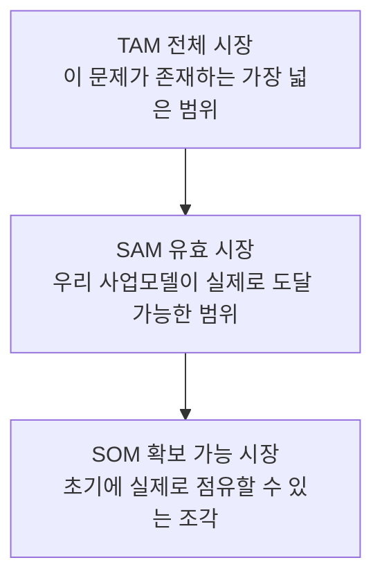
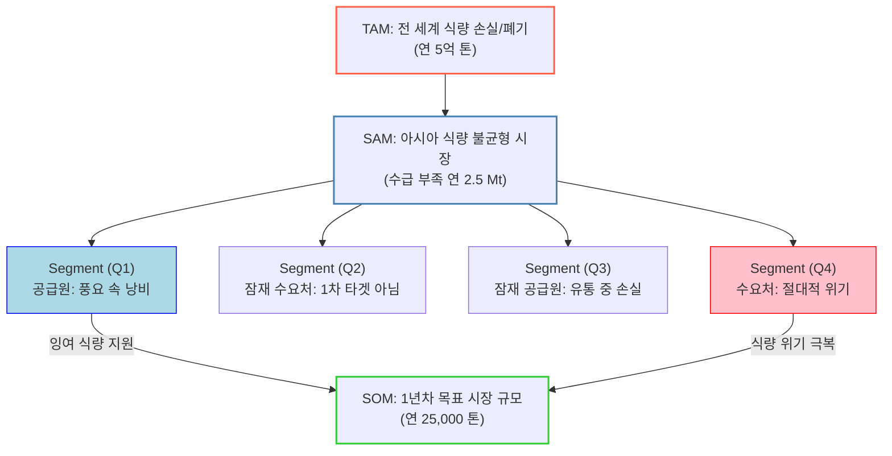

# TAM-SAM-SOM & Market Segment Map 분석 방법론

Five Forces가 "이 산업이 돈이 될까?", 가치사슬이 "우리는 어디서 마진을 만드나?"를 묻는다면, **TAM-SAM-SOM**은 "그 마진을 만들 수 있는 시장이 실제로 얼마나 크고, 우리가 지금 당장 먹을 수 있는 조각은 얼마인가?"를 숫자로 답하는 도구입니다.

## 모델 구조

- **TAM (Total Addressable Market)**: 이 문제·수요가 존재하는 가장 큰 범위. 지리·법규·업종 정의 등 최상위 기준으로만 자른다.
- **SAM (Serviceable Available Market)**: TAM 중에서 우리 사업모델·채널·타깃 고객 정의로 실제 서비스가 가능한 범위.
- **SOM (Serviceable Obtainable Market)**: SAM 중에서 초기 자원·경쟁 상황을 고려했을 때 현실적으로 확보 가능한 조각. 보통 "1~3년 내 목표 매출/물량"으로 환산한다.

축을 좁힐 때마다 **왜 그 조건으로 좁히는지**를 설명할 수 있어야 한다는 것이 핵심이다. 단순히 "전체의 10%" 같은 임의 비율을 곱하는 것이 아니라, 실제 데이터(인구·거래량·자격 조건 등)로 각 단계의 경계를 그어야 숫자에 설득력이 생긴다.

## Market Segment Map — TAM을 어떻게 쪼갤지 정하는 지도

TAM-SAM-SOM이 "얼마나 큰가"를 답한다면, Market Segment Map은 그 전에 "**어느 조각을 잘라야 하는가**"를 정하는 단계다. 고객 특성 축(연령, 지역, 업종 등)과 Pain 축(문제를 얼마나 자주·심하게 겪는가)을 분리해서 교차시키면, 단순히 "규모가 큰 세그먼트"가 아니라 "문제가 실제로 반복·심각하게 발생하는 세그먼트"를 찾을 수 있다.

### 예시: 전 세계 식량 손실·폐기 시장

아래는 TAM(문제가 존재하는 최상위 범위) → SAM(사업모델이 도달 가능한 범위) → Segment(2×2 세분화) → SOM(초기 확보 목표)으로 좁혀가는 구조를 보여주는 예시다. 이 시장에서는 "공급 과잉(음식이 남는 지역)"과 "수요 결핍(음식이 부족한 지역)"이라는 두 개의 축이 자연스럽게 2×2 세분화를 만들고, 그중 실제 사업 모델이 연결할 수 있는 두 세그먼트(Q1 공급원, Q4 수요처)만 SOM으로 이어진다.

이 예시가 보여주는 핵심 원칙 세 가지는 다음 문서들에서 국내 부동산정보 플랫폼 시장에도 동일하게 적용된다.

1. **SAM은 TAM의 임의 비율이 아니라 별도 근거(지역·자격·행동 조건)로 정의한다.** 위 예시에서는 "전 세계"에서 "아시아의 수급 불균형"으로 좁히는 근거가 별도로 필요하다.
2. **Segment Map은 2개 축의 교차로 그린다.** 하나의 축만으로는 "누가 크다"만 보이고 "어디에 진짜 기회가 있다"가 보이지 않는다.
3. **SOM으로 가져가는 조각은 세그먼트 전체가 아니라 사업모델이 실제로 연결할 수 있는 셀(cell)이다.** 위 예시에서도 4개 세그먼트 중 2개(Q1, Q4)만 SOM으로 연결된다.

다음 문서부터는 이 원칙을 국내 부동산정보 플랫폼 시장의 실제 심층 리서치(Pain Point 발굴 → 문제·세그먼트 후보 비교 → 인과분석 → 가설 수립·검증 → 세그먼트 재정의 → Market Segment Map/TAM-SAM-SOM)에 그대로 적용한 과정을 담는다.
