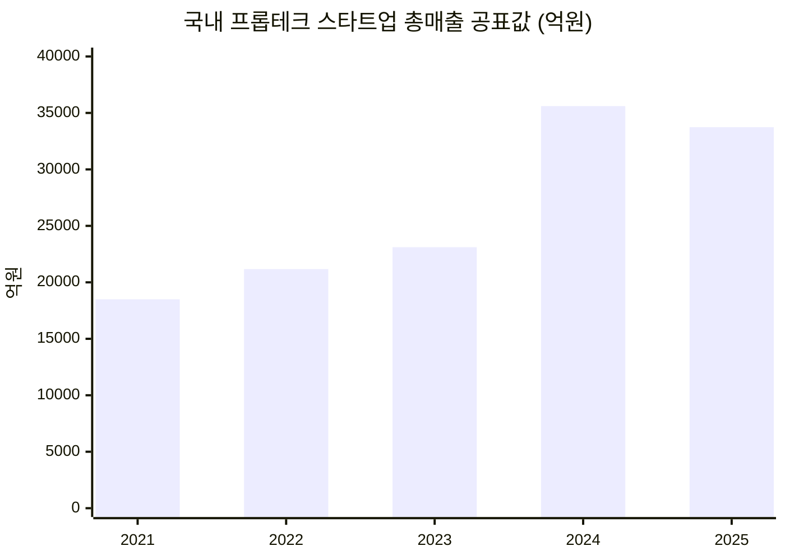
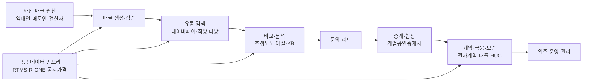

# 국내 부동산정보 플랫폼 시장 개요 (2021~2026)

> TAM-SAM-SOM 분석의 출발점이 되는 시장 스캔. 아래 수치는 이후 문서에서 SAM·SOM 경계를 그을 때 근거로 다시 사용된다.

## 시장 규모: 단일 숫자가 없는 시장

국내에는 '부동산정보 플랫폼'만을 독립 집계하는 공식 통계가 없다. 그래서 세 종류의 서로 다른 proxy를 병행해서 봐야 한다 — ① 프롭테크 기업 매출(상위 개념), ② 개별 플랫폼 매출(기업 economics), ③ 앱 이용자·거래량·전자계약 건수(수요 활동량). 세 수치는 조사대상 자체가 다르므로 직접 합산하면 안 된다.

- 2025년 광의 프롭테크 매출은 3조3,735억원(전년 대비 표면상 -6.4%)이지만, 조사기업 수가 약 131개→103개로 줄어든 표본효과가 크다. 기업당 평균매출은 오히려 +19% 증가했다.
- 반면 신규투자(1,921억원, -25.4%)와 고용(1만3,026명, -9.5%)의 감소는 표본효과가 아닌 실질적인 자본·고용 긴축으로 해석된다.
- 같은 기간 전통 부동산서비스산업 전체 매출은 2023년 -13.7%, 2024년 -2.8%로, 프롭테크 성장률(+9.1%, +17.2%)과 반대 방향으로 움직였다 — "전통 부동산 경기가 나빠도 디지털·데이터 기업군은 상대적으로 견조하다"는 방향성이 확인된다.

## 가치사슬: '광고→리드'에서 '데이터→거래 workflow'로 확장

국토교통부·한국부동산원이 실거래·시세 데이터를 Open API로 공개하면서 "단순 실거래 조회"는 점차 공공재화되고 있다. 민간 플랫폼의 차별화 지점은 데이터 정제·최신성·검증·중개 네트워크·계약 workflow로 이동 중이다.

## 핵심 지표 스냅샷

| 지표 | 값 | 기준 | 의미 |
|---|---:|---|---|
| 독립 앱 이용자 | 호갱노노 228만 · 직방 134만 · 다방 80만 | 2026년 5월 | 매물 검색보다 시세·단지 모니터링(반복 이용)이 더 강한 engagement |
| 전자계약 건수 | 50만7,431건 (전년의 2.2배) | 2025년 | 계약 단계 디지털화가 급성장 중이나 |
| 전자계약 활용률 | 12.04% | 2025년 11월 | 여전히 거래의 약 88%는 전자계약 밖에서 처리됨 |
| 영업 중 개업공인중개사 | 10만9,616명 | 2025년 11월 | 2022년 정점(11만8,952명) 대비 -7.9%, 폐·휴업이 신규개업을 지속 상회 |
| 허위매물 확인 | 신고 1만5,935건 중 1만1,339건 확인 | 2025년 상반기 | 신뢰(trust layer) 문제가 구조적으로 미해결 |
| 전세사기 피해자등 누적 | 3만9,121건 | 2023.6~2026.5 | 저빈도지만 심각성이 매우 큰 risk layer |
| 1인가구 | 804만5천 가구 (36.1%) | 2024년 | 소형주거·임대차·월세관리 수요의 구조적 기반 |

## 사용자 여정 기반 Pain Point 우선순위

아래 점수는 공식 설문이 아니라 **심각성 30% + 고객규모 25% + 빈도 20% + 성장성 15% + 미해결도 10%**로 계산한 분석용 상대점수다.

| 여정·고객 | Pain Point | 우선순위 |
|---|---|---:|
| 중개→계약 | 계약·본인인증·신고·대출·보증을 별도 절차로 처리 | **4.40** |
| 비교 / 매수·임차인 | 실거래·호가·시세·대출·세금·정책·단지정보가 분산, 기준시점 상이 | **4.35** |
| 광고·영업 / 중개사 | 광고비 대비 유효 lead·실제 계약 ROI 측정 곤란 | **4.35** |
| 매물 등록 / 중개사 | 여러 채널에 매물·가격·사진을 반복 관리·동기화 | 4.20 |
| 공급 / 임대인·매도인 | 하나의 '매물 원장' 없이 채널마다 가격·상태가 달라짐 | 4.20 |
| 탐색→계약 / 임차인 | 전세 보증금·권리관계·사기 위험을 스스로 해석해야 함 | 4.10 |

가장 높은 점수를 받은 것은 **계약·서류 workflow**, **의사결정 정보 파편화**, **중개사 lead ROI**다. 허위매물·전세사기 같은 극단적 사건만 우선순위가 높은 것이 아니라, 수백만 사용자와 11만여 중개사에게 **반복적으로** 발생하는 데이터 reconciliation·transaction workflow 마찰이 총시장 관점에서는 더 큰 문제일 수 있다는 뜻이다.

## 가장 큰 미해결 영역: '검색'이 아니라 'closing'

검색·매물·시세 영역에는 이미 네이버페이 부동산·호갱노노·직방·다방·KB 같은 강한 사용자 접점이 있고, 누적 프롭테크 투자의 48.9%가 마케팅 플랫폼에 집중돼 있다. 반대로 **실제 거래를 안전하게 끝내는 전자계약의 침투율은 12% 수준**이고, 허위매물·전세사기·중개사 workflow 문제는 여전히 별개 시스템으로 관리된다. 신규 사업기회 관점에서 가장 큰 whitespace는 또 하나의 매물 검색 앱이 아니라 **"검증된 데이터가 계약까지 이어지는 infrastructure/workflow layer"**일 가능성이 높다.

이 판단을 바탕으로 다음 문서에서는 다섯 개의 Pain Point 후보를 좁혀 TAM-SAM-SOM·Market Segment Map 분석에 적합한 문제·세그먼트를 선정한다.

## Sources
- 국토교통부 부동산거래 전자계약시스템 `https://irts.molit.go.kr/`
- 국토교통부 부동산거래관리시스템(RTMS) `https://rtms.molit.go.kr/`
- 한국부동산원 부동산거래현황 `https://www.reb.or.kr/`
- 한국공인중개사협회 `https://www.kar.or.kr/`
- 한국프롭테크포럼 회원사 편람(2025·2026)
- KISO 부동산매물클린관리센터 거짓매물 신고·확인 통계
- 국토교통부 전세사기피해지원위원회 누적 결정 통계
- 통계청 장래가구추계(1인가구)
