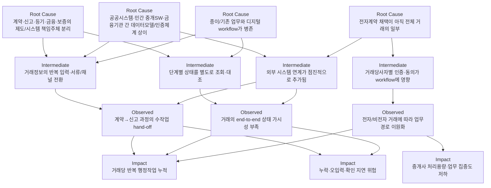
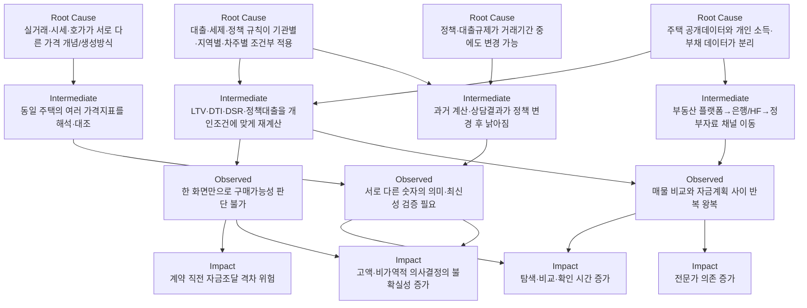
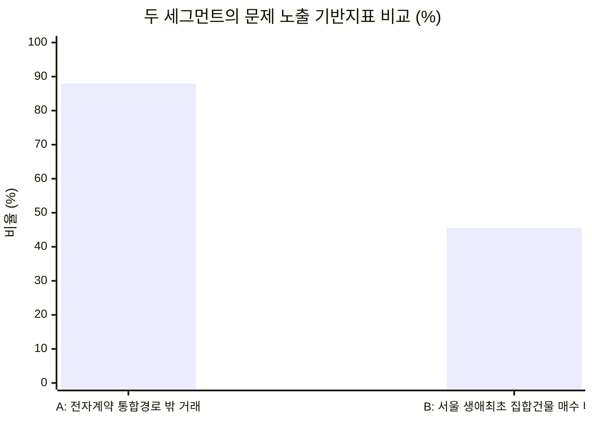

# 세그먼트 A·B 심층 인과 분석

> 분석기간 2021~2026년(2026년 공개분까지 반영). 핵심 결론은 두 문제 모두 "정보가 부족해서"가 아니라 **이미 존재하는 데이터·시스템·서비스의 경계가 실제 의사결정/업무 단위와 일치하지 않아 생기는 연결 실패**에 가깝다는 점이다.

## 세그먼트 정의

| | 세그먼트 A | 세그먼트 B |
|---|---|---|
| 고객 | 수도권에서 주거 거래를 반복 처리하는 개업공인중개사 | 수도권 생애최초·실거주 주택 구매자 |
| 문제 축 | 거래 프로세스 분절 (Workflow Fragmentation) | 의사결정 정보 파편화 (Information Integration Burden) |

## A. 거래 프로세스 분절 — 개업공인중개사

**문제 정의.** 중개사는 계약 체결뿐 아니라 당사자 확인, 계약정보 관리, 거래·임대차 신고, 확정일자, 보증·금융 정보 전달, 후속 행정상태 확인까지 여러 단계에 관여한다. 개별 단계는 전산화됐지만 **거래 전체를 하나의 지속적인 업무 객체로 처리하는 통합도가 낮아, 채널 전환·재확인·재입력·상태 추적**이 반복 발생하는 것이 핵심이다.

전자계약을 쓰면 계약 작성·서명·중개사 확인 후 실거래·임대차 신고와 확정일자가 자동 **신청**된다(완료가 아니라 신청 — 결과 확인은 RTMS/관할기관에서 따로 해야 한다). 일반 경로에서는 당사자가 30일 이내 별도 신고서를 등록해야 한다. 2025년 하반기 HUG 연계, 협회 '한방' 양방향 수정 연계, 2026년 1월 인증수단 3종→15종 확대가 이어졌다는 사실 자체가 **연결비용이 실재했다는 간접 증거**다.

| 관측치 | 값 | 의미 |
|---|---:|---|
| 2025년 전자계약 | 50만7,431건 (전년의 2.2배) | 디지털 전환 가속 |
| 민간 중개 전자계약 | 32만7,974건 (전년의 4.5배) | 중개 현장의 채택 확산 |
| 전자계약 이용률 | 12.04% (2025.11) | 87.96%는 통합경로 밖 — 단 이 수치를 "중개사의 문제 경험률"로 바로 해석하면 안 됨 |
| 전국 영업 중개사 | 10만9,616명 (2025.11 상한) | 수도권 주거중개만의 SAM은 별도 산출 필요 |

**가장 큰 연구공백**은 "거래 1건당 몇 분·몇 번·얼마의 비용으로 나타나는가"다. 시스템 구조와 채택률은 강하게 관찰되지만, 중개사 단위의 productivity loss는 아직 직접 정량화되지 않았다.

## B. 의사결정 정보 파편화 — 생애최초·실거주 구매자

**문제 정의.** 이 세그먼트가 답해야 하는 질문은 "실거래가가 얼마인가" 하나가 아니라 **"내 소득·부채·정책조건에서 이 주택을 얼마까지 살 수 있고, 지금 가격이 합리적이며, 대출·세금·정책변경까지 고려한 최종 부담을 감당할 수 있는가"**다. 이 질문에 필요한 주택 데이터와 개인 금융 데이터는 서로 다른 제도·기관·기준시점에 위치한다.

한국부동산원 거래통계는 전국 시군구에 신고된 거래를 RTMS로 취합한 값이고, 플랫폼 호가·시세는 전혀 다른 개념이다. 대출 가능액도 주택가격뿐 아니라 지역·차주유형·소득·부채·DSR·정책상품 요건에 따라 달라진다. 2025년 6월 28일부터 수도권·규제지역 생애최초 LTV가 80%→70%로 낮아지며(6억원 주택 기준 단순 예시로 한도 차이 6,000만원), 10월에는 규제지역·가격구간별 규칙이 다시 세분화됐다 — **정책이 탐색 기간 중에도 바뀔 수 있다는 것 자체가 통합 부담의 구조적 근거**다.

| 관측치 | 값 | 의미 |
|---|---:|---|
| 수도권 생애최초 집합건물 매수 | 18,430명 (2026.1) | 서울 6,553·경기 10,275·인천 1,602 |
| 서울 연간 생애최초 매수 | 61,161건 (2025) | 2024년 48,493건 대비 +26.1% |
| 주택금융상품 이용률 | 36.4% (일반가구), 30대 이하 43.8% | 금융 노출도가 청년층에서 특히 높음 |
| 구매의향 무주택가구 | 55.5% (n=1,885) | 희망가격 평균 4억6,210만원, 46.3%가 3~6억원 구간 |

## A vs B 비교

두 시장의 가장 큰 차이는 **Pain의 반복 단위**다. A는 '거래 1건'이 반복 단위라 한 중개사가 같은 마찰을 지속 경험하고, B는 거래 자체는 저빈도지만 한 번의 의사결정 금액·금융리스크가 매우 크며 탐색 기간 중 같은 판단을 여러 번 갱신한다.

두 분모가 서로 다른 정의이므로("A 87.96%가 B보다 두 배 심각하다"는 식의 해석은 불가능) 절대 비교는 할 수 없지만, **A는 within-subject 설계(동일 중개사의 전자/비전자 거래 비교)가 가능해 짧은 기간에 인과 가설을 강하게 검증하기 유리**하고, **B는 등기·거래·금융 공공데이터가 풍부해 정량연구 준비도는 더 높다**는 차이가 있다.

이 인과구조를 토대로 다음 문서에서는 각 세그먼트에서 가장 먼저 검증해야 할 falsifiable 가설을 수립한다.
