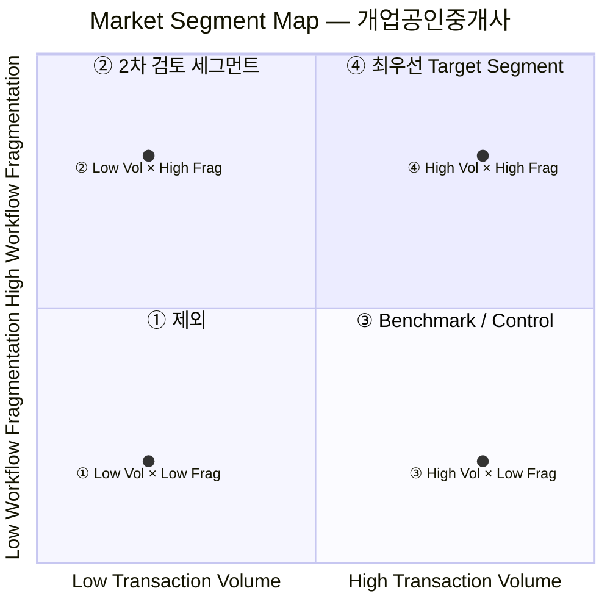
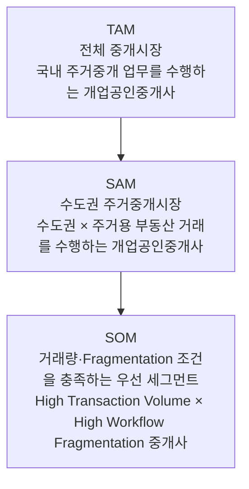
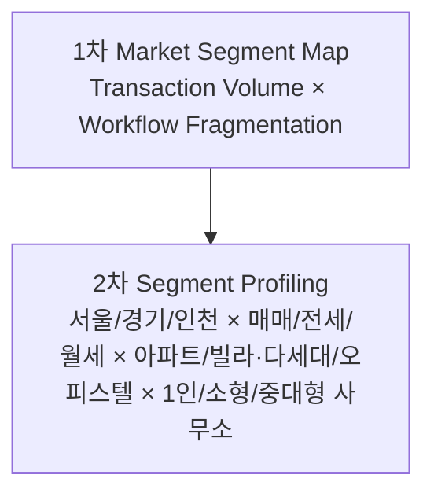

# Market Segment Map & TAM-SAM-SOM — 세그먼트 A (개업공인중개사)

> 이 단계의 목적은 "누가 많은가"가 아니라 **"어디에서 문제가 반복적으로 크게 발생하는가"**를 찾는 것이다. 06번 문서에서 A가 Market Segment Map을 진행할 준비가 됐다고 판단했으므로, A를 기준으로 2×2 Map을 작성하고 TAM-SAM-SOM으로 좁혀간다.

## 세분화 기준 정리

고객 특성 축("누구인가")과 Pain 축("얼마나 심하게 겪는가")을 분리하는 것이 핵심이다.

| 고객 특성 기준 | 세부 구분 | 중요도 |
|---|---|---|
| 월 거래량 | 저 / 중 / 고 | ★★★★★ |
| 사무소 규모 | 1인 / 소형 / 중대형 | ★★★★ |
| 거래유형 | 매매 / 전세 / 월세 | ★★★★ |
| 주택유형 | 아파트 / 빌라·다세대 / 오피스텔 | ★★★★ |
| 디지털 활용도 | 수기 중심 / 혼합 / 디지털 중심 | ★★★★ |
| 사용 시스템 수 | 적음 / 많음 | ★★★★ |
| 지역 | 서울 / 경기 / 인천 | ★★★ |
| 전자계약 활용도 | 미사용 / 일부 / 적극 | ★★★ (핵심 축으로는 사용하지 않음) |

> 전자계약 활용도를 핵심 세분화 축으로 쓰지 않는 이유: 06번 문서에서 이미 확인했듯 **전자계약 사용 여부 ≠ Workflow 통합 수준**이기 때문이다. 향후 각 세그먼트를 설명하는 보조변수로만 사용한다.

| Pain 세분화 기준 | 의미 | 핵심성 |
|---|---|---|
| System Switching | 거래 1건 처리 시 시스템·사이트 간 이동 횟수 | ★★★★★ |
| Manual Handoff | 전화·문자·메일·문서로 정보를 직접 전달하는 횟수 | ★★★★★ |
| Duplicate Entry | 동일 정보를 다른 시스템에 재입력 | ★★★★★ |
| Follow-up Check | 신고·승인·처리상태 재확인 | ★★★★★ |
| Rework / Correction | 누락·오류·변경으로 재처리 | ★★★★★ |
| **Workflow Fragmentation** | 위 요소들의 종합적 분절 수준 | ★★★★★ |
| 행정 Active Time | 거래 1건당 실제 행정업무 시간 | ★★★★★ |

여기서 중요한 구분이 있다: **Workflow Fragmentation은 원인에 가까운 변수**이고 **Active Processing Time / Rework는 결과변수**다. 따라서 Segment Map의 축은 결과(업무시간)가 아니라 **Fragmentation 자체**를 쓰는 것이 좋다 — 시스템 5개를 써도 자동연동돼 있으면 Fragmentation은 낮을 수 있고, 시스템 3개뿐이어도 매번 수기로 복사·전화확인하면 Fragmentation은 높을 수 있기 때문이다.

## 최종 Market Segment Map — 2×2

| | Workflow Fragmentation **낮음** | Workflow Fragmentation **높음** |
|---|---|---|
| **월 거래량 높음** | ③ High Volume × Low Fragmentation | **④ High Volume × High Fragmentation** |
| **월 거래량 낮음** | ① Low Volume × Low Fragmentation | ② Low Volume × High Fragmentation |

X축을 "사무소 규모"가 아니라 "월 거래량"으로 잡은 이유는, 1인 사무소도 거래량이 많을 수 있고 직원이 많아도 거래가 적을 수 있어 **거래량이 Pain Exposure(거래가 발생할 때마다 반복)와 더 직접적으로 연결**되기 때문이다.

### 4개 셀 평가

| Segment | Pain 빈도 | Pain 강도 | 시장 매력도 | 접근 가능성 | 평가 |
|---|---:|---:|---:|---:|---|
| ① Low Volume × Low Fragmentation | 1 | 1 | 1 | 4 | 제외 |
| ② Low Volume × High Fragmentation | 2 | 5 | 3 | 4 | 2차 검토 세그먼트 |
| ③ High Volume × Low Fragmentation | 5 | 2 | 3 | 3 | Benchmark/Control 세그먼트 |
| **④ High Volume × High Fragmentation** | **5** | **5** | **5** | 4 | **최우선 Target Segment** |

**④가 최우선인 이유**: `Workflow Fragmentation × Transaction Volume = Cumulative Administrative Burden`. Pain의 빈도와 강도가 동시에 가장 높은 유일한 셀이며, A라는 문제 정의가 맞다면 가장 먼저 검증해야 할 고객군이다. **③은 정답을 부정하는 역할을 한다** — 거래량이 많아도 Fragmentation이 낮은 집단이 존재한다면 "무엇이 두 집단의 차이를 만드는가"를 밝힐 수 있는 비교군(control)이 되기 때문이다.

> **주의**: "월 5건 이상 = High" 같은 임의의 절대 기준을 지금 넣지 않는다. 실제 중개사 데이터를 확보해 월 거래량의 중앙값·상위/하위 25%를 먼저 확인한 뒤 경계값을 정해야 한다. Fragmentation도 System Switching/Manual Handoff/Duplicate Entry/Follow-up Check 네 항목을 개별 수집해 분포를 확인한 뒤 Composite Index로 구성한다. 이번 단계에서는 High/Low를 **개념적으로만** 정의한다.

## TAM → SAM → SOM

| 단계 | 정의 | 근거 |
|---|---|---|
| **TAM** | 국내 전체 개업공인중개사 | 2025년 11월 영업 중 10만9,616명 (전국 상한) |
| **SAM** | 수도권 × 주거용 부동산 거래를 수행하는 개업공인중개사 | 지역·거래유형 필터 — 별도 집계 필요 |
| **SOM** | 1순위: 수도권에서 주거 중개거래를 반복적으로 많이 수행하면서, 거래 처리 과정의 Workflow Fragmentation이 높은 개업공인중개사 (④ High Volume × High Fragmentation) | Market Segment Map 4개 셀 평가에서 Pain 빈도·강도·시장매력도가 모두 최고 |

**2순위 SOM 후보**는 `Low/Moderate Transaction Volume × High Workflow Fragmentation`(② 셀)이다. 다만 이를 그대로 시장으로 잡기보다는, 후속 조사에서 "Fragmentation으로 인한 누적 행정부담이 일정 수준 이상인 중개사"로 재정의하는 것이 좋다. 월 거래량이 아주 적으면 Pain은 강해도 경제적 시장성이 낮을 수 있기 때문에, 실전에서는 최종 SOM을 `중·고거래량 × High Fragmentation` 형태로 잡을 가능성이 높다.

**지역·거래유형·주택유형은 버리는 것이 아니다.** 이 세 변수는 2×2 Map의 핵심 축에서는 제외했지만, TAM-SAM-SOM의 2차 필터로 중요하게 남는다.

이렇게 2단계로 나누는 이유는 처음부터 축을 너무 많이 넣어 Segment Map을 복잡하게 만들지 않기 위해서다.

## 최종 Market Segment 정의

| 요소 | 내용 |
|---|---|
| Customer | 수도권에서 주거 중개거래를 반복 수행하는 개업공인중개사 |
| Segment Condition | 거래량이 상대적으로 높고 Workflow Fragmentation이 높은 집단 |
| Pain Exposure | 거래마다 System Switching, Manual Handoff, Duplicate Entry, Follow-up Check가 반복됨 |
| Pain Outcome | 거래당 Active Processing Time과 Rework가 누적됨 |

이번 Market Segment Map의 핵심 발견 논리는 **"디지털을 덜 쓰는 중개사"나 "전자계약을 안 쓰는 중개사"를 찾는 것이 아니라, 거래량이 많으면서 실제 Workflow가 분절된 중개사를 찾아내는 것**이다. TAM-SAM-SOM은 ① 전체 중개시장 → ② 수도권 주거중개시장 → ③ 거래량과 Fragmentation 조건을 충족하는 우선 세그먼트 순으로 좁혀가는 구조가 가장 논리적이다.

## 세그먼트 B(생애최초 구매자)는 왜 아직 SOM까지 가지 않았는가

06번 문서에서 정리했듯, B는 TAM(주택 실수요 구매자) → SAM(수도권 실거주 구매자) 구조는 만들 수 있지만 **"금융조달 의존도가 높은 사람이 실제로 더 큰 Information Integration Burden을 겪는가"가 검증되지 않아 SAM→SOM 세분화 근거가 부족**하다. 따라서 B는 SOM을 확정하기 전에 05번 문서에서 권장한 Decision Diary/설문으로 대출의존도·구매임박도·금융지식·정책금융 이용 중 어떤 요인이 실제 부담을 가장 잘 설명하는지 먼저 확인하는 **Segment Discovery**를 한 차례 더 거쳐야 한다. A와 B를 나란히 두면, "Segment Map부터 시작해 SOM까지 완성한 사례(A)"와 "Segment Map은 그렸지만 SOM 확정 전에 추가 조사가 필요한 사례(B)"를 함께 학습할 수 있다.
