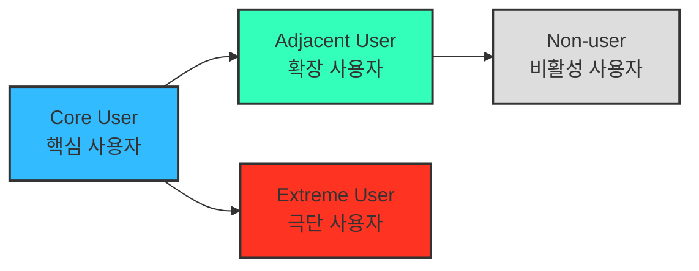

# 페르소나 분석 방법론

## 2. 페르소나 스펙트럼 (Persona Spectrum)

> 더 정확한 방법으로 내 서비스를 둘러싼 "여러 유형의 페르소나와 유형별 특성"을 파악하고, 구체적인 사례까지 확인합니다!
>
- 극단적·비전형적 사용자까지 포함해 서비스의 **포용성(Inclusivity)** 과 **사용 맥락의 다양성**을 확보하는 분석 방법.

**페르소나 스펙트럼 유형별 설명**

| 구분 | 설명 | 목적 | 생성 포인트 |
| --- | --- | --- | --- |
| **핵심(Core)** | 이상적인 주요 고객군 | 주력 타깃 설정 | 매출/사용 빈도 중심 |
| **확장(Adjacent)** | 유사 문제를 가진 인접 시장군 | 확장 기회 탐색 | 유사 니즈/다른 맥락 |
| **극단(Extreme)** | 제약·극단적 상황을 가진 사용자 | 제품 개선 및 포용적 설계 | 실패·불편·대안 사용 중심 |
| **비활성(Non-user)** | 아직 사용하지 않거나 회피하는 집단 | 시장 진입 장벽 및 거부 요인 파악 | 인식·가치·신뢰 결여 중심 |

**페르소나 스펙트럼 도출 핵심 질문**

- (확장) "유사한 제품/서비스를 사용하고 있는 사람은 누구인가?"
- (비활성) "이 제품/서비스를 `사용할 수 없는 사람`은 누구인가?"
- (극단) "가장 자주 실패를 경험하는 사람은 누구인가?"

> 💡 AI 활용 방향:
> AI를 고객의 '다양한 가능성'을 빠르게 탐색하는 프로토타이핑 파트너로 삼아 각 사용자 군의 맥락적 특성과 감정적 동기를 가상으로 생성

## 2-1. AI 기반 다중 페르소나 생성 및 평가 워크플로우

| 단계 | 목적 | AI 프롬프트 예시 | 산출물 |
| --- | --- | --- | --- |
| **① 1차 생성** (Divergent Thinking) | 각 스펙트럼 유형별 3~5개 버전 생성 | "핵심 사용자 5명, 확장 사용자 3명, 극단 사용자 2명, 비활성 사용자 2명을 만들어줘. 각자는 이름, 직무, 문제, 목표, 감정, 대체 솔루션을 포함해." | 총 10~12개 페르소나 원본 |
| **② 2차 평가** (Convergent Filtering) | 생성된 페르소나를 평가 및 선별 | "각 페르소나를 문제·행동·맥락의 현실성 기준으로 평가해, 상위 1개씩만 추천해줘." | 4개 대표 페르소나 (Core, Adjacent, Extreme, Non-user) |
| **③ 3차 보정** (Contextual Rewriting) | 사업 주제에 맞게 언어 및 상황 맞춤화 | "우리의 서비스 맥락(예: SaaS 컨설팅 플랫폼)에 맞춰 다시 기술해줘." | 실제 적용 가능한 4종 페르소나 카드 |
| **④ 4차 검증** (AI Peer Review) | 다중 AI 교차검증 | "이 4명의 페르소나가 실제 시장에서 존재할 확률과 근거를 설명해줘." | 검증 코멘트 요약 리포트 |
| **⑤ 5차 통합** (Spectrum Map) | 페르소나 간 관계 구조화 | Mermaid / Figma로 시각화 | Persona Spectrum Map 완성 |

## 3. 고객 여정지도 (Customer Journey Map, CJM)

> 고객이 "문제를 인식 → 해결을 탐색 → 구매/사용 → 평가/유지"와 같은 과정에서 겪는
경험, 감정, Pain Point를 시각화한 흐름도.
>

> ❓ **고객 여정의 단계를 정의하는 방법**
> → [IBM: Customer Journey Map이란?](https://www.ibm.com/kr-ko/think/topics/customer-journey-map)

> 💡 **비즈니스 유형별로 `매우 다른` 맞춤형 고객 여정지도가 도출될 수 있음!**
>
> 잘 만들어진 고객 여정지도는 **내 서비스에 대해 고객의 생각과 행동 반경을 잘 담고있는 체계적인 분석도구**
>
> - **가구 시장에 대한 CJM** → "`실측`" & "`조립/설치`"
> - **자동차 시장에 대한 CJM** → "`비교`" & "`시승`" & "`협상`"
>
> 즉, 같은 5단계 골격(문제 인식 → 탐색 → 의사결정 → 사용 → 유지)을 쓰더라도, 업종 고유의 Pain Point/개선 기회는 그 시장의 실제 구매·사용 행동(실측, 조립, 시승, 협상 등)에서 나와야 함.

> ***"예쁘면 다 좋은 게 아니라, 지식으로서 가치있는 부분을 가독성 높고 재사용하기 쉽게 추출하기"***

| **단계** | 고객 행동 | 고객 생각 | 감정 | Pain Point | 개선 기회 |
| --- | --- | --- | --- | --- | --- |
| **문제 인식** | 불편함을 느낌 | "이 문제 왜 생기는 거지?" | 불안 | 정보 부족 | 문제 원인 콘텐츠 제공 |
| **탐색** | 대안을 찾음 | "이건 괜찮아 보이는데?" | 기대 | 복잡한 비교 | 비교 툴 제공 |
| **의사결정** | 선택 고민 | "이걸 사도 될까?" | 불안 | 신뢰 부족 | 후기·데모 제공 |
| **사용** | 실제 사용 | "생각보다 어렵네" | 실망 | UX 미흡 | 온보딩 개선 |
| **유지** | 반복 사용 | "이제 익숙해졌네" | 안정 | 가치 감소 | 리텐션 캠페인 |

> ⚠️ **경고: 고객 여정지도의 핵심 단계는 시장이 바뀌어도 항상 동일하게 유지할 것**
>
> 위 표의 "문제 인식 → 탐색 → 의사결정 → 사용 → 유지" 5단계는 **모든 시장 분석에서 균일하게 고정**되어야 하는 뼈대임.
> 업종·시장마다 달라지는 것은 이 골격 위에 채워지는 **고객 행동/생각/감정/Pain Point/개선 기회의 구체적인 내용**(예: 가구=실측·조립, 자동차=비교·시승·협상)이지, **단계 자체의 이름·개수·순서가 아님.**
> 시장마다 단계 구조 자체를 다르게 만들면 여러 시장의 CJM을 나란히 비교·재사용할 수 없게 되므로, 반드시 동일한 핵심 단계 위에서 시장별 세부 내용만 다르게 채워 넣을 것.
