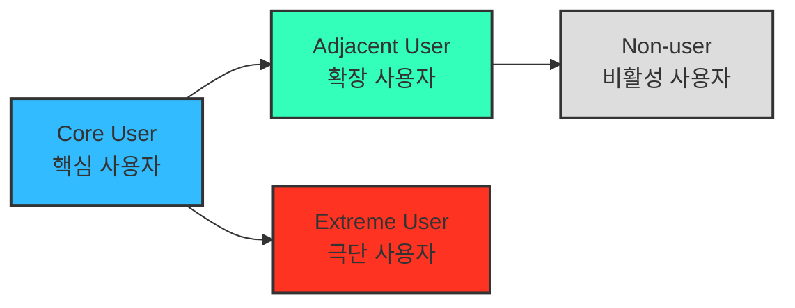

# 페르소나 분석 방법론

## 2. 페르소나 스펙트럼 (Persona Spectrum)

> 더 정확한 방법으로 내 서비스를 둘러싼 "여러 유형의 페르소나와 유형별 특성"을 파악하고, 구체적인 사례까지 확인합니다!
>
- 극단적·비전형적 사용자까지 포함해 서비스의 **포용성(Inclusivity)** 과 **사용 맥락의 다양성**을 확보하는 분석 방법.

**페르소나 스펙트럼 유형별 설명**

| 구분 | 설명 | 목적 | 생성 포인트 |
| --- | --- | --- | --- |
| **핵심(Core)** | 이상적인 주요 고객군 | 주력 타깃 설정 | 매출/사용 빈도 중심 |
| **확장(Adjacent)** | 유사 문제를 가진 인접 시장군 | 확장 기회 탐색 | 유사 니즈/다른 맥락 |
| **극단(Extreme)** | 제약·극단적 상황을 가진 사용자 | 제품 개선 및 포용적 설계 | 실패·불편·대안 사용 중심 |
| **비활성(Non-user)** | 아직 사용하지 않거나 회피하는 집단 | 시장 진입 장벽 및 거부 요인 파악 | 인식·가치·신뢰 결여 중심 |

**페르소나 스펙트럼 도출 핵심 질문**

- (확장) "유사한 제품/서비스를 사용하고 있는 사람은 누구인가?"
- (비활성) "이 제품/서비스를 `사용할 수 없는 사람`은 누구인가?"
- (극단) "가장 자주 실패를 경험하는 사람은 누구인가?"

> 💡 AI 활용 방향:
> AI를 고객의 '다양한 가능성'을 빠르게 탐색하는 프로토타이핑 파트너로 삼아 각 사용자 군의 맥락적 특성과 감정적 동기를 가상으로 생성
