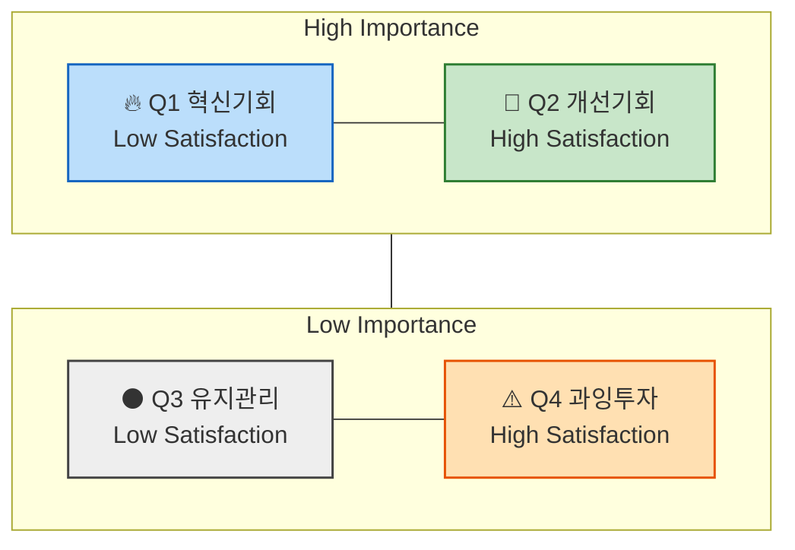

# 시장기회 분석 방법론

## 1. 기회점수(OS, Opportunity Score)란? & 조정형 기회점수(AOS, Adjusted Opportunity Score)란?

> **전통적 `기회점수` OS**의 수식에서는 고객의 불만족 수준 계산에 고객의 기대치(`중요도`)와 만족도 지표를 직접 사용합니다.
> 하지만, 이 경우 고객이 문제(Pain, Goal, Job)에 대해 가지고 있는 기대치(`중요도`)가 두 번 반영됩니다.
>
> 아래와 같이 `Importance`가 두 번 반영되면, **실제 시장감각을 왜곡**하는 문제가 발생하게 됩니다.
>
> ```
> OS = Importance(기대치) + (Importance(기대치) - Satisfaction(만족도))(불만족도)
>    = Importance × 2 - Satisfaction(만족도)
> ```
>
> **조정형 `기회점수` AOS**는 그러한 수식을 개선하여, 고객의 불만족 수준을 고객의 기대치 및 중요도와 관계 없는 방법을 사용해 `비율 계산 형태` (`1 − Satisfaction / 5`) 로 도출한 뒤, 거기에 `Importance`를 곱하여 **현실적 혁신기회 강도**를 산출합니다.
>
> 아래의 변경된 수식을 사용하면 실제 시장감각에 더 가까운 계산이 가능합니다.
>
> ```
> AOS = Importance × (1 - Satisfaction(rate) / 5)
> ```

### 💡 AOS(Adjusted Opportunity Score)의 정의

| 항목 | 설명 |
| --- | --- |
| Importance | 고객에게 Pain/Goal이 얼마나 중요한가 (1~5점) |
| Satisfaction | 현재 이 Pain이 얼마나 잘 해결되고 있는가 (1~5점) |
| 1 − Satisfaction/5 | 충족되지 않은 영역(Unmet Need)의 비율 |
| AOS | "중요하지만 덜 해결된 문제"의 강도 |

### 📊 점수 해석 예시

| Pain / Goal | Importance | Satisfaction | 1 - Satisfaction(rate) | AOS | 해석 |
| --- | --- | --- | --- | --- | --- |
| 리포트 자동화의 한계 | 5 | 2 (40%) | 0.6 | 5×(1−0.4)=3.0 | 명확한 혁신 기회 |
| AI 학습 피로감 | 3 | 2 (40%) | 0.6 | 3×(1−0.4)=1.8 | 부분적 개선 기회 |
| 데이터 공유 비효율 | 4 | 3 (60%) | 0.4 | 4×(1−0.6)=1.6 | 유지관리 대상 |
| 신뢰 부족 | 2 | 4 (80%) | 0.2 | 2×(1−0.8)=0.4 | 저기회 영역 |

### 📈 AOS 시각화 구조



- **사분면 형태로 시각화**: `X축`은 Satisfaction(충족도), `Y축`은 Importance(중요도)로 둔다.
- **사분면 해석 방법**

| 사분면 | 조건 | 의미 | 전략 행동 |
| --- | --- | --- | --- |
| Q1 | High AOS | 혁신기회 (High Importance + Low Satisfaction) | JTBD 인터뷰 대상, MVP 실험 우선 |
| Q2 | 중간 AOS | 개선기회 | 지속적 개선 필요 |
| Q3 | Low AOS | 유지/보완 | UX·마케팅 최적화 중심 |
| Q4 | 0 근처 | 과잉투자 위험 | 자원 분배 재검토 |

> ❓ [참고] 매트릭스에서 사분면 상하 좌우를 가르는 수치 기준점은 어디인가? — 별도 확인 필요.

---

## 2. 평가 대상 정의 – 무엇을 (재료로) 점수화하는가?

- **`우리가 설계한 솔루션`**에 대한 **페르소나 스펙트럼과 고객 여정 지도**에 대하여
- **`기존 솔루션 생태계`** 하에서 **고객이 겪고 있는 Pain/Job 상황**을 평가합니다.

| 분석 단계 | 평가 단위 = `고객 타겟` | 평가 대상 = `Pain 정의 내용` |
| --- | --- | --- |
| 페르소나 단계 | 각 페르소나의 주요 Pain·Goal | "이 사람에게 가장 중요한 고통은 무엇인가?" |
| 고객 여정 지도 | 여정 단계별 Pain Point / 개선기회 | "고객 여정 중 어디서 좌절이 가장 큰가?" |
| ~~JTBD 인터뷰 사전 단계~~ | ~~Job Statement 단위~~ | ~~"이 고객이 진보를 이루기 위해 수행하는 일(Job)은 무엇인가?"~~ |

> ✅ **앞선 분석 결과 중 무엇을 사용하는가?**
>
> - 페르소나가 도출되기 전, "`문제정의`", "`Segment`" 단계의 Pain List를 사용하면 어떻게 될까요?
> - 페르소나 Spectrum 4가지 중 어떤 페르소나가 가진 Pain List를 사용해야 할까요?

> *분석 & 기획 단계에서는 최대한 많은 "유효한" 문제들에 시장기회 점수를 매겨서 내림차순으로 정렬해 봅니다.*
