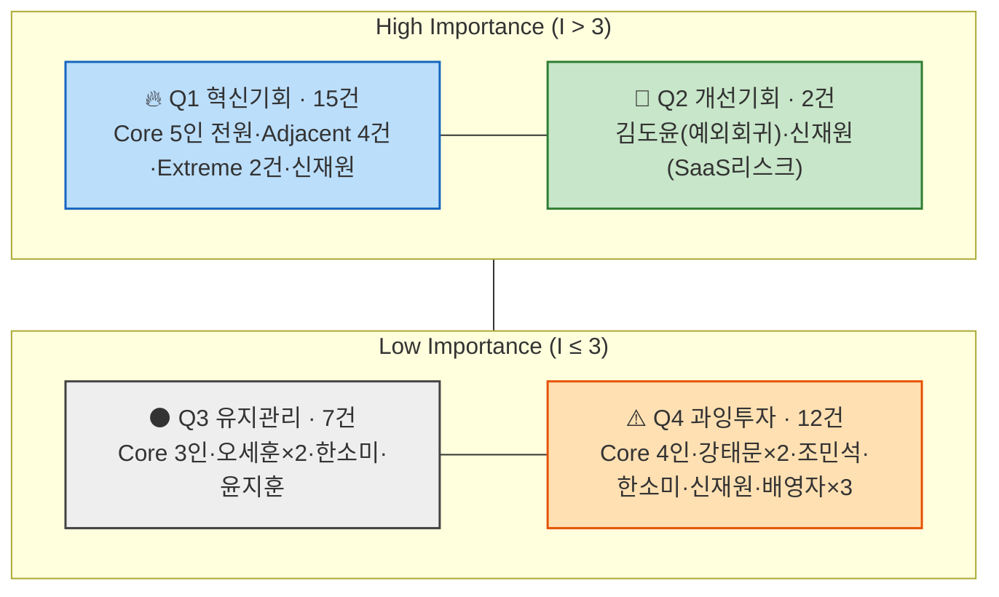

# AOS(조정형 기회점수) 채점 및 매트릭스 배치

> `02_CJM_대표PainPoint_Goal추출.md`에서 뽑은 **12명 페르소나(Core 5인 개별 재분리 반영) × 3개 Pain Point(총 36개)**에 `01_methodology.md`의 채점 절차(② Importance → ③ Satisfaction → ④ AOS → ⑤ Matrix)를 적용한다.
>
> (2026-08-11 갱신: Core 5인도 개별 여정으로 재분리됨에 따라, 24개였던 채점 대상이 36개로 늘었다. 표본이 늘면서 사분면 중앙값도 다시 계산했다 — 이번엔 Importance 쪽에서도 새로운 "동률 문제"가 발견됐다.)
>
> - **Importance(1~5)**: 이 Pain이 해소되는 것이 고객의 목표(Goal) 달성에 얼마나 중요한가.
> - **Satisfaction(1~5)**: 현재 대체 수단(수첩·카톡·엑셀·전화·수기·앱 등)이 이 Pain을 얼마나 잘 해결해주고 있는가.
> - **AOS = Importance × (1 − Satisfaction/5)**
> - 매트릭스 사분면 기준선은 `01_methodology.md`의 **중앙값(median) 변형**을 사용한다.

## 1. Importance / Satisfaction / AOS 채점 결과 (AOS 내림차순)

| # | 스펙트럼 | 페르소나 | Pain Point (축약) | Importance | Satisfaction | AOS | 채점 근거 |
| --- | --- | --- | --- | --- | --- | --- | --- |
| 1 | Core | 김도윤 | 거래 단위 반복입력·시스템 전환 | 5 | 2 | **3.0** | 1인 중개사 반복입력의 원형 Pain / 수첩+캘린더로는 부분적으로만 해결 |
| 2 | Core | 최지안 | 고액거래 확인항목·기관 多 | 5 | 2 | **3.0** | 고액거래 특유의 리스크가 최고 수준 / 폴더+체크리스트로는 부분적으로만 해결 |
| 3 | Extreme | 조민석 | 지점 단위 취합 비용 | 5 | 2 | **3.0** | 지점 단위로 중첩되는 핵심 Pain(압박감) / 수동 취합 외 해법 없음 |
| 4 | Core | 김도윤 | 전환 확신 부족(의사결정) | 4 | 2 | **2.4** | 도입 여부를 가르는 직접적 장벽 / 확신을 줄 근거 자체가 부족 |
| 5 | Core | 박서연 | 파트너 간 Handoff 반복확인 | 4 | 2 | **2.4** | 공동운영 구조적 Pain / 카톡+엑셀로는 부분적으로만 해결 |
| 6 | Core | 이현우 | 다수 임대인 통합관리 안 됨 | 4 | 2 | **2.4** | 관리대상 수가 문제를 키우는 구조적 Pain / 종이체크리스트로는 부분적으로만 해결 |
| 7 | Core | 최지안 | 고액거래 특수항목 표준 미지원 | 4 | 2 | **2.4** | 전문성 목표에 직결 / 수동 추가 외 해법 없음 |
| 8 | Core | 정하윤 | 온라인 리드-계약관리 단절 | 4 | 2 | **2.4** | 구조적 Pain / 인스타DM+수첩으로는 부분적으로만 해결 |
| 9 | Adjacent | 오세훈 | 구매 자격·대출조건 계산 도구 부재 | 4 | 2 | **2.4** | 구매 판단 핵심 질문에 대한 도구 부재 / 앱·계산기·상담을 오가며 부분적으로만 해결 |
| 10 | Adjacent | 한소미 | 상업용 자산관리 데이터 형식 불일치 | 4 | 2 | **2.4** | 통합관리 목표 직결 핵심 Pain / 스프레드시트+수기로 매번 처음부터 정리 |
| 11 | Adjacent | 윤지훈 | 등기시스템 연동 도구 부재 | 4 | 2 | **2.4** | 재입력 제거 목표 직결 / 팩스·이메일 수동 재입력 외 해법 없음 |
| 12 | Adjacent | 윤지훈 | 등기 지연·고객 항의 리스크 | 4 | 2 | **2.4** | 실질적 업무 리스크 / 현재로선 리스크를 줄일 방법이 없음 |
| 13 | Extreme | 강태문 | 디지털 진입장벽 중첩 | 4 | 2 | **2.4** | 이중 장벽 / 회피로만 대응해 미해결 |
| 14 | Extreme | 조민석 | 조직 단위 도입 결정 부담 | 4 | 2 | **2.4** | 전원 동의·전환 조율이 필요한 큰 장벽 / 관련 해법·경험 부재 |
| 15 | Non-user | 신재원 | Pain은 인정하나 해법을 경계 | 4 | 2 | **2.4** | 반복입력 부담은 실제로 크게 느낌 / 신뢰할 수 있는 해법이 아직 없음 |
| 16 | Core | 박서연 | 2인분 학습부담으로 의사결정 지연 | 3 | 2 | **1.8** | 공동도입 특유의 마찰 / 줄일 해법이 없음 |
| 17 | Core | 이현우 | 문자·전화 회신 임대인은 수동입력 필요 | 3 | 2 | **1.8** | 실사용 단계의 갭 / 절반만 해소 |
| 18 | Core | 정하윤 | SNS-계약관리 연결이 MVP 범위 밖 | 3 | 2 | **1.8** | 실사용 갭 / 수동 이어붙이기 지속 |
| 19 | Adjacent | 오세훈 | 조회 불가로 매물마다 재계산 부담 지속 | 3 | 2 | **1.8** | 직접 조회가 걸린 실사용 지점 / 여전히 스스로 재계산 |
| 20 | Adjacent | 오세훈 | 전환 유인 약함(의사결정) | 3 | 2 | **1.8** | 메타 수준 장벽 / 참여했을 때의 이득이 현재 없음 |
| 21 | Adjacent | 한소미 | 도입 검토 근거 자체가 없음 | 3 | 2 | **1.8** | 검토 성립 여부 문제 / 판단 근거 자체가 없음 |
| 22 | Adjacent | 윤지훈 | Handoff가 "기록"만 되고 실질 연동 없음 | 3 | 2 | **1.8** | 메커니즘 신뢰도 문제 / 기록만 되고 실제 연동 없음 |
| 23 | Core | 김도윤 | 예외 거래 시 회귀 위험(유지) | 4 | 3 | **1.6** | 장기 확장성에는 중요하지만 / 예외는 기존 방식으로 어느 정도 처리 가능 |
| 24 | Non-user | 신재원 | 클라우드 SaaS 구조 자체가 리스크로 평가 | 4 | 3 | **1.6** | 보안이 최우선 가치일 만큼 중요 / 로컬 저장으로 이 니즈는 이미 꽤 충족 중 |
| 25 | Core | 박서연 | 사무소 규모 확장 시 권한관리 리스크 | 3 | 3 | **1.2** | 장기 확장성 이슈 / 현재 규모에서는 이미 만족스러움 |
| 26 | Core | 이현우 | 관리 임대인 수 증가 시 복잡성 리스크 | 3 | 3 | **1.2** | 장기 확장성 이슈 / 현재는 만족스러움 |
| 27 | Core | 최지안 | 정책 변경 지속 리스크(유지) | 3 | 3 | **1.2** | 외부요인 리스크 / 현재는 최신화로 만족 |
| 28 | Core | 정하윤 | 마케팅퍼널 미해결로 체감가치 제한 | 3 | 3 | **1.2** | 근본 미해결 / 계약관리 부분만은 만족 |
| 29 | Extreme | 강태문 | 직접 사용 못해 효익 체감 어려움 | 3 | 3 | **1.2** | 서비스 효익 체감이 걸린 지점 / 위임 구조로 일부 안도감이 이미 있음 |
| 30 | Extreme | 강태문 | 효과가 조직 내 특정 인원에게만 국한 | 3 | 3 | **1.2** | 본인 체감으로 이어져야 하는 문제 / 위임으로 부담이 일부 완화된 상태 |
| 31 | Extreme | 조민석 | 확장성 미검증(유지) | 3 | 3 | **1.2** | 조직이 커질 때를 대비해야 함 / 현재 규모에서는 이미 만족스러움 |
| 32 | Adjacent | 한소미 | 상업용 인접시장 자체가 검증되지 않음 | 2 | 3 | **0.8** | 시장 자체의 장기 불확실성 / 일상적으로 체감하는 Pain은 아님 |
| 33 | Non-user | 신재원 | 외부 사고 뉴스로 전환 가능성 지속 하락 | 3 | 4 | **0.6** | 장기적으로는 유의미하지만 / 현재 보안 판단에 대한 확신이 강함(만족) |
| 34 | Non-user | 배영자 | 제안이 "지금까지 틀렸다"는 위협으로 인식 | 2 | 4 | **0.4** | 자존감 보호 목적일 뿐 실질적 목표 중요도는 낮음 / 방어적으로 만족 중 |
| 35 | Non-user | 배영자 | Pain을 Pain으로 인식하지 않음 | 1 | 5 | **0.0** | 목표 달성과 무관하게 취급됨(무관심) / 현재 방식에 완전히 만족 |
| 36 | Non-user | 배영자 | 세대 교체 전까지 전환 불가(유지) | 1 | 5 | **0.0** | 은퇴 시점까지 유지가 목표이므로 "해결"이 오히려 무의미 / 완전 만족 고착 |

## 2. 매트릭스 사분면 배치 (중앙값 기준)

36개 항목의 Importance/Satisfaction 값을 각각 정렬한 중앙값을 기준선으로 사용한다.

| 축 | 중앙값 | 기준 |
| --- | --- | --- |
| Importance (Y축) | **3.0** | **3.0 초과** → High Importance(상단) |
| Satisfaction (X축) | **2.0** | **2.0 초과** → High Satisfaction(우측) |

> ⚠️ **두 축 모두 "초과" 규칙을 쓰는 이유**: 표본이 36개로 늘면서 Importance=3점인 항목이 15개(약 42%)로 늘어 **중앙값(3.0)과 데이터 최다 빈출값이 정확히 일치**하는 상황이 됐다. Satisfaction=2점도 여전히 22개(약 61%)로 최솟값=중앙값 상태다. `03_AOS_채점_및_매트릭스.md`의 이전 버전(24개 표본)에서는 Satisfaction만 이 문제가 있어 "초과 → High"로 보정했는데, 이번엔 Importance에도 같은 문제가 생겨 **두 축 모두 "중앙값 초과 → High, 중앙값 이하 → Low"**로 통일한다. 이렇게 하면 Importance는 Low(1~3점, 19개)/High(4~5점, 17개), Satisfaction은 Low(2점, 22개)/High(3~5점, 14개)로 나뉜다.

`01_methodology.md`의 사분면 정의(Q1 혁신기회 / Q2 개선기회 / Q3 유지관리 / Q4 과잉투자)에 따라 36개 항목을 배치하면:

### 🔥 Q1 — 혁신기회 (High Importance + Low Satisfaction) · 15건

| 페르소나 | Pain Point | Importance | Satisfaction | AOS |
| --- | --- | --- | --- | --- |
| 김도윤 | 반복입력·시스템 전환 | 5 | 2 | 3.0 |
| 최지안 | 고액거래 확인항목 多 | 5 | 2 | 3.0 |
| 조민석 | 지점 단위 취합 비용 | 5 | 2 | 3.0 |
| 김도윤 | 전환 확신 부족 | 4 | 2 | 2.4 |
| 박서연 | 파트너 간 Handoff | 4 | 2 | 2.4 |
| 이현우 | 다수 임대인 통합관리 안 됨 | 4 | 2 | 2.4 |
| 최지안 | 고액거래 특수항목 미지원 | 4 | 2 | 2.4 |
| 정하윤 | 온라인 리드-계약관리 단절 | 4 | 2 | 2.4 |
| 오세훈 | 구매 자격·대출조건 계산 도구 부재 | 4 | 2 | 2.4 |
| 한소미 | 상업용 데이터 형식 불일치 | 4 | 2 | 2.4 |
| 윤지훈 | 등기시스템 연동 도구 부재 | 4 | 2 | 2.4 |
| 윤지훈 | 등기 지연·고객 항의 리스크 | 4 | 2 | 2.4 |
| 강태문 | 디지털 진입장벽 중첩 | 4 | 2 | 2.4 |
| 조민석 | 조직 단위 도입 결정 부담 | 4 | 2 | 2.4 |
| 신재원 | Pain 인정하나 해법을 경계 | 4 | 2 | 2.4 |

### 💎 Q2 — 개선기회 (High Importance + High Satisfaction) · 2건

| 페르소나 | Pain Point | Importance | Satisfaction | AOS |
| --- | --- | --- | --- | --- |
| 김도윤 | 예외 거래 시 회귀 위험 | 4 | 3 | 1.6 |
| 신재원 | 클라우드 SaaS 구조=리스크 | 4 | 3 | 1.6 |

### ⚫ Q3 — 유지관리 (Low Importance + Low Satisfaction) · 7건

| 페르소나 | Pain Point | Importance | Satisfaction | AOS |
| --- | --- | --- | --- | --- |
| 박서연 | 2인분 학습부담 | 3 | 2 | 1.8 |
| 이현우 | 수동입력 필요(실사용) | 3 | 2 | 1.8 |
| 정하윤 | SNS-계약관리 연결 MVP 밖 | 3 | 2 | 1.8 |
| 오세훈 | 조회 불가로 재계산 부담 | 3 | 2 | 1.8 |
| 오세훈 | 전환 유인 약함 | 3 | 2 | 1.8 |
| 한소미 | 도입 검토 근거 없음 | 3 | 2 | 1.8 |
| 윤지훈 | Handoff가 기록만 됨 | 3 | 2 | 1.8 |

### ⚠️ Q4 — 과잉투자 (Low Importance + High Satisfaction) · 12건

| 페르소나 | Pain Point | Importance | Satisfaction | AOS |
| --- | --- | --- | --- | --- |
| 박서연 | 권한관리 리스크(유지) | 3 | 3 | 1.2 |
| 이현우 | 복잡성 리스크(유지) | 3 | 3 | 1.2 |
| 최지안 | 정책 변경 리스크(유지) | 3 | 3 | 1.2 |
| 정하윤 | 마케팅퍼널 미해결(유지) | 3 | 3 | 1.2 |
| 강태문 | 효익 체감 어려움 | 3 | 3 | 1.2 |
| 강태문 | 효과가 특정 인원에게만 국한 | 3 | 3 | 1.2 |
| 조민석 | 확장성 미검증 | 3 | 3 | 1.2 |
| 한소미 | 상업용 인접시장 미검증 | 2 | 3 | 0.8 |
| 신재원 | 전환 가능성 지속 하락 | 3 | 4 | 0.6 |
| 배영자 | 제안=위협으로 인식 | 2 | 4 | 0.4 |
| 배영자 | Pain 미인식 | 1 | 5 | 0.0 |
| 배영자 | 세대 교체 전까지 전환 불가 | 1 | 5 | 0.0 |

> ⚠️ 36개 항목 중 15개가 Q1에, 그중 12개가 Satisfaction=2로 겹쳐 있는 등 동일 점수 항목이 매우 많다. 좌표 산점도(mermaid quadrantChart)는 이전 버전에서도 정보 전달력이 떨어져 제외했는데, 표본이 더 늘어난 이번 버전에서는 그 문제가 더 커진다. 정확한 점수·순위는 1절 표를 기준으로 볼 것.

## 3. 해석 및 다음 단계

- **최우선 혁신기회(Q1, 15건, 전체의 42%)**는 이제 **12명 중 9명**의 Pain을 포함한다 — Core 5인 전원(김도윤·박서연·이현우·최지안·정하윤 각 1건 이상), Adjacent 4건(오세훈·한소미·윤지훈×2), Extreme 2건(강태문·조민석), Non-user 1건(신재원)까지 걸쳐 있다. Core를 개별 재분리하고 나서야 드러난 결과다 — "고액거래"(최지안), "다수 임대인 관리"(이현우) 같은 하위유형별로 서로 다른 이유에서 똑같이 최상위권 Pain을 겪는다는 게 보인다.
- **AOS 3.0 최고점 그룹(3건)**은 김도윤(반복입력), 최지안(고액거래 확인항목), 조민석(지점 취합비용)이다. 세 사람 모두 "Importance=5"라는 점에서, 04챕터 SOM 정의(고거래량×High Fragmentation)의 핵심을 서로 다른 각도(표준거래량 반복/고액거래 리스크/다지점 취합)에서 대표한다.
- **Q2(개선기회, 2건)**는 김도윤의 예외거래 대응, 신재원의 보안 신뢰 확보다. 최지안의 "정책 변경 리스크"도 성격은 비슷하지만(장기 리스크) Importance가 3으로 평가돼 이번엔 Q4로 분류됐다 — Importance 산정의 미세한 차이가 사분면을 가른 사례다.
- **Q3(유지관리, 7건)**에 Core 3인(박서연·이현우·정하윤)의 2번째 Pain이 몰려 있다. 공통점은 "구조적 원인(①)은 심각하지만, 그 다음 단계(사용/의사결정)에서 드러나는 2차 Pain은 중간 강도"라는 패턴 — 근본 Pain(①)을 해결하는 김에 함께 다뤄질 가능성이 높은 부수적 문제로 읽을 수 있다.
- **Q4(과잉투자, 12건 — 전체의 33%)**에 Core 4인의 "유지" 단계 Pain(장기 확장성 우려)이 대부분 몰려 있다. 이는 이 리스크들이 "지금 당장"이 아니라 "규모가 커진 다음"에야 문제가 되는, 시기상 나중 순위의 Pain이라는 뜻이다. 배영자·강태문·한소미(시장미검증)도 여전히 이 사분면에 남아 있다.
- **다음 단계 제안**: Q1의 15개 Pain Point 중 05챕터 원본 CJM에서 서로 다른 하위유형을 대표하는 항목(김도윤=표준형, 최지안=고액거래형, 이현우=관리규모형, 박서연=공동운영형, 정하윤=리드연동형)을 07챕터(JTBD 분석) 인터뷰 대상 후보로 우선 넘길 것 — 5개 하위유형을 모두 커버해야 세그먼트 A 내부의 다양성을 놓치지 않는다.
