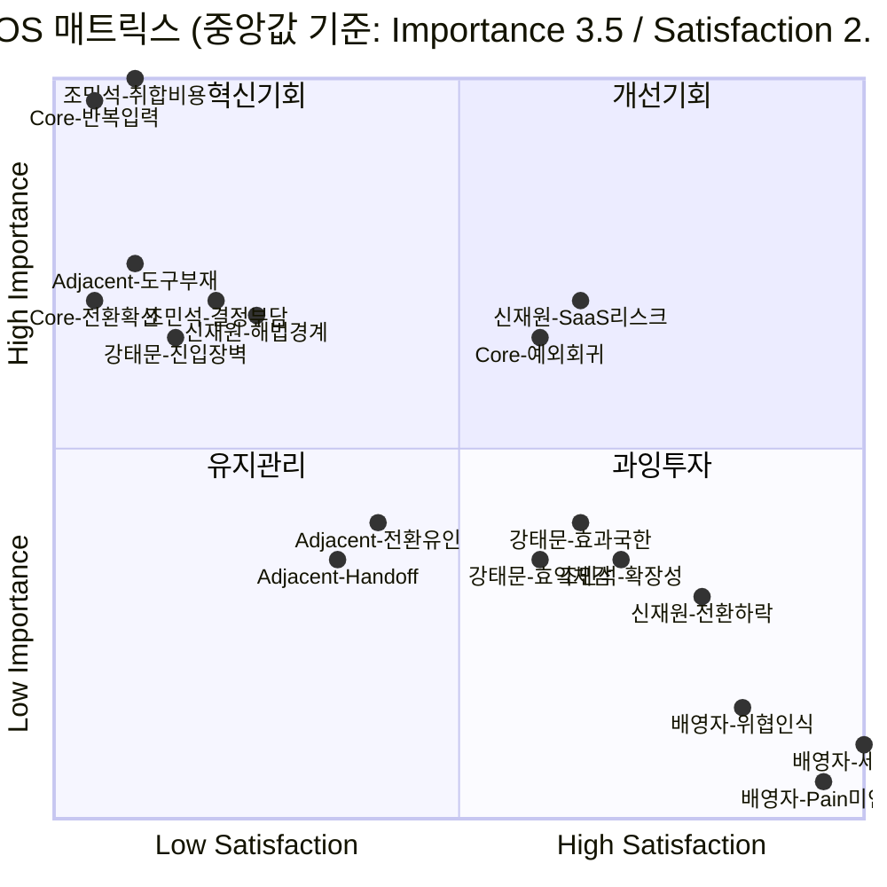

# AOS(조정형 기회점수) 채점 및 매트릭스 배치

> `02_CJM_대표PainPoint_Goal추출.md`에서 뽑은 6개 페르소나 × 3개 Pain Point(총 18개)에 `01_methodology.md`의 채점 절차(② Importance → ③ Satisfaction → ④ AOS → ⑤ Matrix)를 적용한다.
>
> - **Importance(1~5)**: 이 Pain이 해소되는 것이 고객의 목표(Goal) 달성에 얼마나 중요한가.
> - **Satisfaction(1~5)**: 현재 대체 수단(수첩·카톡·엑셀·전화·수기 등)이 이 Pain을 얼마나 잘 해결해주고 있는가.
> - **AOS = Importance × (1 − Satisfaction/5)**
> - 매트릭스 사분면 기준선은 `01_methodology.md`의 **중앙값(median) 변형**을 사용한다 — 평균 대신 중앙값을 쓴 이유는 배영자(Non-user)처럼 Importance 1점/Satisfaction 5점 같은 극단값이 섞여 있어, 평균을 쓰면 기준선이 극단값 쪽으로 끌려가기 때문이다.

## 1. Importance / Satisfaction / AOS 채점 결과 (AOS 내림차순)

| # | 스펙트럼 | 페르소나 | Pain Point (축약) | Importance | Satisfaction | AOS | 채점 근거 |
| --- | --- | --- | --- | --- | --- | --- | --- |
| 1 | Core | 5인 그룹 | 거래 단위 반복입력·시스템 전환 | 5 | 2 | **3.0** | SOM 세그먼트 A의 핵심 구조적 Pain / 현재 각자 다른 도구를 오가며 부분적으로만 해결 |
| 2 | Extreme | 조민석 | 지점 단위 취합 비용 | 5 | 2 | **3.0** | 거래 단위를 넘어 지점 단위로 중첩되는 핵심 Pain(압박감) / 수동 취합 외 해법 없음 |
| 3 | Core | 5인 그룹 | 전환 확신 부족(의사결정) | 4 | 2 | **2.4** | 도입 여부를 가르는 직접적 장벽 / 확신을 줄 근거 자체가 부족 |
| 4 | Adjacent | 3인 그룹 | 업무영역별 맞춤 도구 부재 | 4 | 2 | **2.4** | Core와 동일한 구조적 문제를 겪음 / 자신에게 맞는 도구가 아예 없어 미해결 |
| 5 | Extreme | 강태문 | 디지털 진입장벽이 원래 Pain 위에 중첩 | 4 | 2 | **2.4** | 문제를 풀 수단 자체에 접근 못 하는 이중 장벽 / 회피로만 대응해 미해결 |
| 6 | Extreme | 조민석 | 조직 단위 도입 결정 부담 | 4 | 2 | **2.4** | 전원 동의·전환 조율이 필요해 결정 자체가 큰 장벽 / 관련 해법·경험 부재 |
| 7 | Non-user | 신재원 | Pain은 인정하나 해법(외부 SaaS)을 경계 | 4 | 2 | **2.4** | 반복입력 부담은 실제로 크게 느낌 / 신뢰할 수 있는 해법이 아직 없음 |
| 8 | Adjacent | 3인 그룹 | Handoff가 "기록"만 되고 실질 개선 없음 | 3 | 2 | **1.8** | 직접 체감해야 하는 지점이지만 아쉬움 / 실제로 아무것도 바뀌지 않음 |
| 9 | Adjacent | 3인 그룹 | 전환 유인 약함(의사결정) | 3 | 2 | **1.8** | 메타 수준 장벽 / 참여했을 때의 이득이 현재 없음 |
| 10 | Core | 5인 그룹 | 예외 거래 시 회귀 위험(유지) | 4 | 3 | **1.6** | 장기 확장성에는 중요하지만 / 예외는 기존 방식으로 어느 정도 처리 가능 |
| 11 | Non-user | 신재원 | 클라우드 SaaS 구조 자체가 리스크로 평가 | 4 | 3 | **1.6** | 보안이 최우선 가치일 만큼 중요 / 로컬 저장으로 이 니즈는 이미 꽤 충족 중 |
| 12 | Extreme | 강태문 | 직접 사용 못해 효익 체감 어려움 | 3 | 3 | **1.2** | 서비스 효익 체감이 걸린 지점 / 위임 구조로 일부 안도감이 이미 있음 |
| 13 | Extreme | 강태문 | 효과가 조직 내 특정 인원에게만 국한 | 3 | 3 | **1.2** | 본인 체감으로 이어져야 하는 문제 / 위임으로 부담이 일부 완화된 상태 |
| 14 | Extreme | 조민석 | 확장성 미검증(유지) | 3 | 3 | **1.2** | 조직이 커질 때를 대비해야 함 / 현재 규모에서는 이미 만족스러움 |
| 15 | Non-user | 신재원 | 외부 사고 뉴스로 전환 가능성 지속 하락 | 3 | 4 | **0.6** | 장기적으로는 유의미하지만 / 현재 보안 판단에 대한 확신이 강함(만족) |
| 16 | Non-user | 배영자 | 제안이 "지금까지 틀렸다"는 위협으로 인식 | 2 | 4 | **0.4** | 자존감 보호 목적일 뿐 실질적 목표 중요도는 낮음 / 방어적으로 만족 중 |
| 17 | Non-user | 배영자 | Pain을 Pain으로 인식하지 않음 | 1 | 5 | **0.0** | 목표 달성과 무관하게 취급됨(무관심) / 현재 방식에 완전히 만족 |
| 18 | Non-user | 배영자 | 세대 교체 전까지 전환 불가(유지) | 1 | 5 | **0.0** | 은퇴 시점까지 유지가 목표이므로 "해결"이 오히려 무의미 / 완전 만족 고착 |

## 2. 매트릭스 사분면 배치 (중앙값 기준)

18개 항목의 Importance/Satisfaction 값을 각각 정렬한 중앙값을 기준선으로 사용한다.

| 축 | 중앙값 | 기준 |
| --- | --- | --- |
| Importance (Y축) | **3.5** | 3.5 이상 → High Importance(상단) |
| Satisfaction (X축) | **2.5** | 2.5 이상 → High Satisfaction(우측) |

`01_methodology.md`의 사분면 정의(Q1 혁신기회 / Q2 개선기회 / Q3 유지관리 / Q4 과잉투자)에 따라 18개 항목을 배치하면:

### 🔥 Q1 — 혁신기회 (High Importance + Low Satisfaction) · 7건

| 페르소나 | Pain Point | Importance | Satisfaction | AOS |
| --- | --- | --- | --- | --- |
| Core | 거래 단위 반복입력·시스템 전환 | 5 | 2 | 3.0 |
| 조민석 | 지점 단위 취합 비용 | 5 | 2 | 3.0 |
| Core | 전환 확신 부족 | 4 | 2 | 2.4 |
| Adjacent | 업무영역별 맞춤 도구 부재 | 4 | 2 | 2.4 |
| 강태문 | 디지털 진입장벽 중첩 | 4 | 2 | 2.4 |
| 조민석 | 조직 단위 도입 결정 부담 | 4 | 2 | 2.4 |
| 신재원 | Pain 인정하나 해법을 경계 | 4 | 2 | 2.4 |

### 💎 Q2 — 개선기회 (High Importance + High Satisfaction) · 2건

| 페르소나 | Pain Point | Importance | Satisfaction | AOS |
| --- | --- | --- | --- | --- |
| Core | 예외 거래 시 회귀 위험 | 4 | 3 | 1.6 |
| 신재원 | 클라우드 SaaS 구조=리스크 | 4 | 3 | 1.6 |

### ⚫ Q3 — 유지관리 (Low Importance + Low Satisfaction) · 2건

| 페르소나 | Pain Point | Importance | Satisfaction | AOS |
| --- | --- | --- | --- | --- |
| Adjacent | Handoff가 기록만 됨 | 3 | 2 | 1.8 |
| Adjacent | 전환 유인 약함 | 3 | 2 | 1.8 |

### ⚠️ Q4 — 과잉투자 (Low Importance + High Satisfaction) · 7건

| 페르소나 | Pain Point | Importance | Satisfaction | AOS |
| --- | --- | --- | --- | --- |
| 강태문 | 직접 사용 못해 효익 체감 어려움 | 3 | 3 | 1.2 |
| 강태문 | 효과가 특정 인원에게만 국한 | 3 | 3 | 1.2 |
| 조민석 | 확장성 미검증 | 3 | 3 | 1.2 |
| 신재원 | 전환 가능성 지속 하락 | 3 | 4 | 0.6 |
| 배영자 | 제안=위협으로 인식 | 2 | 4 | 0.4 |
| 배영자 | Pain 미인식 | 1 | 5 | 0.0 |
| 배영자 | 세대 교체 전까지 전환 불가 | 1 | 5 | 0.0 |

> ⚠️ 위 mermaid 차트의 좌표는 라벨 겹침을 피하기 위해 동일 점수 항목끼리 서로 살짝 흩어서(jitter) 표시한 **근사 시각화**다. 정확한 점수·사분면 판정은 위 표(1절, 2절)를 기준으로 판단할 것 — 이 차트는 "대략적인 분포 형태"를 보기 위한 보조 자료다.

## 3. 해석 및 다음 단계

- **최우선 혁신기회(Q1, AOS 2.4~3.0, 7건)**는 Core(5인 그룹)와 Extreme-조민석(다지점 운영)에 집중된다. 둘 다 "정보·업무가 단위(거래/지점)별로 단절되어 반복 작업이 발생한다"는 동일 구조를 서로 다른 규모에서 겪고 있다는 점이 눈에 띈다 — Core의 반복입력 Pain(#1)과 조민석의 취합 비용 Pain(#2)이 나란히 AOS 3.0 최고점을 차지한 것은, 04챕터에서 이미 SOM으로 확정한 세그먼트 A(고거래량×High Fragmentation)의 채점 결과와 방향이 일치함을 재확인해준다.
- Non-user 신재원의 Pain 1개(#7, "Pain은 인정하나 해법을 경계")도 Q1에 들어간 점이 중요하다. 그는 배영자처럼 Pain 자체를 부정하지 않기 때문에, **보안이 검증된 형태의 해법이 제시되면 Q1 → Q2로 이동할 잠재력이 있는 조건부 기회**로 분류할 수 있다.
- **Q2(개선기회, 2건)**는 이미 어느 정도 해소되고 있지만 여전히 중요한 문제들이다 — Core의 예외 거래 대응, 신재원의 보안 신뢰 확보. 신규 기능보다는 기존 설계를 다듬는 방향(확장성 강화, 보안 인증 취득)이 맞는 영역이다.
- **Q4(과잉투자, 7건 — 전체의 39%)**에 배영자(58)의 Pain 3개 중 2개가 몰려 있고, 강태문(68)의 Pain도 대부분 이쪽으로 분류됐다. 이는 두 Extreme/Non-user 페르소나 모두 "제품이 해결해도 본인이 체감하지 못하거나, 애초에 문제로 인식하지 않는" 구조라는 03번 문서의 해설과 일치한다 — 이 세그먼트에 자원을 추가로 투입하는 것은 우선순위가 낮다.
- **다음 단계 제안**: Q1의 7개 Pain Point를 07챕터(JTBD 분석)의 1차 인터뷰 대상 후보로 넘기고, Q1에 걸쳐 있는 신재원의 조건부 Pain(#7)에 대해서는 "보안 인증 취득 시 전환 의사가 실제로 바뀌는지"를 확인하는 별도 가설 검증을 설계할 것.
