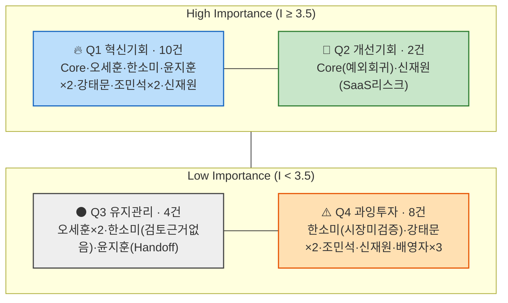

# AOS(조정형 기회점수) 채점 및 매트릭스 배치

> `02_CJM_대표PainPoint_Goal추출.md`에서 뽑은 **8개 페르소나(Adjacent 3인 개별 재분리 반영) × 3개 Pain Point(총 24개)**에 `01_methodology.md`의 채점 절차(② Importance → ③ Satisfaction → ④ AOS → ⑤ Matrix)를 적용한다.
>
> (2026-08-11 갱신: Adjacent를 오세훈·한소미·윤지훈 3인 개별 여정으로 재분리함에 따라, 기존 18개였던 채점 대상이 24개로 늘었다. 늘어난 표본 때문에 사분면 중앙값도 재계산했다.)
>
> - **Importance(1~5)**: 이 Pain이 해소되는 것이 고객의 목표(Goal) 달성에 얼마나 중요한가.
> - **Satisfaction(1~5)**: 현재 대체 수단(수첩·카톡·엑셀·전화·수기·앱 등)이 이 Pain을 얼마나 잘 해결해주고 있는가.
> - **AOS = Importance × (1 − Satisfaction/5)**
> - 매트릭스 사분면 기준선은 `01_methodology.md`의 **중앙값(median) 변형**을 사용한다 — 평균 대신 중앙값을 쓴 이유는 배영자(Non-user)처럼 Importance 1점/Satisfaction 5점 같은 극단값이 섞여 있어, 평균을 쓰면 기준선이 극단값 쪽으로 끌려가기 때문이다.

## 1. Importance / Satisfaction / AOS 채점 결과 (AOS 내림차순)

| # | 스펙트럼 | 페르소나 | Pain Point (축약) | Importance | Satisfaction | AOS | 채점 근거 |
| --- | --- | --- | --- | --- | --- | --- | --- |
| 1 | Core | 5인 그룹 | 거래 단위 반복입력·시스템 전환 | 5 | 2 | **3.0** | SOM 세그먼트 A의 핵심 구조적 Pain / 현재 각자 다른 도구를 오가며 부분적으로만 해결 |
| 2 | Extreme | 조민석 | 지점 단위 취합 비용 | 5 | 2 | **3.0** | 거래 단위를 넘어 지점 단위로 중첩되는 핵심 Pain(압박감) / 수동 취합 외 해법 없음 |
| 3 | Core | 5인 그룹 | 전환 확신 부족(의사결정) | 4 | 2 | **2.4** | 도입 여부를 가르는 직접적 장벽 / 확신을 줄 근거 자체가 부족 |
| 4 | Adjacent | 오세훈 | 구매 자격·대출조건 계산 도구 부재 | 4 | 2 | **2.4** | 구매 판단의 핵심 질문("살 수 있는가")에 대한 도구 부재 / 앱·대출계산기·상담을 오가며 부분적으로만 해결 |
| 5 | Adjacent | 한소미 | 상업용 자산관리 데이터 형식 불일치 | 4 | 2 | **2.4** | 통합관리 목표에 직결되는 핵심 Pain / 스프레드시트+수기로 매번 처음부터 정리해야 함 |
| 6 | Adjacent | 윤지훈 | 등기시스템 연동 도구 부재(재입력) | 4 | 2 | **2.4** | 재입력 제거 목표에 직결 / 팩스·이메일 수동 재입력 외 해법 없음 |
| 7 | Adjacent | 윤지훈 | 정보 누락 시 등기 지연·고객 항의 리스크 | 4 | 2 | **2.4** | 등기지연·고객항의라는 실질적 업무 리스크 / 현재로선 리스크를 줄일 방법이 없음 |
| 8 | Extreme | 강태문 | 디지털 진입장벽이 원래 Pain 위에 중첩 | 4 | 2 | **2.4** | 문제를 풀 수단 자체에 접근 못 하는 이중 장벽 / 회피로만 대응해 미해결 |
| 9 | Extreme | 조민석 | 조직 단위 도입 결정 부담 | 4 | 2 | **2.4** | 전원 동의·전환 조율이 필요해 결정 자체가 큰 장벽 / 관련 해법·경험 부재 |
| 10 | Non-user | 신재원 | Pain은 인정하나 해법(외부 SaaS)을 경계 | 4 | 2 | **2.4** | 반복입력 부담은 실제로 크게 느낌 / 신뢰할 수 있는 해법이 아직 없음 |
| 11 | Adjacent | 오세훈 | 조회 불가로 매물마다 재계산 부담 지속 | 3 | 2 | **1.8** | 직접 조회가 걸린 실사용 지점 / 여전히 스스로 재계산해야 함 |
| 12 | Adjacent | 오세훈 | 전환 유인 약함(의사결정) | 3 | 2 | **1.8** | 메타 수준 장벽 / 참여했을 때의 이득이 현재 없음 |
| 13 | Adjacent | 한소미 | 도입 검토 근거 자체가 없음(의사결정) | 3 | 2 | **1.8** | 도입 검토 성립 여부에 관한 문제 / 판단 근거 자체가 없음 |
| 14 | Adjacent | 윤지훈 | Handoff가 "기록"만 되고 실질 연동 없음 | 3 | 2 | **1.8** | Handoff 메커니즘 신뢰도 문제 / 기록만 되고 실제 연동 없음 |
| 15 | Core | 5인 그룹 | 예외 거래 시 회귀 위험(유지) | 4 | 3 | **1.6** | 장기 확장성에는 중요하지만 / 예외는 기존 방식으로 어느 정도 처리 가능 |
| 16 | Non-user | 신재원 | 클라우드 SaaS 구조 자체가 리스크로 평가 | 4 | 3 | **1.6** | 보안이 최우선 가치일 만큼 중요 / 로컬 저장으로 이 니즈는 이미 꽤 충족 중 |
| 17 | Extreme | 강태문 | 직접 사용 못해 효익 체감 어려움 | 3 | 3 | **1.2** | 서비스 효익 체감이 걸린 지점 / 위임 구조로 일부 안도감이 이미 있음 |
| 18 | Extreme | 강태문 | 효과가 조직 내 특정 인원에게만 국한 | 3 | 3 | **1.2** | 본인 체감으로 이어져야 하는 문제 / 위임으로 부담이 일부 완화된 상태 |
| 19 | Extreme | 조민석 | 확장성 미검증(유지) | 3 | 3 | **1.2** | 조직이 커질 때를 대비해야 함 / 현재 규모에서는 이미 만족스러움 |
| 20 | Adjacent | 한소미 | 상업용 인접시장 자체가 검증되지 않음(유지) | 2 | 3 | **0.8** | 시장 자체의 장기 불확실성 / 일상적으로 체감하는 Pain은 아님 |
| 21 | Non-user | 신재원 | 외부 사고 뉴스로 전환 가능성 지속 하락 | 3 | 4 | **0.6** | 장기적으로는 유의미하지만 / 현재 보안 판단에 대한 확신이 강함(만족) |
| 22 | Non-user | 배영자 | 제안이 "지금까지 틀렸다"는 위협으로 인식 | 2 | 4 | **0.4** | 자존감 보호 목적일 뿐 실질적 목표 중요도는 낮음 / 방어적으로 만족 중 |
| 23 | Non-user | 배영자 | Pain을 Pain으로 인식하지 않음 | 1 | 5 | **0.0** | 목표 달성과 무관하게 취급됨(무관심) / 현재 방식에 완전히 만족 |
| 24 | Non-user | 배영자 | 세대 교체 전까지 전환 불가(유지) | 1 | 5 | **0.0** | 은퇴 시점까지 유지가 목표이므로 "해결"이 오히려 무의미 / 완전 만족 고착 |

## 2. 매트릭스 사분면 배치 (중앙값 기준)

24개 항목의 Importance/Satisfaction 값을 각각 정렬한 중앙값을 기준선으로 사용한다.

| 축 | 중앙값 | 기준 |
| --- | --- | --- |
| Importance (Y축) | **3.5** | 3.5 이상 → High Importance(상단) |
| Satisfaction (X축) | **2.0** | **2.0 초과** → High Satisfaction(우측) |

> ⚠️ **Satisfaction 기준선 판정 규칙에 대한 주의**: 24개 항목 중 Satisfaction=2점인 항목이 14개(약 58%)로 데이터의 최솟값이자 정확히 중앙값이다. 만약 "중앙값 이상 → High"라는 원래 규칙을 그대로 적용하면 최솟값조차 중앙값과 같아 **전체 24개 항목이 모두 High Satisfaction으로 분류**되어 X축 구분이 무의미해진다. 이런 경우에는 `01_methodology.md`의 중앙값 규칙을 다음과 같이 보정해 적용한다: **Satisfaction은 "중앙값 초과 → High, 중앙값 이하 → Low"**로 부등호 방향을 뒤집는다. Importance는 중앙값(3.5)이 실제 데이터에 없는 값(정수 척도라 3.5인 항목이 없음)이라 이런 문제가 생기지 않으므로 원래 규칙("이상 → High")을 그대로 쓴다.

`01_methodology.md`의 사분면 정의(Q1 혁신기회 / Q2 개선기회 / Q3 유지관리 / Q4 과잉투자)에 따라 24개 항목을 배치하면:

### 🔥 Q1 — 혁신기회 (High Importance + Low Satisfaction) · 10건

| 페르소나 | Pain Point | Importance | Satisfaction | AOS |
| --- | --- | --- | --- | --- |
| Core | 거래 단위 반복입력·시스템 전환 | 5 | 2 | 3.0 |
| 조민석 | 지점 단위 취합 비용 | 5 | 2 | 3.0 |
| Core | 전환 확신 부족 | 4 | 2 | 2.4 |
| 오세훈 | 구매 자격·대출조건 계산 도구 부재 | 4 | 2 | 2.4 |
| 한소미 | 상업용 자산관리 데이터 형식 불일치 | 4 | 2 | 2.4 |
| 윤지훈 | 등기시스템 연동 도구 부재 | 4 | 2 | 2.4 |
| 윤지훈 | 정보 누락 시 등기 지연·고객 항의 리스크 | 4 | 2 | 2.4 |
| 강태문 | 디지털 진입장벽 중첩 | 4 | 2 | 2.4 |
| 조민석 | 조직 단위 도입 결정 부담 | 4 | 2 | 2.4 |
| 신재원 | Pain 인정하나 해법을 경계 | 4 | 2 | 2.4 |

### 💎 Q2 — 개선기회 (High Importance + High Satisfaction) · 2건

| 페르소나 | Pain Point | Importance | Satisfaction | AOS |
| --- | --- | --- | --- | --- |
| Core | 예외 거래 시 회귀 위험 | 4 | 3 | 1.6 |
| 신재원 | 클라우드 SaaS 구조=리스크 | 4 | 3 | 1.6 |

### ⚫ Q3 — 유지관리 (Low Importance + Low Satisfaction) · 4건

| 페르소나 | Pain Point | Importance | Satisfaction | AOS |
| --- | --- | --- | --- | --- |
| 오세훈 | 조회 불가로 재계산 부담 지속 | 3 | 2 | 1.8 |
| 오세훈 | 전환 유인 약함 | 3 | 2 | 1.8 |
| 한소미 | 도입 검토 근거 자체가 없음 | 3 | 2 | 1.8 |
| 윤지훈 | Handoff가 기록만 됨 | 3 | 2 | 1.8 |

### ⚠️ Q4 — 과잉투자 (Low Importance + High Satisfaction) · 8건

| 페르소나 | Pain Point | Importance | Satisfaction | AOS |
| --- | --- | --- | --- | --- |
| 한소미 | 상업용 인접시장 자체가 검증되지 않음 | 2 | 3 | 0.8 |
| 강태문 | 직접 사용 못해 효익 체감 어려움 | 3 | 3 | 1.2 |
| 강태문 | 효과가 특정 인원에게만 국한 | 3 | 3 | 1.2 |
| 조민석 | 확장성 미검증 | 3 | 3 | 1.2 |
| 신재원 | 전환 가능성 지속 하락 | 3 | 4 | 0.6 |
| 배영자 | 제안=위협으로 인식 | 2 | 4 | 0.4 |
| 배영자 | Pain 미인식 | 1 | 5 | 0.0 |
| 배영자 | 세대 교체 전까지 전환 불가 | 1 | 5 | 0.0 |

> ⚠️ 24개 항목 중 Q1에만 8건이 Satisfaction=2로 겹쳐 있는(1위 그룹의 절반 이상) 등 동일 점수 항목이 매우 많아, 좌표 기반 산점도(mermaid quadrantChart)로 그리면 점들이 대부분 겹쳐 정보 전달력이 떨어진다. 그래서 이번 버전은 `01_methodology.md`의 개념도 스타일(사분면 박스 + 소속 항목 나열)로 시각화했다 — 정확한 점수는 위 표(1절, 2절)를 기준으로 판단할 것.

## 3. 해석 및 다음 단계

- **최우선 혁신기회(Q1, AOS 2.4~3.0, 10건)**는 Core(5인 그룹), Extreme-조민석(다지점 운영)뿐 아니라 **Adjacent 3인(오세훈·한소미·윤지훈)의 1번 Pain이 모두 포함**된다. Adjacent 그룹을 개별 여정으로 재분리하고 나서야 드러난 결과다 — 예전 통합 버전에서는 3명의 Pain이 뭉뚱그려져 있어 이 정도로 선명하게 보이지 않았다. Core의 반복입력 Pain(#1)과 조민석의 취합 비용 Pain(#2)이 나란히 AOS 3.0 최고점을 차지한 것은, 04챕터에서 이미 SOM으로 확정한 세그먼트 A(고거래량×High Fragmentation)의 채점 결과와 방향이 일치함을 재확인해준다.
- Non-user 신재원의 Pain 1개(#10, "Pain은 인정하나 해법을 경계")도 Q1에 들어간 점이 중요하다. 그는 배영자처럼 Pain 자체를 부정하지 않기 때문에, **보안이 검증된 형태의 해법이 제시되면 Q1 → Q2로 이동할 잠재력이 있는 조건부 기회**로 분류할 수 있다.
- **Q2(개선기회, 2건)**는 이미 어느 정도 해소되고 있지만 여전히 중요한 문제들이다 — Core의 예외 거래 대응, 신재원의 보안 신뢰 확보. 신규 기능보다는 기존 설계를 다듬는 방향(확장성 강화, 보안 인증 취득)이 맞는 영역이다.
- **Q3(유지관리, 4건)은 이번에 새로 생긴 사분면**이다 — 예전 18개 버전에는 Adjacent 그룹의 Pain 2개만 있었는데, 개별 재분리 후 오세훈의 나머지 2개 Pain과 한소미의 "도입 검토 근거 없음" Pain이 여기 합류했다. 공통점은 "중요도는 중간 수준(3점)이지만, 지금 당장 해결해줄 명확한 해법이 없다"는 것 — Phase 3 확장 시 재검토할 후보로 남겨둔다.
- **Q4(과잉투자, 8건 — 전체의 33%)**에 배영자(58)의 Pain 3개 중 2개, 강태문(68)의 Pain 2개, 그리고 새로 합류한 한소미의 "상업용 인접시장 자체가 검증되지 않음" Pain이 몰려 있다. 한소미의 이 Pain이 Q4에 들어간 것은 두 가지를 동시에 보여준다: ① Importance가 낮게 평가된 것은 "일상적으로 체감하는 개별 Pain"이 아니라 "시장 자체의 장기 불확실성"이라는 성격 때문이고, ② 이는 AOS/DOS 채점 대상으로 다루기보다 `04_DOS_Market_Relevance_기준설정.md`에서 이미 판단한 대로 "TAM-SAM-SOM 펀널을 먼저 그려야 하는 사전 과제"로 다뤄야 한다는 뜻이다.
- **다음 단계 제안**: Q1의 10개 Pain Point를 07챕터(JTBD 분석)의 1차 인터뷰 대상 후보로 넘기고, Q1에 걸쳐 있는 신재원의 조건부 Pain(#10)에 대해서는 "보안 인증 취득 시 전환 의사가 실제로 바뀌는지"를 확인하는 별도 가설 검증을 설계할 것. 오세훈(세그먼트 B)의 Q1 Pain(#4)은 `05_DOS_SAM_SOM_비교.md`를 오세훈 개별 기준으로 갱신해 시장 파급력까지 함께 확인할 것.
