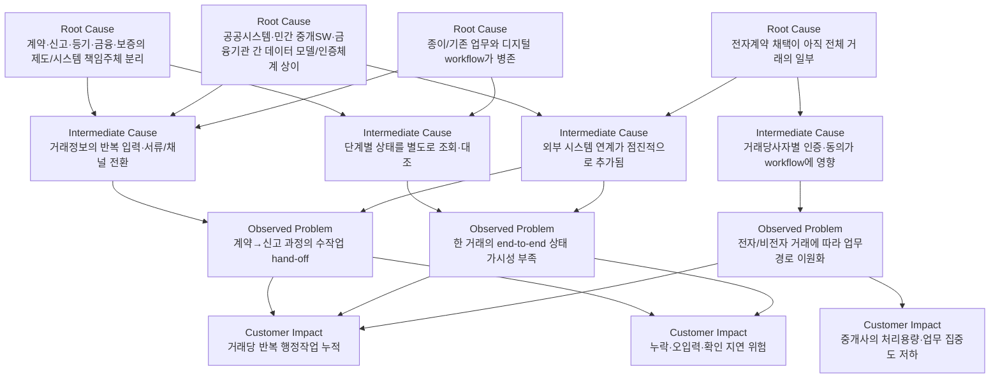
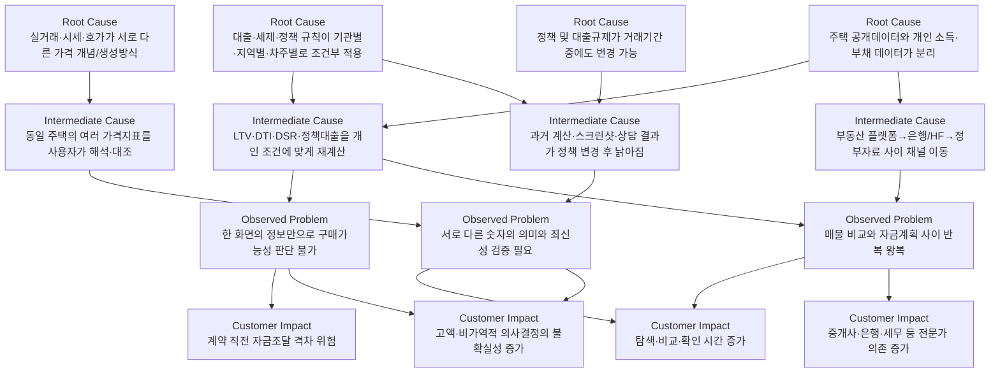
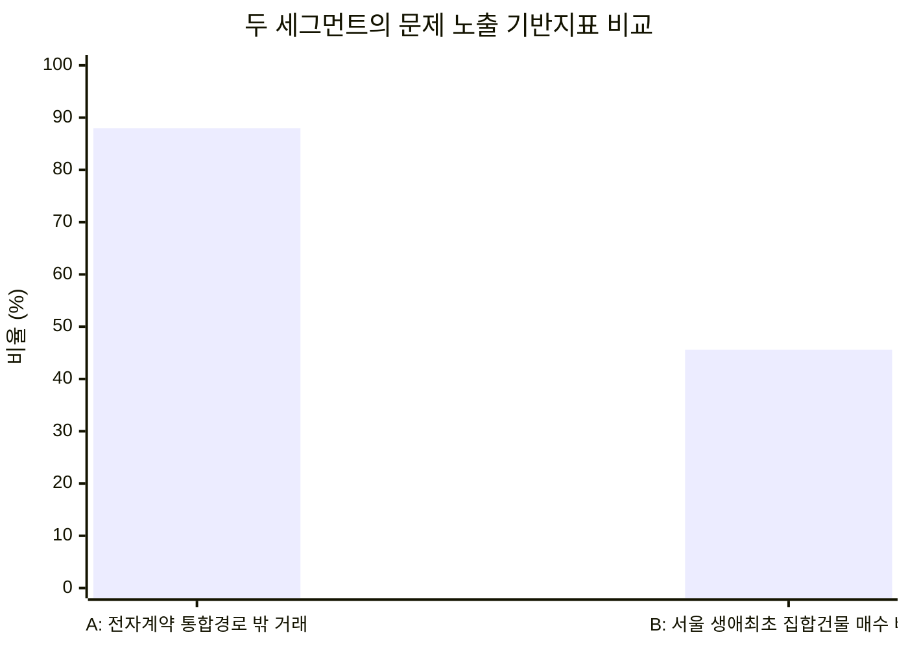

# 국내 주거 부동산 정보 플랫폼의 두 핵심 문제×고객 세그먼트 심층 인과 분석

## Executive Summary

본 보고서는 최근 5년인 **2021~2026년을 기본 분석기간**으로 두고, 앞선 시장 탐색에서 선별된 두 세그먼트를 비교한다. **세그먼트 A는 ‘거래 프로세스 분절 × 수도권에서 주거 거래를 반복 처리하는 개업공인중개사’, 세그먼트 B는 ‘의사결정 정보 파편화 × 수도권 생애최초·실거주 주택 구매자’**다. 공개자료는 2026년 공개분까지 반영했으며, 최신 확정치가 없는 경우 가장 최근의 공공·공식 통계를 사용했다.

핵심 결론은 두 문제가 모두 “정보가 부족해서” 발생한다기보다 **이미 존재하는 데이터·시스템·서비스의 경계가 실제 의사결정 또는 업무 단위와 일치하지 않아서 발생하는 연결 실패**에 가깝다는 것이다.

**A의 핵심 문제는 거래 단계별 디지털화 속도보다 단계 간 통합 속도가 느리다는 점이다.** 부동산 전자계약은 계약 후 실거래·임대차 신고와 확정일자 신청을 자동화하지만, 2025년 전자계약 체결은 50만7,431건으로 급증했음에도 전체 거래 대비 이용률은 2025년 11월 기준 **12.04%**에 불과했다. 따라서 약 **87.96%가 전자계약이라는 통합 경로 밖에서 처리됐다는 노출 지표**를 얻을 수 있다. 단, 이 87.96%에는 직거래 등도 포함되므로 “중개사의 87.96%가 분절 문제를 경험한다”는 의미는 아니다. citeturn13search1turn13search6turn13search13

A에서 중요한 것은 전자계약 기능의 부재가 아니다. 국토교통부 전자계약시스템은 계약 작성·서명·중개사 확인 후 실거래·임대차 신고와 확정일자를 연계한다. 반면 일반 경로에서는 거래당사자 또는 중개업자가 별도의 부동산거래관리시스템에 신고서를 등록해야 한다. 2025년 하반기에야 HUG와의 계약정보 전송, 공인중개사협회 ‘한방’ 시스템과의 양방향 계약 수정 연계가 추가됐고, 2026년 1월에는 인증수단도 3종에서 15종으로 확대됐다. 이는 **기존 시스템이 계속 통합되고 있다는 사실 자체가 이전까지의 연결비용이 실재했음을 보여주는 간접 증거**다. citeturn24view2turn13search13

**B의 핵심 문제는 ‘매물 정보가 여러 앱에 흩어져 있다’보다 더 깊다.** 실거래, 시세, 호가, 대출가능액, 정책대출, 세금과 규제는 각각 **다른 정의·기준시점·기관·개인정보 요구조건**을 갖는다. 한국부동산원의 거래통계는 전국 256개 시군구에 신고·접수된 거래자료를 RTMS에서 취합해 산출하는 반면, 플랫폼 시세나 매도자의 호가는 다른 개념이다. 동시에 대출 가능액은 주택가격뿐 아니라 지역, 차주 유형, 보유주택, 소득·부채, DSR, 정책상품 요건 등에 의해 달라진다. citeturn24view6turn24view4turn24view5

이 복잡성은 특히 생애최초 구매자에게 크다. 한국주택금융공사의 2025년 조사에서 일반가구의 **36.4%가 주택금융상품을 이용**했고, 30대 이하에서는 43.8%였다. 무주택가구 1,885가구 중 **55.5%가 향후 주택 구입 의향**을 보였으며, 구매의향 가구의 희망가격 평균은 **4억6,210만원**, 46.3%가 3억~6억원 구간을 선호했다. 85.1%는 아파트를 선호했다. citeturn25view0turn25view1turn25view3

정책 변화의 금액 효과도 크다. 2025년 6월 28일부터 수도권·규제지역 생애최초 주택구입자의 LTV가 **80%에서 70%로 낮아졌다.** 다른 제약이 없다는 단순 예시에서 6억원 주택이라면 LTV 한도 차이만 **6,000만원**이다. 실제 대출액은 DSR·상품한도 등에 의해 더 낮아질 수 있으므로 이는 실제 손실액이 아니라 **의사결정 규칙이 바뀔 때 자금계획이 얼마나 크게 달라질 수 있는지를 보여주는 민감도 예시**다. 같은 해 10월에는 규제지역 여부와 주택가격 구간에 따라 일반 차주의 LTV 및 최대 대출한도가 다시 세분화됐다. citeturn24view4turn24view5

연구 우선순위 관점에서 보면 **A는 발생빈도와 반복성, B는 영향받는 소비자 기반과 금전적 의사결정 규모가 강점**이다. A는 한 중개사가 동일한 업무를 반복하므로 작은 마찰도 누적되지만, 최근 5년간 거래 1건당 몇 분·몇 원이 추가되는지를 직접 측정한 대표 공공통계가 부족하다. 반대로 B는 대출·거래·등기·가격 관련 데이터가 풍부하지만, “첫 구매자가 정보 조합에 실제 몇 시간을 쓰는가”에 대한 대표적 전국 조사 역시 확인되지 않았다. **따라서 두 세그먼트 모두 다음 단계에서 직접 시간측정·행동로그·인터뷰가 필요한 연구공백이 명확하다.**

## 연구 범위·시장 정의·데이터 해석

분석단위가 다른 통계를 그대로 섞으면 시장규모와 문제빈도를 과대·과소평가할 수 있으므로 다음과 같이 정의를 구분했다.

| 지표 | 본 보고서의 정의 | 기준/조사대상 | 해석상 주의점 |
|---|---|---|---|
| **A 고객 모집단** | 실제 영업 중인 개업공인중개사 중 수도권·주거중개를 반복 수행하는 사무소 | 전국 영업 개업공인중개사 2025년 11월 10만9,616명; 한국공인중개사협회 집계 인용 | 10만9,616명은 **전국 전체**이므로 수도권 주거중개 SAM의 상한에 가깝다. 수도권 정확한 SAM은 지자체/V-World 중개업소 원장을 별도 집계해야 한다. citeturn16search10turn17search6 |
| **A 거래 빈도 Proxy** | 전체 부동산거래 중 전자계약 통합경로 이용률 | 2025년 11월 12.04%; 국토교통부 | 전체 부동산거래가 분모이므로 “중개거래만의 채택률”과 동일하지 않다. citeturn13search1turn13search6 |
| **B 고객 모집단 Proxy** | 생애 처음 집합건물을 매수해 소유권이전등기를 한 사람 | 대법원 등기정보광장 | ‘집합건물’에는 아파트뿐 아니라 연립·다세대·오피스텔 등이 포함되고, “실거주 목적”을 직접 식별하지 못한다. 계약시점이 아니라 **등기시점** 통계다. citeturn23search3turn23search0 |
| **B 금융노출 Proxy** | 주담대·전세대출·중도금대출 이용 여부 | 2025년 HF 일반가구 조사 | 생애최초 구매자만의 이용률은 아니다. 전체 가구 및 연령별 금융의존도를 보여주는 보조지표다. citeturn25view0 |
| **거래통계** | 신고·검인·허가 등으로 지자체에 접수된 부동산거래 | 전국 256개 시군구, 한국부동산원 | 법원 등기통계와 사건·시점·대상 정의가 다르므로 직접 합산하면 안 된다. citeturn24view6 |

수치 간 차이도 정의와 업데이트 시점에서 발생한다. 예를 들어 2025년 서울 집합건물 생애최초 매수자는 2026년 1월 8일 조회 기사에서는 **61,132명**이었으나 이후 등기정보광장 갱신을 반영한 2월 자료에서는 **61,161건**으로 나타난다. 여기서는 더 늦게 조회된 61,161을 사용하되, 법원 등기통계는 후행 등기가 추가되면서 이전 조회치가 소폭 수정될 수 있음을 전제로 한다. citeturn23search9turn23search8

또한 국토교통부의 **2025년 전자계약 50만7,431건**은 연간 누계인 반면, **이용률 12.04%는 2025년 11월 기준**으로 발표된 지표다. 따라서 50만7,431을 연간 전체거래 건수로 단순 나누어 12.04%를 재현하려 해서는 안 된다. citeturn13search6turn13search13

## 세그먼트 A — 거래 프로세스 분절 × 수도권 주거거래 개업공인중개사

**문제 정의.** 수도권에서 주거용 매매·임대차를 반복 중개하는 개업공인중개사는 계약 체결 자체뿐 아니라 당사자 확인, 계약정보 관리, 거래·임대차 신고, 확정일자, 보증·금융 관련 정보 전달 및 후속 행정상태 확인 등 여러 단계에 관여한다. 개별 단계의 전산화는 진행됐지만 **거래 전체를 하나의 지속적인 업무 객체로 처리하는 통합 정도가 충분하지 않아, 채널 전환·재확인·재입력·상태 추적이 발생하는 것**이 핵심 문제다. 이 진술은 전자계약 이용 시 신고·확정일자가 자동 연계되는 반면 일반 RTMS 경로에서는 별도 신고가 필요하고, 2025~2026년에도 시스템 간 연동과 인증 개선이 계속된 사실을 종합한 인과적 추론이다. citeturn24view2turn13search13

**인과 트리**

이 구조의 가장 강한 실증 근거는 **통합경로와 비통합경로의 프로세스 차이**다. 전자계약에서는 계약 작성·당사자 서명·중개사 확인 이후 거래신고·임대차 신고 및 확정일자가 연계되는 반면, 일반 임대차 신고는 임대인·임차인이 계약 체결 후 30일 이내 공동 신고하는 별도 절차이며 계약서를 첨부하면 일방 신고와 확정일자 자동부여가 가능하다. citeturn0search5turn24view2

**Observed direct cause별 구조적 원인**

| 관찰되는 직접 원인 | 제도 | 시장 | 기술 | 데이터 | 사용자 행동 |
|---|---|---|---|---|---|
| **계약 후 신고가 별도 workflow로 존재** | 계약 체결과 법정 신고는 법적 행위·책임구조가 다름 | 전자계약을 쓰지 않는 거래도 계속 존재 | IRTS와 RTMS가 각각 존재 | 계약정보를 신고 데이터로 다시 연결할 필요 | 비전자계약을 선택하면 별도 신고단계 발생 citeturn24view2turn0search5 |
| **전자계약과 기존 계약 경로가 병존** | 전자계약이 모든 거래의 유일한 법정 방식은 아님 | 거래 상대방·중개사가 함께 전자 절차에 참여해야 함 | 전자서명·본인인증 필요 | 전자계약 데이터일 때 자동연계 이점 발생 | 거래별 선택에 따라 사무소가 두 workflow를 모두 유지해야 함이라는 추론 가능 citeturn0search5turn13search6 |
| **외부 시스템 연계가 아직 추가되는 중** | HUG·국토부·협회 등 기관별 기능 존재 | 공공·민간 시스템이 서로 다른 사용자 기반 보유 | 2025년 하반기 HUG 전송·‘한방’ 양방향 수정 연계 추가 | 같은 계약정보를 기관 간 전달하는 인터페이스 필요 | 기존 업무관행과 신규 연계기능의 학습·전환 필요 citeturn13search13 |
| **인증·상태확인 마찰** | 신고 처리 결과는 별도 확인 필요 | 거래당사자별 참여가 필요 | 인증수단이 2026년 1월 3종→15종으로 확대 | 당사자·계약 상태가 단계별로 달라짐 | 인증·승인 지연 시 다음 단계가 대기할 가능성 citeturn0search2turn13search13 |

여기서 사용자 행동 요인은 특히 신중하게 해석해야 한다. 공개자료만으로는 **“중개사들이 종이계약을 선호해서 전자계약을 안 쓴다”**, 혹은 어떤 특정 이유가 12.04% 채택률을 설명한다고 결론 내릴 수 없다. 현재 자료가 입증하는 것은 **낮은 채택률과 기능·인증 개선이 지속 중이라는 사실**이며, 미채택의 구체적 원인 비중은 후속 설문·행동조사가 필요하다. citeturn13search1turn13search13

**현재 대체행동.** 이 고객군에는 크게 두 경로가 병존한다. 전자계약을 사용하면 계약정보를 기반으로 신고·확정일자 연계를 이용하고, 그렇지 않은 거래는 계약 후 RTMS 등을 통해 별도로 신고하는 방식이다. 금융·보증처럼 거래 이후의 다른 업무는 해당 기관 경로로 이어진다. 중개사 개인의 메신저·스프레드시트·수기 체크리스트 사용 비율을 보여주는 전국 대표통계는 확인되지 않았으므로, 이를 “보편적 행태”로 간주하기보다는 현장조사에서 검증할 정성적 대체행동 후보로 두는 것이 적절하다. citeturn24view2turn13search13

**기존 서비스가 완전히 해결하지 못하는 이유.** 가장 중요한 증거는 역설적으로 전자계약 자체의 성과다. 2025년 전자계약은 **50만7,431건으로 2024년 23만1,074건의 두 배 이상**, 민간 중개 전자계약은 **32만7,974건으로 전년 7만3,622건의 약 4.5배** 증가했다. 자동 신고와 정보연계에 분명한 효용이 존재한다는 뜻이다. 그러나 전체 이용률은 2025년 11월 **12.04%**에 그쳤다. 즉, 시스템이 없는 것이 아니라 **효용 있는 통합경로가 전체 업무환경의 표준이 되지 못한 상태**가 문제다. citeturn13search6turn13search13

또한 “전자계약=전체 거래 lifecycle 완전 통합”으로 보기도 어렵다. 국토교통부 안내상 전자계약은 신고·확정일자를 자동화하지만, 임차인의 대항력 확보를 위한 전입신고 등은 별도의 법적 행위로 남으며, 처리결과 확인이 필요한 경우도 있다. 2025년 하반기에 HUG 연계와 민간 중개시스템 양방향 수정 기능이 추가된 것도 **통합 범위가 단계적으로 확장되고 있음**을 보여준다. citeturn0search2turn0search5turn13search13

**결과의 정량화**

| 결과 차원 | 관측치 | 출처·기준연도·대상 | 의미 |
|---|---:|---|---|
| **문제 노출 빈도 Proxy** | 전자계약 이용률 12.04% → 비이용 87.96% | 국토교통부, 2025년 11월, 전체 부동산거래 | 통합 전자계약 경로 밖에 있는 거래의 규모 Proxy. 중개거래만의 비율은 아님. citeturn13search1turn13search6 |
| **디지털 전환 속도** | 507,431건 | 2025년 전체 전자계약 | 전년 231,074건의 두 배 이상으로 문제환경이 빠르게 변하고 있음. citeturn13search6 |
| **민간중개 전환** | 327,974건 | 2025년 민간 중개 전자계약 | 2024년 73,622건 대비 약 4.5배. citeturn13search13 |
| **잠재 고객 상한** | 109,616명 | 2025년 11월 말 전국 영업 개업공인중개사, 한국공인중개사협회 | 수도권·주거중개만을 추리면 실제 SAM은 더 작음. citeturn16search10 |
| **산업 압박 지표** | 폐·휴업 > 신규개업이 2023년 2월 이후 지속 | 한국공인중개사협회, 2025년 11월까지 | workflow 문제의 결과로 해석하면 안 되지만, 중개업자의 비용·생산성 민감도가 커진 환경임을 보여주는 배경지표. citeturn16search8turn16search10 |
| **법정 반복업무** | 임대차 계약 후 30일 이내 신고 | RTMS, 주택임대차 신고대상 거래 | 비전자 경로에서 발생하는 후속 행정 단계의 객관적 빈도. citeturn24view2 |
| **거래당 추가 시간** | **신뢰 가능한 최신 대표값 미확인** | 2021~2026 공개자료 검색 | 핵심 데이터 공백. 직접 time-and-motion 측정 필요. |
| **중개사 직접 비용** | **대표적 전국 실측값 미확인** | 동일 | 시스템 비용보다 인건비·재작업시간을 측정해야 함. |
| **오류/누락 확률** | **통합경로 vs 비통합경로 비교통계 미확인** | 동일 | 후속 연구에서 신고 정정률·반려율·재처리율 확보 필요. |

즉 A의 가장 큰 연구공백은 **“문제가 있는가”가 아니라 “거래 1건당 몇 분·몇 번·얼마의 비용으로 나타나는가”**이다. 공개자료로는 시스템 구조와 채택률은 강하게 관찰되지만, 공인중개사 단위의 productivity loss는 아직 직접 정량화하기 어렵다.

## 세그먼트 B — 의사결정 정보 파편화 × 수도권 생애최초·실거주 주택 구매자

**문제 정의.** 이 세그먼트가 해결하려는 실질 질문은 “이 집의 실거래가가 얼마인가?” 하나가 아니라 **“현재 내 소득·부채·정책조건에서 이 주택을 얼마까지 살 수 있고, 지금의 가격이 합리적이며, 대출·세금·정책변경을 고려한 최종 부담을 감당할 수 있는가?”**에 가깝다. 그런데 이 질문에 필요한 주택 데이터와 개인 금융 데이터는 서로 다른 제도·기관·플랫폼에 위치하고 기준시점과 정의도 다르다. citeturn24view6turn24view4turn25view0

**인과 트리**

이 인과 구조에서 특히 객관적으로 확인되는 것은 **데이터 정의의 분리와 금융규칙의 조건부성**이다. 한국부동산원의 부동산거래현황은 전국 시군구에 신고·검인된 거래를 RTMS로 취합해 통계를 생산한다. 이는 매도자가 현재 제시하는 호가나 민간 플랫폼의 자체 시세와 같은 개념이 아니다. citeturn24view6

금융에서는 단순히 “생애최초이면 LTV 70%”로 끝나지 않는다. 2025년 10월 금융위원회 문답 기준 규제지역에서는 일반 무주택 금융권 차주의 LTV가 40%까지 낮아지는 반면 생애최초 구매자의 LTV는 70%가 유지됐고, 15억원 이하·15~25억원·25억원 초과 등 가격구간에 따라 최대 주담대 한도도 달라졌다. 동시에 은행권 DSR 40%가 적용되고, 디딤돌·보금자리론은 별도의 최대한도·DTI·주택가격·소득요건을 가진다. citeturn24view5

**Observed direct cause별 구조적 원인**

| 관찰되는 직접 원인 | 제도 | 시장 | 기술 | 데이터 | 사용자 행동 |
|---|---|---|---|---|---|
| **실거래·호가·시세가 서로 다른 숫자** | 신고거래 통계와 감정·시세정보의 목적이 다름 | 매도자 호가는 시장 참여자가 결정 | 플랫폼별 산정·표시방식 차이 가능 | 발생시점·표본·신고여부·추정방식이 다름 | 첫 구매자는 어느 숫자를 의사결정 기준으로 써야 할지 학습해야 함 citeturn24view6 |
| **대출 가능액이 개인마다 다름** | LTV·DTI·DSR·정책상품 규칙 병존 | 금융기관별 실제 심사·상품조건 존재 | 개인 신용·부채정보가 필요 | 소득·기존대출·주택가격·지역 데이터를 결합해야 함 | 온라인 계산 후에도 금융기관 확인을 반복할 유인이 큼 citeturn24view4turn24view5 |
| **정책이 탐색기간 중 변할 수 있음** | 2025년 6·27, 10·15 등 연속 대출정책 변경 | 정책 발표 직후 수요·가격·대출환경 반응 | 계산 로직·콘텐츠의 신속한 업데이트 필요 | 적용일·경과규정이 데이터에 추가됨 | 사용자는 이전에 저장한 계산을 다시 검증해야 함 citeturn24view4turn24view5 |
| **주택정보와 구매자의 financial context가 분리** | 부동산·금융 데이터의 담당기관과 법적 목적이 다름 | 부동산 플랫폼과 금융기관이 별도 서비스 | 개인 금융정보 결합에는 인증·동의 필요 | 공개 주택데이터와 비공개 개인부채 데이터 성격이 다름 | 여러 앱·상담채널을 넘나들며 스스로 조합하게 됨이라는 구조적 추론 citeturn24view6turn25view0 |

이 문제에서 ‘사용자가 정보를 중요하게 여긴다’는 점은 학술자료에서도 관찰된다. 2022년 국내 20~50대 417명을 대상으로 한 부동산 디지털 애플리케이션 연구에서는 **정보성·관련성이 인지된 유용성과 신뢰도, 만족도와 유의한 관계**를 보였다. 다만 이 조사는 생애최초 구매자만을 표본으로 한 연구가 아니므로, B 세그먼트에 그대로 일반화해서는 안 된다. citeturn24view7

**현재 대체행동.** 현 구조에서 합리적인 구매자는 부동산 앱의 매물·호가·단지정보와 국토부/한국부동산원의 실거래·통계를 교차 확인하고, 별도로 금융기관·한국주택금융공사의 대출조건을 확인하며, 복잡한 경우 공인중개사·은행 직원·세무 전문가 등의 설명을 다시 받는 방식으로 판단을 보완할 수밖에 없다. 이는 각 정보서비스가 별도로 존재한다는 구조에서 도출되는 대체행동이며, **각 행동을 몇 %의 구매자가 수행하는지를 보여주는 최신 전국 대표통계는 확인되지 않았다.** citeturn24view6turn25view0turn24view4

**기존 서비스가 완전히 해결하지 못하는 이유**는 정보량이 부족해서라기보다 “대상 주택 × 시점 × 개인” 세 축을 동시에 반영해야 하기 때문이다. 실거래시스템은 실제 신고거래를 제공하는 데 강하지만 해당 구매자의 소득·부채·대출상품 적격성을 알지 못한다. 금융기관과 정책대출 시스템은 개인 금융조건을 평가할 수 있지만 시장의 모든 매물을 가격·입지 관점에서 탐색하는 시스템이 아니다. 민간 부동산 앱은 반대로 매물 탐색과 가격정보를 넓게 제공하지만 최종 대출승인은 금융기관 심사와 정책규칙에 좌우된다. 이것은 각 서비스의 기능 부족이라기보다는 **서비스 경계가 고객의 최종 의사결정 단위와 다르다는 문제**다. citeturn24view6turn24view4turn24view5

정책의 변화 속도도 문제를 증폭시킨다. 2025년 6월 28일부터 수도권·규제지역 생애최초 LTV는 80%에서 70%로 조정되고 6개월 전입의무가 붙었으며, 디딤돌 생애최초 최대한도도 3억원에서 2.4억원으로 조정됐다. 이후 10월 규제지역 확대에 따라 일반차주·생애최초·서민실수요자·정책대출의 규칙이 다시 세분화됐다. citeturn24view4turn24view5

**결과의 정량화**

| 결과 차원 | 관측치 | 출처·기준연도·대상 | 의미 |
|---|---:|---|---|
| **최근 수도권 유입 고객** | 18,430명 | 2026년 1월 수도권 생애최초 집합건물 매수자; 서울 6,553·경기 10,275·인천 1,602 | 한 달 기준 관측 가능한 고객 flow Proxy. 집합건물·등기 기준. citeturn23search1turn23search5 |
| **서울 연간 고객 규모** | 61,161건 | 2025년 서울 생애최초 집합건물 등기, 후속 조회치 | 2024년 48,493명 대비 크게 증가. 집합건물에는 오피스텔 등 포함. citeturn23search8turn23search9 |
| **서울 시장 내 비중** | 45.6% | 2026년 1~5월 서울 집합건물 매매등기 72,025건 중 32,843건 | 통계 공개 이후 높은 수준의 첫 구매자 참여. citeturn23search4turn23search15 |
| **금융노출** | 36.4% | HF 2025 일반가구, 주담대·전세대출·중도금대출 이용 | 전체가구 기준. 30대 이하에서는 43.8%. citeturn25view0 |
| **잠재 구매수요** | 55.5% | HF 2025 무주택 일반가구 1,885가구 | 향후 주택구입 의향. 30대 이하 가구주는 58.2%. citeturn25view1 |
| **금전적 의사결정 규모** | 평균 4억6,210만원 | HF 2025 주택구입 의향 가구의 희망 주택가격 | 46.3%가 3억~6억원, 25.7%가 6억원 이상 선호. citeturn25view0turn25view3 |
| **금융규칙 변화의 민감도 예시** | 6억원 주택에서 LTV 80→70% = 이론상 6,000만원 차이 | 2025년 6·27 정책, 단순 계산 | DSR·상품한도 전의 예시이며 실제 승인액과 다름. citeturn24view4 |
| **금리 불확실성** | 고정금리 선호 53.8% | HF 2025 주담대 이용희망 가구 | 전년 50.9%에서 상승; HF는 금리전망 불확실성 증가를 한 배경으로 해석. citeturn25view4 |
| **정보탐색 시간** | **생애최초 구매자 대표 실측값 미확인** | 2021~2026 공개자료 검색 | 후속 diary study/브라우징 로그 필요. |
| **잘못된 정보조합으로 인한 실제 손실액** | **대표 통계 미확인** | 동일 | 계약취소·대출부족·추가 자기자본 등 사건단위 자료 필요. |

B의 문제심각성을 가격 수준만으로 단정할 수는 없지만, **수억원대 거래에 금융규칙이 직접 연결된다는 점**은 분명하다. 특히 HF 조사에서 구입의향 가구의 46.3%가 3억~6억원 주택을 선호하고, 무주택자의 구매의향도 55.5%인 가운데, 같은 2025년에 수도권 생애최초 대출규칙이 크게 바뀌었다는 사실은 정보의 최신성과 맥락성이 고객 의사결정에 실질적인 중요성을 갖는다는 강한 근거다. citeturn25view1turn24view4

## A와 B 비교 분석 및 노출 지표 차트

두 시장의 가장 큰 차이는 **Pain의 반복 단위**다. A에서는 ‘거래 1건’이 반복 단위이므로 한 중개사가 같은 마찰을 지속 경험한다. B에서는 동일 고객의 주택구매 빈도는 낮지만, 한 번의 의사결정 금액과 금융리스크가 매우 크며 탐색 기간 중 동일 판단을 여러 번 갱신할 수 있다. 이 평가는 A의 반복 workflow 구조, B의 거래·금융규모 자료를 종합한 분석이다. citeturn24view2turn25view0turn24view4

| 비교 차원 | A 거래 프로세스 분절 × 중개사 | B 정보 파편화 × 생애최초 구매자 |
|---|---|---|
| **문제의 본질** | 시스템·기관 간 **workflow hand-off** | 데이터·규칙·개인조건 간 **decision hand-off** |
| **주요 사용자 여정** | 중개 → 계약 → 신고 → 확정일자/후속업무 | 탐색 → 가격비교 → 자금계획 → 대출확인 → 구매판단 |
| **Root Cause 핵심** | 법정 업무와 시스템 책임의 분산, 전자/비전자 병존 | 가격 데이터 정의 차이, 금융규칙 조건부성, 개인데이터 분리 |
| **발생 빈도** | **높음**: 중개사가 거래마다 반복 | 거래 자체는 저빈도이나 탐색기간 내 반복 확인이 발생한다는 구조적 추론 |
| **문제 강도** | 건당 중간, 누적효과 큼 | 건당 매우 큼; 수억원의 자금계획과 연계 |
| **가장 강한 정량근거** | 전자계약 이용률 12.04%, 연간 전자계약 50.7만건 citeturn13search6 | 서울 2026년 1~5월 생애최초 집합건물 비중 45.6%, HF 희망가격 평균 4.62억원 citeturn23search4turn25view0 |
| **고객 규모** | 전국 영업 중개사 10만9,616명 상한; 수도권 SAM 별도 산출 필요 citeturn16search10 | 2026년 1월 수도권 생애최초 집합건물 매수 18,430명 citeturn23search1 |
| **기존 서비스 해결 수준** | 전자계약이 핵심 일부를 효과적으로 통합하지만 채택률 낮고 범위 확장 중 | 각 영역별 서비스 품질은 높을 수 있으나 개인화된 구매판단을 횡단적으로 연결하지 못함 |
| **현재 대체행동** | 전자계약 또는 기존계약+RTMS 등 단계별 처리 | 부동산 플랫폼+공공 실거래+금융기관/HF+전문가 교차확인 |
| **시간 영향 정량화** | 최근 대표 실측치 없음 | 최근 대표 실측치 없음 |
| **금전 영향 정량화** | 중개사 단위 직접 생산성비용 자료 부족 | 대출규칙 변화의 자금계획 영향 규모가 직접 계산 가능 |
| **데이터 검증 가능성** | 시스템 로그·중개사 업무관찰을 확보하면 높음 | 공공거래·등기·금융통계는 풍부하나 개인 탐색행동 데이터가 필요 |
| **핵심 미해결 질문** | “한 거래에서 몇 번의 수작업 hand-off가 실제로 발생하는가?” | “어떤 정보 간 불일치가 구매판단을 가장 많이 되돌리는가?” |

공개통계에는 A와 B의 **동일 정의를 사용한 ‘문제 발생률’**이 존재하지 않는다. 따라서 아래 차트는 인과적 발생률 비교가 아니라, 각 세그먼트의 규모를 보여주는 **서로 다른 exposure proxy**를 동일한 0~100% 축에 표시한 것이다.

**A 87.96%**는 2025년 11월 전체 부동산거래의 전자계약 이용률 12.04%를 100에서 뺀 값으로, 통합 전자계약 경로 밖 거래의 비율이다. **B 45.6%**는 2026년 1~5월 서울 집합건물 매매등기 중 생애최초 매수 비중이다. 두 분모가 다르므로 **87.96%가 B보다 두 배 심각하다는 식의 해석은 불가능하다.** citeturn13search6turn23search4

정량연구의 준비도만 보면 B가 약간 우위다. 법원 등기정보광장, 국토부·한국부동산원 거래자료, 금융위원회 규제자료, HF 가구조사를 결합해 **지역×연령×주택가격×대출조건**을 비교할 수 있기 때문이다. A는 시스템 채택률과 개업중개사 모집단은 확보할 수 있으나 실제 업무 loss를 설명하려면 거래별 업무로그나 직접 관찰이 중요하다. citeturn23search3turn24view6turn25view0turn16search10

반면 **인과 가설을 짧은 기간 안에 강하게 검증하기에는 A가 오히려 유리할 수 있다.** 동일 중개사가 여러 거래를 반복하기 때문에 전자계약/비전자계약 거래를 같은 사무소 내에서 비교하거나, 거래당 입력 횟수·사용 시스템 수·처리시간·후속문의 횟수를 측정하는 within-subject 설계가 가능하기 때문이다. 이는 현재 데이터 구조에 대한 연구설계상의 판단이다.

## 검증 가능한 핵심 인과 가설

각 가설은 현재 자료가 보여주는 “상관 또는 구조적 가능성”을 **인과 주장으로 확정하지 않고**, 후속 자료로 반증할 수 있도록 정의했다.

**세그먼트 A 가설**

| 가설 | 명확한 인과 주장 | 반증 조건 | 필요한 데이터와 핵심 Metric |
|---|---|---|---|
| **A-H1: 비통합 경로가 반복업무의 핵심 원인이다** | 동일한 유형의 주거 중개거래에서 **비전자계약 거래가 전자계약 거래보다 계약 후 별도 데이터 입력·채널 전환 횟수를 유의하게 많이 발생시킨다.** 전자계약의 자동신고 구조가 근거다. citeturn0search5turn24view2 | 두 방식의 시스템 전환·재입력 횟수와 총 처리시간에 유의한 차이가 없으면 기각 | 거래별 화면/업무 로그. `시스템 수`, `동일 필드 재입력 횟수`, `계약→신고 완료 시간`, `중개사 active minutes` |
| **A-H2: 채택의 병목은 기능 부족보다 다자간 workflow 의존성이다** | 전자계약의 미사용은 중개사의 기술수용도만으로 설명되지 않고 **거래당사자의 인증·동의·사용가능성**이 유의한 추가 설명력을 가진다. 인증수단 확대가 지속된 사실은 이 가설의 배경근거다. citeturn13search13 | 중개사 디지털 역량을 통제한 뒤 상대방 변수의 설명력이 없으면 기각 | 최근 100~300건 거래 설문/로그. `전자계약 제안율`, `상대방 거절률`, `인증 실패·지연률`, `최종 채택률` |
| **A-H3: 가장 큰 Pain은 계약서 작성이 아니라 단계 사이 상태관리다** | 총 불편시간 중 문서 작성 자체보다 **신고·승인·보증 등 후속 상태확인과 예외처리 시간**이 더 큰 비중을 차지한다. 시스템이 신고를 자동화하면서도 처리결과 확인이 필요하다는 구조가 근거다. citeturn0search2turn13search13 | 계약서 입력·작성 시간이 후속 확인·재처리보다 일관되게 크면 기각 | Time-and-motion study. `단계별 소요시간`, `재조회 횟수`, `반려/수정률`, `전화·메시지 후속접촉 수` |

A-H1이 가장 먼저 검증할 가치가 높다. **전자계약 채택률 12.04%라는 시장지표를 실제 생산성 차이로 연결할 수 있기 때문**이다. 만약 전자/비전자 거래 간 처리시간 차이가 미미하다면 “프로세스 분절”의 사업적 심각성은 크게 낮아지고, 반대로 차이가 크다면 시장 문제의 정량적 근거가 강해진다. citeturn13search6

**세그먼트 B 가설**

| 가설 | 명확한 인과 주장 | 반증 조건 | 필요한 데이터와 핵심 Metric |
|---|---|---|---|
| **B-H1: 정보의 ‘부족’보다 ‘조합’이 구매판단 지연의 주원인이다** | 생애최초 구매자는 필요한 정보가 전혀 없는 경우보다 **실거래·호가·대출·정책 정보를 서로 대조해야 할 때 더 많은 탐색시간과 판단 번복을 경험한다.** 정보성과 관련성이 앱 만족도에 유의하다는 기존 연구가 배경근거다. citeturn24view7turn24view6 | 정보원 수/교차확인 횟수가 많아도 총 판단시간·번복횟수가 증가하지 않으면 기각 | 구매자 browser diary 및 설문. `정보원 수`, `cross-check 횟수`, `탐색시간`, `후보주택 탈락·복원 횟수`, `판단확신도` |
| **B-H2: 대출조건 변화가 가격정보 차이보다 더 큰 재계획을 유발한다** | 대출의존도가 높은 생애최초 구매자에서는 **가격정보의 소폭 수정보다 LTV·DSR·정책대출 적격조건 변경이 자기자본 부족액과 구매후보 변경에 더 큰 영향을 준다.** 2025년 LTV·상품한도 변화가 검증 가능한 자연실험을 제공한다. citeturn24view4turn24view5 | 정책 변경 전후 대출의존 구매자의 예산·후보 변화가 현금의존 구매자와 차이가 없으면 기각 | 정책 전후 패널/대출 사전조회 로그. `최대대출액 변화`, `필요 자기자본 변화`, `검색가격 상한`, `후보지역/주택 변경률` |
| **B-H3: 첫 구매자의 핵심 마찰은 가격정보 자체보다 ‘개인화된 적용 가능성’의 불확실성이다** | 같은 공공정보를 제공받아도 **기존 주택구매 경험이 없는 사람은 자신의 소득·부채·지역·주택가격에 규칙을 적용하는 오류율과 전문가 재확인율이 더 높다.** | 구매경험을 통제해도 규칙 적용 정확도·재확인 행동에 차이가 없으면 기각 | 첫 구매자 vs 기존 구매자 실험. `대출가능액 추정오차`, `세금/정책 적격성 오답률`, `은행·중개사 재확인율`, `confidence-error gap` |

B-H2는 특히 자연실험 가능성이 높다. 2025년 6월 28일 수도권 생애최초 LTV가 **80%→70%**로 바뀌고 디딤돌 생애최초 한도가 **3억원→2.4억원**으로 낮아진 뒤, 10월 규제지역별 규칙이 다시 변경됐다. 정책 경계일 전후의 검색가격대, 대출 사전조회, 계약·등기 행동을 비교하면 단순 설문보다 강한 인과검증이 가능하다. citeturn24view4turn24view5

두 시장을 연구목적으로 다시 요약하면 다음과 같다. **A에서 가장 중요한 미지수는 ‘반복되는 업무마찰의 단위 비용’이고, B에서 가장 중요한 미지수는 ‘정보를 스스로 조합하는 과정이 실제 구매판단에 만드는 오류·지연의 크기’다.** 이 두 수치가 확보되기 전에는 어느 문제도 특정 서비스 방식이 필요하다고 결론 내리기 이르다.

## 핵심 참고자료와 URL

아래는 시장규모·프로세스·금융규칙·고객행태 판단에 직접 사용한 핵심 원자료다.

| 기관·자료 | 활용 내용 | URL |
|---|---|---|
| 국토교통부 부동산거래 전자계약시스템 | 전자계약 절차, 자동 신고·확정일자 연계 | `https://irts.molit.go.kr/` |
| 국토교통부 부동산거래관리시스템 | 주택임대차 신고 절차·30일 신고의무 | `https://rtms.molit.go.kr/main/serviceInfo.do` |
| 한국부동산원 부동산거래현황 | 거래통계의 대상·전국 256개 시군구·RTMS 취합 방식 | `https://www.reb.or.kr/reb/cm/cntnts/cntntsView.do?cntntsId=1061&mi=10338&statId=S234220286` |
| 한국주택금융공사 2025년 주택금융 및 보금자리론 실태조사 | 금융상품 이용률, 무주택 구매의향, 희망가격, 금리선호 | `https://www.hf.go.kr/ko/sub05/sub05_04_05.do?articleNo=599851&mode=view` |
| 금융위원회 2025년 6월 가계부채 관리 강화방안 | 수도권 생애최초 LTV 80→70%, 대출한도·전입의무 변경 | `https://www.fsc.go.kr/no010101/84824` |
| 금융위원회 10·15 대책 정책문답 | 규제지역·주택가격·차주유형별 LTV·DTI·주담대 한도 | `https://www.fsc.go.kr/po020201/85466` |
| 대한민국 법원 등기정보광장 | 생애최초·지역·연령·집합건물 소유권이전등기 기반 데이터 | `https://data.iros.go.kr/cr/rs/openRgsCs.do?ris_menu_seq=0000000022` |
| 한국공인중개사협회 | 개업공인중개사 현황 및 중개업 관련 통계·자료 | `https://www.kar.or.kr/` |
| KCI, 「소비자의 부동산 디지털 어플리케이션 이용 요인 및 만족도 연구」 | 20~50대 417명 대상 정보성·관련성·신뢰·만족 관계 | `https://www.kci.go.kr/kciportal/landing/article.kci?arti_id=ART002925058` |

전체적으로 공공데이터는 **A의 ‘제도·시스템 구조’와 B의 ‘시장·금융규칙’에는 매우 강하지만**, A의 거래당 업무시간·재작업률과 B의 구매자별 탐색시간·정보전환 횟수에는 공통적으로 약하다. 따라서 이후 TAM-SAM-SOM이나 시장성 평가에서 단순한 모집단 규모뿐 아니라 **A는 `거래건수 × 추가업무시간`, B는 `활성 구매자 수 × 판단 반복횟수 × 재계획의 금전적 규모`**를 중심 변수로 검증하는 것이 두 문제의 실질적 크기를 판별하는 데 가장 중요하다.