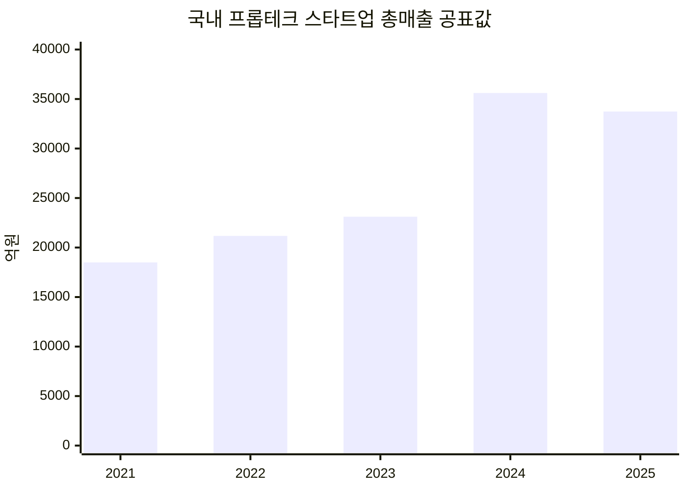
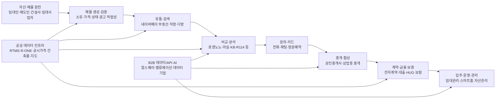

# 국내 부동산 정보 플랫폼 시장 심층분석

**분석 범위:** 대한민국, 최근 5개년 중심(2021~2025년), 2026년 8월 초까지 공개된 자료 반영  
**시장 정의:** 주거·상업용 부동산의 **매물 탐색·광고, 시세·실거래·입지 정보, 비교·분석, 중개 리드, 거래·계약 지원, 데이터·밸류에이션 서비스**를 핵심 범위로 본다. 자산관리·스마트홈·건설테크 등은 사용자 여정이나 주요 플랫폼의 사업모델과 직접 연결될 때만 포함한다.  
**중요한 측정 한계:** 한국에는 '부동산 정보 플랫폼'만을 독립 산업으로 집계하는 공식 시장통계가 없다. 따라서 아래에서는 ① 한국프롭테크포럼의 **광의 프롭테크 기업 매출**을 시장규모의 상위 개념 proxy로, ② 개별 플랫폼 공시 매출을 기업 economics의 관측치로, ③ 앱 이용자·주택거래·전자계약 등 활동지표를 수요 proxy로 병행한다. 이 세 종류의 수치는 서로 시장 정의와 조사대상이 달라 직접 합산하면 안 된다. 한국프롭테크포럼의 편람 자체도 연도별 응답·공시 확인 기업이 달라 과거 수치가 재작성되고 있다. citeturn18search1turn17search1turn17search5

## Executive Summary

국내 부동산 정보 플랫폼 시장의 최근 5년은 단순히 **"온라인 매물광고 시장이 성장했다"**고 요약하기 어렵다. 더 중요한 변화는 **매물 검색 → 데이터 기반 의사결정 → 신뢰·검증 → 문의·중개 → 전자계약·금융/보증**으로 플랫폼의 가치사슬이 길어졌다는 점이다. 2025년 광의 프롭테크 스타트업 총매출은 3조3,735억원으로 최신 편람 기준 전년보다 6.4% 감소했지만, 기업당 평균 매출은 오히려 19% 늘었다. 최신 집계의 총매출과 평균매출을 역산하면 매출 집계 기업이 약 131개에서 103개로 줄어든 셈이므로, **총매출 감소를 동일 기업군의 6.4% 역성장으로 해석하면 오류**다. 같은 시기 신규투자액은 2,574억원에서 1,921억원으로 25.4% 감소했고 고용도 1만3,026명으로 1,363명 줄어, 외형확대보다는 비용·생산성·AI 중심의 재편이 진행된 것은 비교적 분명하다. citeturn17search4turn17search5turn18search7

| 핵심 지표 | 최신 관측치 | 기준·조사대상·정의 | 의미 |
|---|---:|---|---|
| 광의 프롭테크 스타트업 매출 | **3조3,735억원** | 2025년, 한국프롭테크포럼 2026 회원사 편람의 매출 확인 기업; 중개·마케팅뿐 아니라 데이터·관리·건설 등 광의 프롭테크 | 좁은 의미 '정보 플랫폼'보다 넓은 proxy. 최신 편람 기준 전년 -6.4%, 기업당 평균매출 +19%. citeturn17search4turn17search5 |
| 프롭테크 신규투자 | **1,921억원** | 2025년, 투자유치 27개사 | 2024년 2,574억원·37개사 대비 금액 -25.4%; 투자 한파 지속. citeturn17search5 |
| 프롭테크 종사자 | **1만3,026명** | 2025년 편람 조사기업 | 전년보다 1,363명(-9.5%) 감소; 표본변동과 효율화가 함께 작용. citeturn17search4 |
| 마케팅 플랫폼 누적 투자 비중 | **48.9%** | 2011~2025 누적투자 6조5,955억원 중 3조2,253억원 | 역사적으로 자본이 매물·중개·마케팅 플랫폼에 집중. citeturn17search5turn18search10 |
| 전국 주택 매매량 | **약 72.6만건** | 2025년 전국 주택 매매; 한국부동산원 통계를 인용한 KB 분석 | 2024년 대비 약 13% 증가했지만 직전 10년 평균 88.5만건보다 약 18% 낮음. citeturn8search8 |
| 전자계약 | **50만7,431건** | 2025년 부동산 전자계약 전체, 공공+민간 | 2024년 23만1,074건의 2.2배; 2025년 11월 활용률 12.04%. citeturn22search5turn22search13 |
| 독립 부동산 앱 사용자 | 호갱노노 **228만**, 직방 **134만**, 다방 **80만** | 2026년 5월 WiseApp·Retail 추정 사용자; 독립 앱 기준 | 거래 직전만 쓰는 앱보다 반복적인 시세·단지 모니터링 서비스가 강한 사용성을 보임. 네이버페이 내 부동산은 이 순위와 직접 비교 불가. citeturn12search1turn13search12 |
| 1인가구 | **804만5천 가구, 36.1%** | 2024년 전체 가구, 통계청 | 소형주거·임대차·월세·생활권 데이터 수요의 구조적 기반. citeturn20search1 |
| 영업 중 개업공인중개사 | **10만9,616명** | 2025년 11월 말, 한국공인중개사협회 집계 | 2022년 11만8,952명 정점 대비 약 7.9% 감소; 2023년 이후 폐·휴업이 신규개업을 지속적으로 상회. citeturn21search0turn21search6 |
| 허위매물 신고·확인 | 신고 **1만5,935건**, 실제 허위 **1만1,339건** | 2025년 상반기 KISO 부동산매물클린관리센터 신고 표본 | 신고 중 71.2%가 실제 허위로 확인. 단, 전체 매물 중 허위 비율을 뜻하지 않음. citeturn23search1 |
| 전세사기 피해자등 누적 결정 | **3만9,121건** | 2023년 특별법 제정~2026년 5월, 국토교통부 위원회 | 주거 플랫폼에서 '정보량'보다 권리·위험 검증이 중요해진 대표 사례. citeturn23search9 |

### 핵심 결론

| 판단 | 근거 | 함의 |
|---|---|---|
| **정보 플랫폼의 경쟁축이 '매물 수'에서 '의사결정의 질'로 이동** | 2026년 5월 호갱노노 이용자 228만명이 직방 134만명을 웃돌고, 호갱노노의 월평균 이용시간도 주요 매물 앱보다 길게 측정됨. citeturn12search1turn12search4 | 시세·단지·실거래·학군·개발정보처럼 거래 전후에도 반복 방문시키는 데이터가 핵심 retention 자산. |
| **탐색은 디지털화됐지만 계약은 아직 덜 디지털화됨** | 전자계약 활용률은 2024년 5.95%에서 2025년 11월 12.04%로 급상승했지만 여전히 대부분의 계약은 전자계약 밖에서 이뤄짐. citeturn22search6turn22search13 | 가장 큰 공백은 '검색 앱' 자체보다 검증·중개·계약·금융을 연결하는 workflow에 존재. |
| **신뢰 문제는 아직 구조적으로 미해결** | 2025년 상반기 KISO 허위매물 확인 1만1,339건, 2026년 5월까지 전세사기 피해자등 누적 3만9,121건. citeturn23search1turn23search9 | 매물의 실재 여부, 소유·권리관계, 보증 가능성, 계약 조건을 하나의 provenance chain으로 연결할 필요가 큼. |
| **중개업 공급자는 오히려 축소·압박 국면** | 영업 중 중개사는 2022년 11만8,952명에서 2025년 11월 10만9,616명으로 감소. citeturn21search6turn21search13 | 중개사 대상의 광고 슬롯 판매보다 업무 자동화·CRM·광고 ROI·전자계약·리스크 관리가 중요해짐. |
| **AI는 새 서비스라기보다 데이터·workflow 경쟁력을 증폭시키는 층** | 2026 프롭테크 편람은 마케팅·자산관리·데이터분석·건설·스마트빌딩·투자·금융 전반에 AI 적용이 확산됐다고 집계. citeturn17search4turn18search7 | 차별화는 LLM 자체보다 독점/검증 데이터, 최신성, 법적 책임, 업무 시스템 연결에서 발생할 가능성이 높음. |

## 시장 정의와 규모·성장

### 좁은 '부동산 정보 플랫폼' 시장은 공식 규모가 존재하지 않는다

공식 산업분류상 '온라인 부동산 정보 플랫폼 매출'만 따로 집계하는 통계는 없다. 국토교통부의 부동산서비스산업 실태조사는 중개·임대·관리 등 오프라인 사업체까지 포함하는 **부동산서비스산업 전체**를 조사하고, 한국프롭테크포럼은 마케팅 플랫폼뿐 아니라 공유서비스, 데이터·밸류에이션, 인테리어, 스마트빌딩, 건설 솔루션 등 **기술 기반 기업군**을 집계한다. 반면 네이버페이 부동산처럼 대형 플랫폼 내부에 포함된 서비스는 부동산만의 매출이 독립적으로 드러나지 않고, 알스퀘어처럼 데이터·중개와 인테리어 공사가 결합된 회사는 회사 매출 전체를 '정보 플랫폼 매출'로 볼 수 없다. 따라서 단일 숫자보다 **시장정의별 범위**를 먼저 분리하는 것이 타당하다. 국토연구원도 프롭테크를 중개·임대, 관리, 개발, 투자·금융 등 복수 영역으로 구분하고 있으며, 자본시장연구원 역시 국내 프롭테크가 마케팅·공유서비스를 넘어 데이터·관리·건설로 확장돼 왔다고 정리한다. citeturn1search5turn2view3

| 분석상 시장 정의 | 포함 범위 | 규모 측정 방법 | 장점 | 한계 |
|---|---|---|---|---|
| **핵심 정보 플랫폼 시장** | 매물광고, 실거래·시세·단지정보, 비교·분석, 중개 리드, 상업용 데이터 | 플랫폼별 관련 매출 합산 | 사용자가 말하는 '부동산 정보 플랫폼'과 가장 근접 | 네이버 등 사업부 매출 미분리, 비상장사 다수, 회사별 매출 정의 상이 → 현재 공개자료만으로 신뢰성 높은 총액 산출 불가 |
| **광의 프롭테크 시장** | 위 핵심 영역 + 관리·스마트빌딩·인테리어·건설기술·공유서비스 등 | 한국프롭테크포럼 회원·조사기업 매출 합산 | 5년 추세 관측 가능 | 정보 플랫폼보다 범위가 큼; 조사기업 변경으로 시계열 단절. citeturn18search1turn17search4 |
| **부동산서비스산업 전체** | 전통 중개·임대·관리·개발 등 사업체 | 국토부 실태조사 | 산업 전체 경기와 고용 파악에 적합 | 디지털 플랫폼 시장보다 훨씬 넓음. 2023년 매출 -13.7%, 2024년 -2.8%로 프롭테크와 다른 움직임. citeturn3search4turn3search0 |
| **활동량 시장** | 앱 이용, 매매·임대차, 문의·계약 등 | MAU, 거래량, 전자계약 | 소비자 행동 변화를 직접 관측 | 매출과 일대일 대응하지 않음 |
| **기업가치·투자 시장** | 스타트업 투자유치 | 투자액·누적 투자 | 자본의 기대를 파악 | 매출·TAM과 동일하지 않음; 2025년 투자 감소와 기업당 매출 증가가 동시에 발생. citeturn17search5 |

### 최근 5년의 광의 시장 proxy

한국프롭테크포럼의 편람 공표값을 기준으로 보면 프롭테크 기업 매출은 2021년 1조8,499억원, 2022년 2조1,172억원, 2023년 2조3,112억원으로 증가했다. 다만 다음 연도 편람이 조사기업·공시자료를 다시 반영하면서 2023년 비교기준을 3조361억원으로 바꾸었고, 2024년에는 3조5,605억원으로 집계했다. 2026년 편람에서는 다시 2024년 비교기준을 3조6,044억원으로 보정하고 2025년을 3조3,735억원으로 집계했다. 즉 **2023~2025 구간에는 통계적 구조 단절이 있다.** citeturn18search1turn17search1turn17search5

| 연도 | 당시 공표 총매출 | 공표 성장률 | 조사대상·시장정의 | 비교 시 주의점 |
|---|---:|---:|---|---|
| 2021 | **1조8,499억원** | — | 한국프롭테크포럼 조사 프롭테크 기업; 광의 기술기업 | 2024 편람이 제시한 과거값. citeturn18search1 |
| 2022 | **2조1,172억원** | **+14.4%** | 동일 계열 집계 | 2024 편람의 2021·2022 시계열 기준. citeturn18search1 |
| 2023 | **2조3,112억원** | **+9.1%** | 134개사 기준 | 2024 편람 공표값. 이후 2025 편람에서는 2023 비교기준이 3조361억원으로 재산정됨. citeturn18search1turn17search1 |
| 2024 | **3조5,605억원** | **+17.2%*** | 2025 편람 조사기업 | *성장률 분모는 재산정된 2023년 3조361억원이지, 위 행의 2조3,112억원이 아님. citeturn17search1 |
| 2025 | **3조3,735억원** | **-6.4%*** | 2026 편람; 총매출·평균매출 자료상 약 103개사 매출 관측으로 역산 | *2026 편람은 2024년을 3조6,044억원으로 다시 보정. 표본과 공시 확인범위 변화가 감소폭에 포함됨. citeturn17search4turn17search5 |

**도표 해석 주의:** 위 그래프는 각 연도 편람의 대표 공표값을 시각화한 것이며 **동일 표본 패널의 매출 추이 그래프가 아니다.** 특히 2023년 이후에는 재집계가 발생했다. 단순히 2021년 1조8,499억원과 2025년 3조3,735억원을 연결하면 기계적 CAGR은 약 16.2%지만, 이를 통계적으로 엄밀한 시장 CAGR로 사용하는 것은 권하지 않는다. 2025년 편람이 2023년 수치를 3조361억원으로, 2026년 편람이 2024년 수치를 3조6,044억원으로 각각 재기준화했다는 사실이 이를 보여준다. citeturn17search1turn17search5

### 왜 자료마다 시장 규모가 크게 다른가

가장 큰 이유는 **표본·범위·회계기준**이다. 2024 편람은 2023년 총매출을 134개사 기준 2조3,112억원으로 발표했지만, 2025 편람은 전년 비교값을 3조361억원으로 바꿨다. 2026년 자료도 2024년 기존 3조5,605억원을 3조6,044억원으로 보정했다. 2026년 보도자료는 조사대상 회원사 수 변동과 새로 확인된 공시자료 보정이 수치 변화에 반영됐다고 명시한다. 따라서 "어느 자료가 틀렸다"기보다 **각 편람의 vintage가 다르다**고 보는 것이 적절하다. citeturn17search1turn17search5

더 중요한 것은 2025년이다. 총매출은 3조3,735억원으로 전년 재작성치 3조6,044억원보다 6.4% 줄었지만, 기업당 평균매출은 275억1천만원에서 327억5천만원으로 **19% 증가**했다. 총액÷평균을 단순 역산하면 매출이 잡힌 기업 수가 약 131개에서 약 103개로 감소한다. 따라서 2025년의 총액 감소 중 상당 부분은 표본 효과일 가능성이 높으며, 동일기업 매출이 평균적으로 줄었다는 증거가 아니다. 반면 투자유치액은 2,574억원에서 1,921억원으로 줄고 종사자도 1,363명 감소했으므로, **자본과 고용 측면의 긴축은 실질적인 산업 변화**로 보는 것이 더 타당하다. citeturn17search4turn17search5

이 점은 전체 부동산서비스산업과 비교하면 더 선명하다. 국토교통부 실태조사에서 부동산서비스산업 전체의 매출은 2023년 전년 대비 13.7% 감소했고, 2024년에도 2.8% 감소했다. 반면 프롭테크 편람의 비교가능 성장률은 2023년 +9.1%, 2024년 +17.2%였다. 정의가 달라 시장점유율 계산은 할 수 없지만, **전통 부동산서비스 경기가 약할 때 디지털·데이터 기업군은 상대적으로 더 견조했다**는 방향성은 확인된다. citeturn3search4turn3search0turn18search1turn17search1

## 산업 구조와 경쟁구도

### 밸류체인은 '광고→리드'에서 '데이터→거래 workflow'로 길어지고 있다

국내 초기 프롭테크는 매물 중개·마케팅과 공유서비스에 집중됐지만, 연구기관들은 이후 데이터·밸류에이션·관리·건설·금융으로 범위가 확장됐다고 평가한다. 2022년 자본시장연구원 분석 당시 국내 프롭테크 기업 수는 2018년 26개에서 2022년 8월 368개까지 늘었고, 누적 투자금의 약 74%가 마케팅 플랫폼과 공유서비스에 집중돼 있었다. 2025년 말 누적투자 기준으로도 마케팅 플랫폼이 48.9%를 차지해, **검색·중개 계층이 여전히 가장 자본집약적인 출발점**임을 보여준다. citeturn2view3turn17search5

국토교통부와 한국부동산원은 실거래·가격통계·청약·전자계약 등 핵심 인프라를 직접 제공하고 있고, R-ONE은 Open API도 운영한다. 이에 따라 단순한 실거래 조회 자체는 점차 공공재화되고, 민간 플랫폼의 차별화 지점은 **데이터 정제·결합, 최신성, UX, 추천, 검증, 중개 네트워크, 계약 workflow** 쪽으로 이동하고 있다. 한국부동산원 스스로도 R-ONE의 부동산거래현황 통계와 국토부 실거래 공개시스템이 집계·공개 기준이 다르므로 혼용에 주의하라고 안내한다. 즉 공공데이터가 풍부한 것과 사용자가 하나의 일관된 의사결정 데이터셋을 얻는 것은 별개의 문제다. citeturn22search0turn22search7turn22search16

### 플랫폼 유형과 사업자 포지셔닝

| 유형 | 핵심 가치 | 대표 사업자·서비스 | 주 수익모델 | 최근 구조 변화 |
|---|---|---|---|---|
| 주거 매물·중개 리드 | 매물 탐색, 중개사 연결 | 네이버페이 부동산, 직방, 다방, 피터팬 등 | 중개사 광고·상품, 분양광고, 제휴 | 검색만으로는 방문빈도가 낮아 시세·단지·AI·금융으로 확장 |
| 주거 데이터·의사결정 | 실거래, 시세, 단지·학군·수요·개발정보 | 호갱노노, 아실, KB부동산, 부동산R114 | 광고, 데이터, 금융 cross-sell, 플랫폼 생태계 | 호갱노노가 2024년 전국 아파트 매물까지 확대하면서 '정보→거래' 역진입. citeturn12search16 |
| 임대인·중개사 도구 | 매물 등록, 고객관리, 광고·업무 | 다방프로·다방 방주인, 직방 중개사 도구 등 | SaaS/광고/리드 | 중개사 감소와 비용압력 때문에 광고보다 productivity ROI가 중요해짐. 다방은 소비자 앱 외에 '다방프로', '다방 방주인'을 별도 운영한다. citeturn25search20 |
| 상업용 중개·데이터 | 사무실·물류·리테일 DB, 중개, 자문 | 알스퀘어, 부동산플래닛 등 | 중개보수, 데이터 구독, 자문 | B2B SaaS·AI 데이터로 이동; 알스퀘어 RA 고객은 2025년 말 누적 210곳. citeturn11search17 |
| 토지·빌딩 데이터 | 토지·건물 실거래·소유·개발 분석 | 디스코, 밸류맵, 부동산플래닛 등 | 구독·광고·데이터 | 비정형·권리·개발가능성 데이터의 가공가치가 큼 |
| 거래·계약 지원 | 계약서, 신고, 금융·보증 연계 | 국토부 전자계약, 금융·보증기관, 민간 risk-tech | 공공 인프라/제휴·B2B | 2025년 전자계약 50.7만건으로 급증. citeturn22search5 |
| 데이터/API·밸류에이션 | AVM, 권리·공간·시장 데이터 | 리파인, 빅밸류, 알스퀘어 등 | API/SaaS/B2B 계약 | 은행·보험·플랫폼의 데이터 인프라 계층으로 자리잡는 추세. 자본시장연구원도 리파인·빅밸류 등의 금융권 연계를 주요 확장 사례로 제시했다. citeturn2view3 |

### 주요 플랫폼 비교

트래픽은 **독립 앱 MAU**, 매출은 **회사 회계 매출**이므로 서로 다른 지표다. 특히 네이버 부동산 앱은 2024년 11월 종료되고 네이버페이로 통합돼 2026년 독립 부동산 앱 순위와 직접 비교할 수 없다. 종료 직전 네이버 부동산 앱 MAU는 약 120만명 수준으로 보도됐다. citeturn13search12

| 플랫폼 | 이용·트래픽 지표 | 최근 공개 매출 | 수익모델·포지셔닝 | 강점 | 약점·전략 과제 |
|---|---:|---:|---|---|---|
| **네이버페이 부동산** | 독립 앱 종료 전 약 **120만 MAU**(2024); 이후 네이버페이 내부 서비스라 WiseApp 독립앱 순위와 비비교 | 부동산 단독 매출 공개 분리값 확인 어려움 | 매물 검색·광고, 중개업소 노출, 네이버 검색·지도·페이·금융 연결 | 포털 discovery와 광범위한 접점 | 부동산 전용 MAU·매출이 외부에서 잘 보이지 않음. 2025년 AI 집찾기 기능을 도입하고 부동산 영역 광고상품도 확대하는 방향. citeturn13search19turn13search1 |
| **호갱노노** | **228만명**, 2026년 5월; 독립 부동산 앱 1위 | 직방 그룹 내부라 별도 비교 어려움 | 아파트 실거래·단지분석→매물로 확장 | 반복적인 시세·단지 monitoring, 높은 engagement | 매물·중개로 확장할수록 기존 중개 플랫폼과 동일한 검증·lead-quality 문제를 안게 됨. 2024년 전국 아파트 매물 노출 확대. citeturn12search1turn12search16 |
| **직방** | **134만명**, 2026년 5월 | **922억원**, 2025년 감사보고서 기준; 2024년 978억원. 영업손실 121억원 | 매물·분양광고·중개 연결, 데이터, 스마트홈 등 | 강한 주거 브랜드와 호갱노노 데이터 접점 | 2025년에도 회계상 적자이나 영업손실은 256억원→121억원으로 절반 이상 개선; 외형보다 수익성 전환이 핵심. citeturn12search1turn25search0 |
| **다방 / 스테이션3** | **80만명**, 2026년 5월 | **약 209.7억원**, 2024년 감사보고서 영업수익; 2023년 약 209.4억원 | 원룸·투룸·오피스텔 매물, 중개사·집주인 도구 | 임대차·소형주거에서 명확한 브랜드, 다방프로/방주인 등 공급자 도구 | 직방·호갱노노보다 소비자 MAU가 작고 매출 성장도 2023~24 정체. citeturn12search1turn25search5turn25search20 |
| **KB부동산** | **32만명**, 2026년 5월 독립 앱 | 부동산 단독 매출 분리 어려움 | 시세·데이터·금융·대출 연결 | 금융 신뢰·KB시세와 금융 workflow | 독립 앱 사용자 기준 규모는 주요 전문앱보다 작음; 금융 ecosystem 안의 가치가 더 중요. citeturn12search1 |
| **아실** | 인수 시점 약 **140만 MAU**로 보도 | 별도 공개 제한적 | 아파트 공급·수요·거래 데이터 분석 | 투자·시장분석 성격의 반복 이용 | 대형 플랫폼과의 통합 이후 독립 서비스 차별화가 과제; 네이버의 데이터 분석 역량 보강 자산으로 해석 가능. citeturn13search9 |
| **알스퀘어** | 소비자 MAU보다 B2B 고객·DB가 핵심 | **2,001억원**, 2025년 연결 영업수익; 전년 +5.8%. 이 중 서비스수익 약 434억원, 공사수익 약 1,536억원 | 상업용 DB·중개·자문·오피스 인테리어, RA SaaS | 독자적인 상업용 현장·임대 데이터와 end-to-end B2B | 총매출 대부분이 공사수익이라 '데이터 플랫폼 매출'과 동일시하면 안 됨; 데이터 SaaS의 별도 economics가 더 중요한 관찰지표. citeturn11search17turn25search2 |

2026년 5월 앱 이용자만 보면 호갱노노 228만명, 직방 134만명, 다방 80만명, 아파트실거래가 57만명, LH+ 49만명, 자리톡 48만명, KB부동산 32만명 순이었다. 그러나 이는 **네이버페이 내부 부동산, 웹 트래픽, 중복 이용자, 상업용 B2B 서비스를 제외한 독립 앱 지표**다. 이를 점유율로 해석해서는 안 된다. citeturn12search1turn13search12

흥미로운 점은 이용빈도다. 2026년 1~5월 기준 보도된 월평균 앱 이용시간에서 호갱노노는 약 26분24초, 직방·다방은 각각 약 14분54초 수준이었다. 이는 거래 순간의 매물 검색보다 **가격·단지·시장상황을 반복 관찰하는 정보형 use case가 더 높은 engagement를 만들 수 있음**을 시사한다. 인과관계가 아니라 사용패턴에 대한 해석이지만, 호갱노노가 매물 영역으로 역확장한 전략과도 일치한다. citeturn12search4turn12search16

반면 플랫폼별 실제 **문의→방문→중개→계약 전환율과 최종 거래건수**는 비교 가능한 형태로 거의 공개되지 않는다. 부동산 플랫폼은 일반 e-commerce처럼 결제가 플랫폼 안에서 끝나지 않고 상당수 거래가 전화·현장 방문·중개사·외부 계약으로 이탈하기 때문이다. 따라서 MAU가 높다고 계약 점유율이 높다고 판단할 수 없으며, 이 '폐쇄된 funnel 데이터' 자체가 중개사 광고 ROI를 객관적으로 비교하기 어렵게 만드는 시장 구조상의 문제다.

## 고객·공급자와 이용행태

### 수요층은 '한 번 집을 구하는 사용자'에서 '지속적으로 시장을 모니터링하는 사용자'로 넓어졌다

주거 수요 측에서는 가구구조와 임대차 형태 변화가 중요하다. 2024년 한국의 1인가구는 804만5천 가구로 전체 가구의 36.1%였고, 서울에서는 1인가구 비중이 39.9%였다. 통계청 장래가구추계는 1인가구가 2022년 738만9천 가구·34.1%에서 2052년 962만 가구·41.3%까지 늘어날 것으로 본다. 이는 원룸만을 뜻하지 않지만, **소형주거·임대차·생활권·월세관리·이사·보증 등 개인 단위 housing journey가 장기적으로 확대되는 구조**다. citeturn20search1turn20search2

임대차에서도 월세화가 진행되고 있다. 국토교통부 집계에서 2024년 1~8월 전월세 거래 중 월세 비중은 57.4%로 전년 동기보다 2.4%p 높았다. 전세 중심일 때보다 월세가 확대되면 집주인·세입자 모두 계약 이후의 납부관리·증빙·갱신·수익관리 서비스 이용빈도가 높아질 수 있어, 플랫폼의 수익기회가 '입주 전 검색'에서 '입주 후 관리'로 확대될 여지가 있다. citeturn7search22

### 사용자 여정에서 공개적으로 관측 가능한 funnel

| 단계 | 공개적으로 볼 수 있는 지표 | 최신 수치·조사대상 | 해석 | 핵심 데이터 공백 |
|---|---|---|---|---|
| **탐색** | 앱 사용자 | 호갱노노 228만, 직방 134만, 다방 80만; 2026년 5월 독립 앱 추정 | 모바일 탐색 자체는 대규모로 정착. citeturn12search1 | 네이버페이 내 부동산·웹 이용자와 중복을 제거한 전체 시장 UV 없음 |
| **정보 비교** | 이용시간 | 호갱노노 월평균 약 26분24초, 직방·다방 약 14분54초; 2026년 1~5월 | 반복적 데이터 분석 use case의 높은 engagement를 시사. citeturn12search4 | 어떤 데이터가 실제 구매·임차 결정에 영향을 미쳤는지 공개 표준 없음 |
| **문의** | 전화·채팅·방문예약 | 회사별 비공개가 일반적 | 플랫폼의 B2B 광고가치가 결정되는 단계 | **문의율, 유효 lead율, 연락 성공률의 업계 공통지표 없음** |
| **중개** | 개업공인중개사 수 | 2025년 11월 10만9,616명 | 디지털 lead를 실제 거래로 전환하는 공급망은 여전히 약 11만명의 분산 중개사업자에 의존. citeturn21search13 | 플랫폼별 중개사 active seller 수·중복가입·계약전환율 |
| **계약** | 국토부 전자계약 | 2025년 50만7,431건, 전년 23만1,074건의 2.2배; 2025년 11월 활용률 12.04% | 디지털 closing이 빠르게 확산 중이나 아직 minority. citeturn22search5turn22search13 | 플랫폼 탐색에서 전자계약까지 연결되는 cross-service conversion |
| **사후관리** | 임대·자산관리 앱 사용 등 | 표준 통계 부족 | 월세화·1인가구 증가가 빈도를 높일 가능성 | 납부·갱신·수선·보증·재계약을 아우르는 통합 이용데이터 부족 |

### 이해관계자별 이용행태와 공급 측 문제

| 이해관계자 | 최근 행동·시장 변화 | 규모 proxy | 플랫폼이 제공하는 가치 | 아직 남은 공급 측 문제 |
|---|---|---:|---|---|
| **임차인** | 앱 탐색→실거래·시세 비교→권리·보증 확인의 중요성이 확대; 월세 비중 상승 | 1인가구 804.5만, 전월세 거래의 월세 비중 57.4%(2024년 1~8월). citeturn20search1turn7search22 | 사진·가격·지도·실거래, 중개사 연결 | 허위/철회 매물, 보증금 회수 위험, 등기·선순위·보증 가능 여부가 서비스별로 분절 |
| **매수인·투자자** | 거래 직전뿐 아니라 평소 단지·가격·수급 모니터링 | 2025년 주택매매 약 72.6만건; 호갱노노 228만 사용자. citeturn8search8turn12search1 | 실거래·단지·시세·개발정보 | 실거래·호가·세금·대출·정비사업·정책정보의 기준시점과 출처가 서로 다름 |
| **임대인·매도인** | 여러 중개사·채널에 노출시키며 lead 확보 | 직접적인 사업자 모집단 공식통계 부족 | 집 내놓기, 광고 노출, 임대관리 | 동일 매물의 상태·가격이 채널별로 어긋나는 source-of-truth 문제; 광고 성과 측정 어려움 |
| **공인중개사** | 거래 감소·경쟁 심화 후 영업자 수 감소; 전자계약 adoption 증가 | 2022년 11만8,952명→2025년 11월 10만9,616명. citeturn21search6turn21search13 | 매물 노출·lead·CRM·전자계약 | 플랫폼별 등록·응대·광고관리, lead 품질, 표시광고 검증, 계약서류가 하나의 workflow로 연결되지 않음 |
| **건설사·분양사업자** | 일반 매물 외 분양광고가 플랫폼의 중요한 B2B 수입원 | 직방은 2025년 분양광고 등 사업 다각화를 강조. citeturn25search0 | 대규모 수요자 reach와 타기팅 | 광고효율이 주택경기·분양시장에 민감; 실제 계약 attribution 제한 |
| **상업용 자산 소유자·기업 임차인** | 단순 검색보다 공실·임대료·입지·거래·공간운영 데이터 요구 | 알스퀘어 RA 누적 고객 210곳, 2025년 말. citeturn11search17 | 현장조사 DB, 중개, 분석, 자문 | 상업용 데이터는 주거보다 표준화·공개도가 낮고 현장정보 의존성이 높아 업데이트 비용이 큼 |

공급자 측에서 특히 중요한 변화는 공인중개사 사업기반의 축소다. 전국 영업 중 공인중개사는 2022년 11만8,952명으로 정점을 찍은 뒤 2023년 11만5,071명, 2024년 11만1,877명으로 감소했고, 2025년 11월에는 10만9,616명이 됐다. 2023년 2월부터 2025년 말까지 신규개업보다 폐·휴업이 많은 상태가 장기간 이어졌다. 따라서 앞으로 중개사에게 플랫폼을 판매하려면 "더 많은 노출"뿐 아니라 **광고 1원당 유효 문의, 중복 lead 제거, 자동 응대, 매물 검증, 전자계약, 고객재방문 관리**처럼 측정 가능한 생산성을 제공해야 할 가능성이 높다. citeturn21search0turn21search6turn21search7

## 거시환경·정책·기술 영향

### 금리와 거래량: 플랫폼 광고·lead 시장의 가장 큰 경기변수

한국은행 기준금리는 2021년 8월 0.75%, 11월 1.00%로 올라가기 시작해 2022년 말 3.25%, 2023년 1월 3.50%에 도달했다. 이후 2024년 10월 3.25%, 11월 3.00%, 2025년 2월 2.75%, 5월 2.50%로 인하됐고, 최신 공식 기준으로 2026년 7월 16일 2.75%다. citeturn19search0

이 금리 사이클과 주택거래는 강하게 동행했다. 전국 주택 매매량은 2022년 50만8,790건까지 감소한 뒤 2023년 55만5,054건으로 9.1% 반등했고, 2024년 약 64.3만건, 2025년 약 72.6만건으로 회복됐다. 2022년 저점 대비 2025년은 약 42.7% 증가했지만, 2025년 거래량도 직전 10년 평균 88.5만건보다 약 18% 낮다. 금리만이 가격·거래를 결정하는 것은 아니지만, 중개 광고·lead 수요가 거래사이클에 민감한 만큼 플랫폼은 **거래량에 직접 비례하지 않는 데이터 구독·금융·관리·B2B 매출**을 확대할 유인이 강하다. citeturn7search6turn7search18turn8search8

| 거시·구조 변수 | 핵심 수치 | 정보 플랫폼에 미친 영향 | 유리한 영역 / 불리한 영역 |
|---|---|---|---|
| **기준금리** | 2021년말 1.0% → 2022년말 3.25% → 2023년 3.50% → 2025년 5월 2.50% → 2026년 7월 2.75%. citeturn19search0 | 고금리 구간에서 거래·분양 lead 감소, 가격·대출비용 분석 수요는 증가 | 데이터·대출비교·risk 분석 ↑ / 거래 건수형 광고·중개 ↓ |
| **주택가격 변동성** | 한국부동산원 전국주택가격동향 기준 2021년 +9.9%, 2022년 -4.68%. 조사표본은 2024년 기준 약 4만8,170호. citeturn15view0 | 가격 방향성이 바뀔수록 실거래·시세·지역별 비교에 대한 반복 사용 증가 | 정보·분석 앱 ↑ |
| **거래량** | 2022년 50.9만→2023년 55.5만→2024년 약 64.3만→2025년 약 72.6만 | 2022년의 거래절벽이 중개·광고 수익압박, 이후 회복 | 중개·분양광고는 경기 민감 |
| **1인가구** | 2024년 804.5만, 36.1%; 2052년 1인가구 962만·41.3% 전망 | 임대·소형주거·생활권·월세관리 use case 확대 | 임대차·관리·생활데이터 ↑. citeturn20search1turn20search2 |
| **월세화** | 2024년 1~8월 전월세 중 월세 57.4%, 전년 동기 +2.4%p | 계약 이후 반복적인 납부·갱신·관리 필요 증가 | rent-tech·임대관리 ↑. citeturn7search22 |
| **중개사 공급 축소** | 2022년 11.90만→2025년 11월 10.96만 | B2B 광고예산 압력, 생산성 software 필요 증가 | 단순 광고 판매 압력 / broker SaaS ↑. citeturn21search6turn21search13 |
| **투자시장 위축** | 프롭테크 신규투자 2024년 2,574억→2025년 1,921억, -25.4% | GMV·MAU 성장 우선에서 손익·현금흐름 우선으로 전환 | 수익화·통합·M&A ↑ / 무수익 확장 ↓. citeturn17search5 |

### 정책은 '공공 데이터 개방'과 '거래 안전·디지털화' 두 축으로 이동

정부의 2021~2025 부동산서비스산업 육성 방향에는 공공데이터 개방, 데이터 플랫폼, 전자계약, 프롭테크 지원 등이 포함됐다. 자본시장연구원은 이를 기존 부동산정보 플랫폼뿐 아니라 금융·건설·관리와 결합하는 산업 인프라 정책으로 평가했다. 공공 실거래·가격 데이터가 널리 열리면 민간 플랫폼 입장에서는 "데이터를 가지고 있다"는 사실 자체보다 **어떻게 정합성 있게 결합하고 사용자 의사결정으로 번역하는가**가 더 중요해진다. citeturn2view3turn22search7

전자계약은 이 변화의 가장 명확한 수치다. 2024년 상반기 민간 중개 전자계약은 2만7,325건으로 전년 동기보다 약 4배 늘었고 이용자 만족도는 88점 이상이었다. 2025년 전체 전자계약은 50만7,431건으로 2024년 23만1,074건의 2.2배가 됐으며, 특히 민간 전자계약은 2024년 7만3,622건에서 2025년 34만3,984건으로 약 4.5배 확대됐다. 이용률도 2018년 0.77%에서 2024년 5.95%, 2025년 11월 12.04%까지 상승했다. citeturn22search10turn22search5turn22search6

이 수치는 양면적이다. 한편으로는 **전자 closing 시장이 빠르게 성장**하고 있다는 강한 신호다. 다른 한편으로 2025년 말에도 약 88%의 거래가 국토부 전자계약 밖에서 이뤄졌다는 뜻이어서, 중개사 workflow 변경, 당사자 인증, 금융·보증 연동, UX 등이 여전히 보급의 장벽이다. 전자계약의 혜택으로 대출금리 우대와 불법·무등록 중개 및 계약서 위·변조 방지 기능이 제공되고 있다는 점을 고려하면, 플랫폼이 탐색 단계와 전자계약을 직접 이어주는 integration에는 아직 상당한 whitespace가 있다. citeturn22search3turn22search10

### 전세사기와 허위매물은 'trust layer'의 시장가치를 키웠다

2025년 상반기 KISO에 접수된 부동산 거짓매물 신고는 1만5,935건이고, 검증 후 1만1,339건이 실제 허위매물로 확인됐다. 신고 대비 확인 비율은 약 71.2%이며, 확인된 허위매물의 약 75%는 수도권에 집중됐다. 이 비율은 **전체 온라인 매물의 71%가 허위라는 뜻이 아니라, 신고가 접수된 표본 중 검증 결과**라는 점이 중요하다. 그럼에도 검색 화면의 '매물이 존재하는가'라는 가장 기초적인 문제조차 완전히 해결되지 않았음을 보여준다. citeturn23search1

더 심각한 downstream risk는 전세사기다. 국토교통부 전세사기피해지원위원회는 2023년 6월 특별법 시행 이후 2026년 5월까지 누적 3만9,121건을 피해자 등으로 결정했다. 2026년 3월까지의 세부 집계를 인용한 자료에서는 결정 피해자의 97.6%가 보증금 3억원 이하, 약 60.5%가 수도권, 약 76%가 40세 미만이었다. 이는 전세사기 리스크가 소수의 초고가 주택 문제가 아니라 **젊은 임차인의 보편적 주거 탐색 funnel과 겹치는 문제**임을 보여준다. citeturn23search9turn23search13

### AI의 영향: '검색창'보다 검증 데이터와 workflow에 가치가 붙는다

2026 한국프롭테크포럼 편람은 부동산 마케팅, 자산관리, 데이터 분석, 건설·시공, 스마트빌딩, 투자·금융 등 가치사슬 전반에서 AI 활용이 확산됐고, 특히 업무자동화·맞춤추천·예측분석·의사결정 지원이 주요 적용영역이라고 집계했다. 편람에는 157개 기업 정보가 수록됐으며 AI 활용 기업을 별도 지도화했다. citeturn18search7turn18search15

소비자 측에서는 네이버페이 부동산이 AI 기반 집찾기 기능을 선보였고, 직방도 AI 공인중개사·대화형 탐색과 같은 기능을 서비스에 적용하고 있다. 공급자/B2B 측에서는 알스퀘어가 상업용 데이터 분석 서비스 RA를 확장해 2025년 말 누적 고객 210곳을 확보했다. 이는 생성형 AI가 단순 자연어 검색에 머무르지 않고 **'내 조건을 해석→후보를 좁힘→근거 데이터를 제시→계약 위험을 확인'하는 decision agent**로 이동할 가능성을 보여준다. citeturn13search19turn12search5turn11search17

그러나 국내 부동산에서 AI 자체는 장기적 moat가 되기 어렵다는 것이 이 보고서의 판단이다. 실거래·가격·정책 텍스트처럼 공통으로 접근 가능한 데이터는 여러 기업이 같은 모델로 활용할 수 있기 때문이다. 반대로 **실시간 매물 상태, 소유자·중개사 검증, 현장 확인, 상업용 임대조건, 계약 outcome, 고객 행동 데이터**는 획득비용이 높고 feedback loop를 만들 수 있다. 따라서 2026년 이후의 경쟁력은 "누가 더 좋은 LLM을 붙였는가"보다 **누가 더 신뢰할 수 있고 최신인 proprietary/verified data와 실제 transaction workflow를 갖췄는가**에서 갈릴 가능성이 높다. 이 결론은 공공데이터 개방 확대와 동시에 민간 상업용 DB·매물 검증·전자계약이 각각 독립적인 가치층으로 성장하고 있다는 흐름에 근거한 분석이다. citeturn22search7turn23search1turn22search5turn14search1

## 사용자 여정 기반 Pain Point

아래 표의 **발생빈도·심각성·고객규모·성장성·해결수준은 1~5점의 분석용 상대점수**이며 공식 설문값이 아니다. 빈도는 일상적 반복 여부와 신고·이용지표, 심각성은 금전·법률·시간 손실, 고객규모는 앱 이용자·거래자·중개사·가구수 proxy, 성장성은 월세화·전자계약·AI·시장변화, 해결수준은 기존 서비스의 보급률과 잔존 문제를 기준으로 평가했다. **우선순위 점수 = 심각성 30% + 고객규모 25% + 빈도 20% + 성장성 15% + 미해결도 10%**로 계산했다. 해결수준은 5가 '대체로 잘 해결됨', 1이 '거의 미해결'이다.

| 여정·고객 | Pain Point | 근거·발생 빈도 proxy | 영향받는 규모 proxy | 빈도 | 심각성 | 규모 | 성장성 | 기존 해결 | 우선순위 |
|---|---|---|---|---:|---:|---:|---:|---:|---:|
| 탐색 / 소비자 | **허위·철회·중복 매물, 매물 상태 최신성** | 2025년 상반기 신고 15,935건 중 실제 허위 11,339건. 전체 매물 incidence는 미상이나 검증 수요가 지속. citeturn23search1 | 주요 전문앱 이용자가 수십만~수백만명 규모. citeturn12search1 | 4 | 4 | 5 | 3 | 3 | **4.00** |
| 탐색→계약 / 임차인 | **전세 보증금·권리관계·사기 위험을 사용자가 스스로 해석해야 함** | 피해자등 누적 39,121건(2026년 5월); 피해의 97.6%가 보증금 3억원 이하라는 세부집계. citeturn23search9turn23search13 | 임차시장 전반; 1인가구만 804.5만 가구 | 3 | **5** | 4 | 4 | 2 | **4.10** |
| 비교 / 매수·임차인 | **실거래·호가·시세·대출·세금·정책·단지정보가 분산되고 기준시점이 다름** | 한국부동산원도 R-ONE 거래통계와 국토부 실거래 공개자료가 집계·공개 기준이 다름을 명시. citeturn22search16 | 2025년 주택매매 약 72.6만건 + 임대차 수요자 + 상시 정보 이용자 수백만 | **5** | 4 | **5** | 4 | 3 | **4.35** |
| 문의 / 소비자·중개사 | **문의 후 실제 매물 여부·응답속도·중개사 적합성이 불확실** | 업계 공통 문의→유효lead→계약 전환지표가 공개되지 않아 사전 품질 판별이 어려움 | 주요 앱 이용자와 약 11만 중개사 | 4 | 3 | 5 | 3 | 3 | **3.70** |
| 중개→계약 / 소비자 | **계약·본인인증·신고·대출·보증을 별도 절차로 처리** | 전자계약 활용률이 2024년 5.95%→2025년 11월 12.04%로 늘었지만 다수 거래는 아직 비전자. citeturn22search6 | 2025년 전체 부동산 거래 수백만 건 규모 | 4 | 4 | **5** | **5** | 2 | **4.40** |
| 매물 등록 / 중개사 | **여러 채널에 매물·가격·사진을 반복 관리하고 상태를 동기화해야 함** | 네이버·직방·다방·호갱노노 등 채널별 공급자 접점이 병존; 호갱노노도 매물 유통에 진입. citeturn12search16turn25search20 | 영업 중 중개사 약 10.96만명 | **5** | 4 | 4 | 4 | 2 | **4.20** |
| 광고·영업 / 중개사 | **광고비 대비 유효 lead와 실제 계약 ROI 측정 곤란** | 플랫폼별 MAU는 보이지만 중복제거 lead·계약전환율은 표준 공개가 없음; 중개사 수는 2022년 이후 감소. citeturn21search6turn12search1 | 약 10.96만 개업중개사 | **5** | **5** | 4 | 3 | 2 | **4.35** |
| 매물 등록 / 중개사·임대인 | **표시광고·매물 검증·신원·권리 확인의 행정·법률 부담** | 허위매물 검증체계가 운영 중임에도 2025년 상반기 11,339건 확인. citeturn23search1 | 플랫폼에 광고하는 중개업소 전반 | 4 | 4 | 4 | 4 | 2 | **4.00** |
| 공급 / 임대인·매도인·중개사 | **하나의 '매물 원장' 없이 채널마다 가격·상태가 달라질 수 있음** | 복수 유통플랫폼과 독립 검증센터가 병존하는 구조; 매물 클린관리센터가 별도 검증 수행. citeturn23search4turn12search16 | 전국 매물 공급자·중개사 | **5** | 4 | 4 | 4 | 2 | **4.20** |
| 상업용 탐색·중개 / 기업·자산주 | **공실·실질임대료·임차조건·현장 상태 등 비정형 데이터의 불투명성** | 알스퀘어가 '정보 비대칭' 해소를 데이터 서비스의 핵심 가치로 제시하고 RA 고객이 2025년 말 210곳으로 확대. citeturn14search1turn11search17 | 기업 임차인·자산 소유자; 전체 모집단 정밀통계 부족 | 4 | 4 | 3 | **5** | 3 | **3.80** |

가장 높은 분석 점수는 **계약·서류 workflow(4.40)**, **의사결정 정보 파편화(4.35)**, **중개사 lead ROI·수익변동(4.35)**이다. 이 결과에서 중요한 것은 허위매물이나 전세사기 같은 극단적인 문제만 우선순위가 높은 것이 아니라는 점이다. 훨씬 자주 발생하면서 수백만 사용자와 11만여 중개사에게 반복적으로 시간·업무비용을 발생시키는 **데이터 reconciliation과 transaction workflow의 마찰**이 총시장 관점에서는 더 큰 문제일 수 있다.

반면 전세사기 문제는 발생건수만 보면 전체 거래의 일부지만 심각성이 압도적으로 높다. 피해가 발생한 뒤 복구하는 서비스보다 **매물 탐색 시점부터 등기·선순위 채권·보증가입 가능성·임대인 위험·계약조건을 지속 검증하는 pre-transaction risk layer**가 더 높은 사회적 가치와 지불의사를 가질 가능성이 있다. 국토부가 전자계약에 무등록 중개 방지·계약서 위변조 예방 기능과 금융 우대를 결합하고 있는 것도 이러한 방향과 일치한다. citeturn22search3turn22search10turn23search9

## 최종 종합 및 우선순위

### 시장의 주요 구조적 변화

| 구조 변화 | 근거 | 중요도 |
|---|---|---:|
| **매물 포털 → 데이터·의사결정 플랫폼** | 호갱노노 228만 사용자가 직방 134만보다 많고 이용시간도 길며, 호갱노노는 2024년부터 전국 아파트 매물로 확장. citeturn12search1turn12search4turn12search16 | **매우 높음** |
| **탐색 디지털화 → closing 디지털화의 시작** | 전자계약 2025년 50.7만건, 2024년의 2.2배; 활용률 12.04%. citeturn22search5turn22search13 | **매우 높음** |
| **성장 우선 → 수익성·효율 우선** | 2025년 프롭테크 투자 -25.4%, 고용 -9.5%; 직방 영업손실 256억→121억원. citeturn17search5turn25search0 | **높음** |
| **독립 플랫폼 경쟁 → ecosystem·M&A·서비스 융합** | 네이버 부동산 앱의 네이버페이 통합, 데이터 앱 아실의 대형 플랫폼 편입, 직방-호갱노노 간 매물 공동 노출 등의 흐름. citeturn13search12turn13search9turn12search16 | **높음** |
| **정보량 → 신뢰·provenance 경쟁** | 허위매물 1.13만건 확인, 전세사기 피해자등 누적 3.91만건. citeturn23search1turn23search9 | **매우 높음** |
| **소비자 앱 → B2B workflow·data SaaS 확대** | 알스퀘어 RA 누적 210고객, 전자계약 민간부문 급증, 중개사 감소로 productivity 니즈 확대. citeturn11search17turn22search5turn21search6 | **높음** |

### 이해관계자별 핵심 Pain Point

**소비자**의 가장 큰 문제는 더 이상 '온라인에서 매물을 찾을 수 없는 것'이 아니다. 주요 앱만 해도 수십만~수백만 사용자를 확보했고 공공 실거래 데이터도 풍부하다. 문제는 **어떤 매물이 실제로 유효한지, 어떤 가격이 현재 의사결정에 적합한지, 계약해도 안전한지, 대출·보증·세금까지 고려하면 실제 부담이 얼마인지**를 사용자가 여러 출처를 오가며 스스로 합성해야 한다는 것이다. 허위매물 신고와 전세사기 누적피해, R-ONE과 실거래 공개시스템의 서로 다른 집계기준은 이 문제의 서로 다른 측면을 보여준다. citeturn23search1turn23search9turn22search16

**공인중개사**에게는 고객획득비용과 업무비용이 동시에 문제다. 영업 중 사업자는 약 11만명으로 줄고 있는데도 플랫폼은 복수이며, 문의부터 계약까지의 데이터가 분절돼 광고상품별 실제 계약 ROI를 객관적으로 비교하기 어렵다. 전자계약 보급이 빨라지는 만큼 앞으로 중개사 software의 가치도 '매물 올리기'에서 **매물 원장관리→lead scoring→고객관리→검증→계약→신고** 통합으로 옮겨갈 가능성이 크다. citeturn21search6turn22search5

**임대인·매도인 등 매물 공급자**에게는 exposure 자체보다 **매물정보의 일관성과 실제 수요자 연결효율**이 중요해진다. 여러 채널에 같은 매물이 노출될수록 가격·거래상태·사진·중개주체의 sync 문제가 커지고, 잘못된 정보는 허위매물 신고와 중개사 신뢰하락으로 이어질 수 있다. 호갱노노까지 매물 노출을 확대하면서 정보앱과 중개앱의 경계가 희미해진 점은 이러한 source-of-truth 문제를 더 중요하게 만든다. citeturn12search16turn23search1

**상업용 자산주·기업 고객**에게는 데이터 부족 자체가 여전히 핵심 문제다. 주거는 실거래·단지정보가 상대적으로 표준화돼 있지만 상업용은 실제 공실, 협상 임대료, rent-free, 건물상태, 임차인 수요처럼 현장 데이터의 비중이 높다. 알스퀘어가 자체 현장 데이터와 B2B 분석을 결합하고 RA 고객을 210곳까지 늘린 것은 이 정보 비대칭에 명시적인 지불의사가 존재한다는 하나의 시장 신호다. citeturn14search1turn11search17

### 성장 영역과 축소·압박 영역

| 영역 | 방향 | 근거와 판단 |
|---|---|---|
| **AI 기반 데이터 해석·추천·업무자동화** | ▲▲▲ | 프롭테크포럼이 2026년 AI 적용을 전 가치사슬에서 확인; 소비자 추천부터 B2B 분석까지 확산. 단, 독점 데이터 없는 단순 챗봇은 commoditization 위험. citeturn17search4turn18search7 |
| **전자계약·거래 workflow** | ▲▲▲ | 2025년 50.7만건, 전년 2.2배; 이용률은 아직 12%여서 성장여력 큼. citeturn22search5turn22search13 |
| **매물·임대차 risk verification** | ▲▲▲ | 허위매물 확인과 전세사기 피해가 지속; 사회적·금전적 심각성 매우 큼. citeturn23search1turn23search9 |
| **상업용 B2B data/SaaS** | ▲▲ | 비정형 데이터의 정보비대칭과 기업고객의 구독·업무형 이용; RA 고객 증가. citeturn11search17 |
| **월세·임대관리·거주 후 서비스** | ▲▲ | 1인가구 36.1%, 월세 비중 상승 → 검색보다 반복 빈도가 높은 이용기회. citeturn20search1turn7search22 |
| **단순 실거래·시세 조회** | → / 차별화 압력 | 공공데이터와 여러 무료 서비스로 기본 데이터 자체가 commodity화. citeturn22search7turn22search16 |
| **순수 매물광고만의 성장모델** | → / 압박 | 거래량 경기민감성, 중개사 감소, 이미 누적투자의 48.9%가 마케팅 플랫폼에 집중된 성숙영역. citeturn17search5turn21search6 |
| **개업공인중개사 수** | ▼ | 2022년 11.90만에서 2025년 11월 10.96만으로 감소. citeturn21search6turn21search13 |
| **프롭테크 벤처의 외부자본 의존형 확장** | ▼ | 2025년 신규투자 1,921억원, 전년 -25.4%; 4년 연속 둔화 흐름. citeturn17search5 |

### 기존 사업자가 충분히 해결하지 못한 문제

가장 큰 미해결 영역은 **"검색 이전/이후를 연결하는 신뢰 가능한 거래 데이터 구조"**다. 현재 시장에는 훌륭한 매물앱, 시세앱, 금융앱, 전자계약, 보증상품, 공공 실거래시스템이 각각 존재한다. 그러나 소비자 입장에서는 "이 매물이 지금 실제 유효한가 → 이 중개사가 적법한가 → 소유·권리관계가 안전한가 → 이 가격이 합리적인가 → 내 대출 가능액은 얼마인가 → 보증가입 가능한가 → 계약서 조항에 위험이 있는가 → 실제 신고·대출까지 완료됐는가"가 **하나의 연속된 transaction object로 연결돼 있지 않다.** 2025년 전자계약 활용률이 12%에 그치고, 허위매물과 전세사기 문제도 계속 관측된다는 것이 이를 뒷받침한다. citeturn22search6turn23search1turn23search9

두 번째 미해결 영역은 **공인중개사의 측정 가능한 생산성**이다. 플랫폼은 중개사를 광고주로 삼아 성장했지만, 공급자인 개업중개사 수 자체가 줄고 있다. 앞으로는 매물 광고 노출량보다 "한 달에 투입한 광고비가 몇 건의 유효상담·방문·계약을 만들었는가", "어떤 매물은 자동으로 업데이트·종료할 수 있는가", "전자계약과 고객관리가 얼마나 시간을 줄였는가"를 증명해야 한다. 공개된 표준 funnel 지표가 없다는 사실은 이 시장이 아직 advertising marketplace에서 **operating system**으로 완전히 이동하지 못했음을 시사한다. citeturn21search6turn22search5

### 추가 심층 분석 가치가 높은 문제 후보

| 우선순위 | 문제 후보 | 정량 근거 | 왜 지금 중요한가 | 심층분석에서 확인할 핵심 가설 |
|---:|---|---|---|---|
| **최우선** | **전자계약·권리검증·대출·보증을 연결한 transaction workflow** | 전자계약 2025년 50.7만건, 2.2배 성장이나 활용률 12.04%; 전세사기 피해자등 3.91만건. citeturn22search5turn23search9 | 고성장과 높은 pain severity가 동시에 존재 | 중개사와 소비자가 별도 시스템을 오가는 시간을 얼마나 줄일 수 있는가; 누가 지불자인가; 책임·규제 장벽은 무엇인가 |
| **매우 높음** | **실시간 '매물 원장'과 검증된 listing identity/provenance** | 2025년 상반기 허위매물 확인 1.13만건; 복수 대형 플랫폼이 매물 유통 경쟁. citeturn23search1turn12search16 | AI 추천이 늘수록 입력 매물의 진위·최신성이 더 중요 | 소유자·중개사·매물 상태를 실시간으로 동기화할 경제적 인센티브와 데이터 권한이 가능한가 |
| **매우 높음** | **공인중개사용 cross-platform OS 및 광고 ROI 측정** | 중개사 2022년 11.90만→2025년 11월 10.96만; 폐·휴업 우위 지속. citeturn21search6turn21search13 | 공급자의 지불여력이 압박받을수록 '광고'보다 명확한 비용절감·매출증대가 필요 | 매물관리·CRM·lead scoring·전자계약을 통합할 때 실제 월 절감시간·계약증가율이 얼마인가 |
| **높음** | **출처·기준시점이 명확한 AI 부동산 의사결정 assistant** | 정보앱 사용자 수백만, R-ONE과 RTMS도 집계기준 상이, AI 적용 급속 확산. citeturn12search1turn22search16turn17search4 | 정보는 넘치지만 해석·근거·최신성 문제가 남음 | 사용자가 AI 답변에 요구하는 정확도·책임 수준, 실거래·세금·대출·정책 업데이트를 어떻게 provenance와 함께 제공할지 |
| **높음·장기** | **상업용 부동산의 독점 데이터+AI workflow** | 알스퀘어 2025년 서비스수익 약 434억원, RA 고객 누적 210곳; 회사 전체 매출 2,001억원. citeturn11search17turn25search2 | 주거보다 공개데이터가 부족하고 계약단가가 높아 데이터 차별화·B2B willingness-to-pay가 큼 | 산업·지역별 공실·실질임대료·임차수요 DB의 구축비용 대비 SaaS economics와 해외 확장성이 충분한가 |

이 다섯 후보 중 **시장 구조상 가장 우선해서 볼 문제는 '검색'이 아니라 'closing'**이다. 검색·매물·시세 영역에는 이미 네이버페이 부동산, 호갱노노, 직방, 다방, KB 등 강한 사용자 접점이 존재하고 누적 프롭테크 투자도 마케팅 플랫폼에 절반 가까이 집중됐다. 반면 실제 거래를 안전하게 끝내는 전자계약의 침투율은 2025년 말 기준 12% 수준이고, 허위매물·전세사기·중개사 workflow 문제는 여전히 별개의 시스템으로 관리된다. **신규 사업기회 관점에서 가장 큰 whitespace는 또 하나의 매물 검색 앱보다는 '검증된 데이터가 계약까지 이어지는 infrastructure/workflow layer'일 가능성이 높다.** citeturn17search5turn22search6turn23search1turn23search9

다만 두 번째로 중요한 축은 **고빈도 정보 이용**이다. 호갱노노가 직방·다방보다 높은 독립 앱 사용자 수와 이용시간을 확보한 사례는 주택거래 자체가 저빈도여도 **시장 모니터링·가격변화·단지분석은 고빈도 서비스가 될 수 있음**을 보여준다. 따라서 소비자 플랫폼의 장기 경쟁구도는 한쪽에서는 AI·데이터로 재방문 빈도를 높이고, 다른 한쪽에서는 계약·금융·보증으로 거래당 수익을 높이는 **'frequency × transaction depth' 경쟁**으로 재편될 가능성이 크다. citeturn12search1turn12search4turn22search5